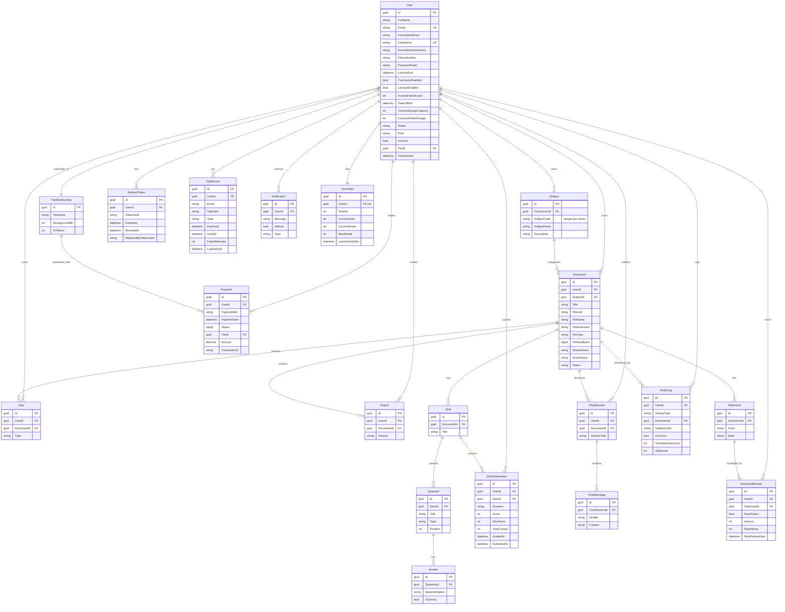
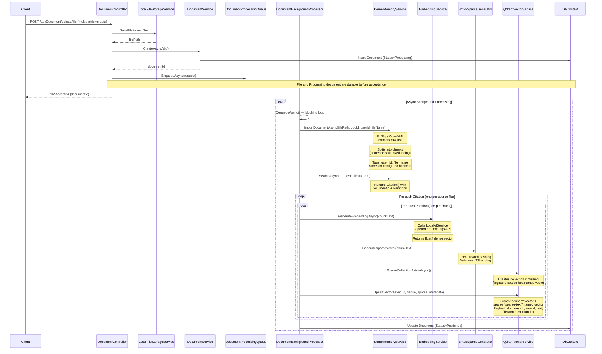
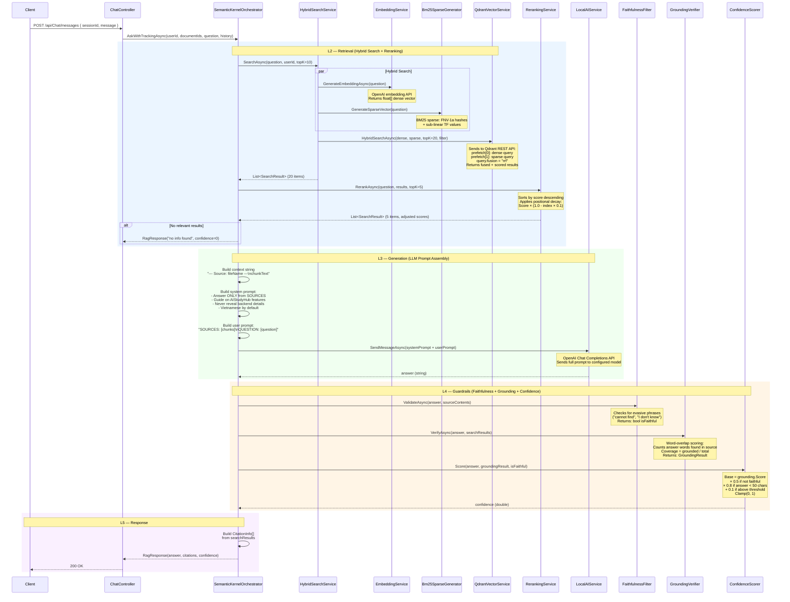
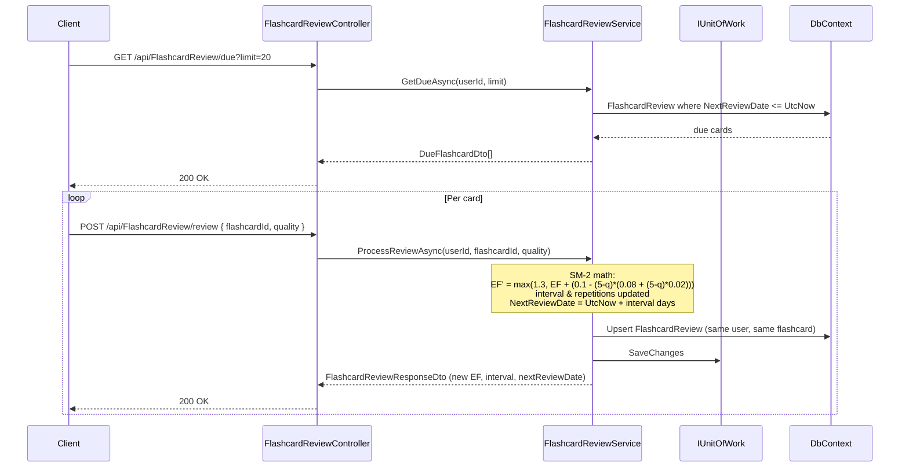
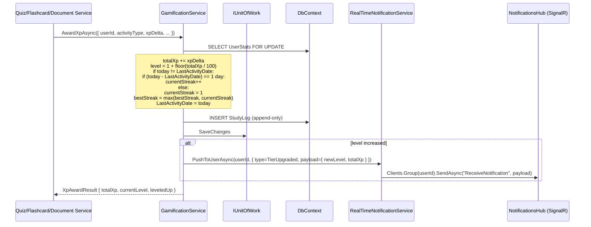
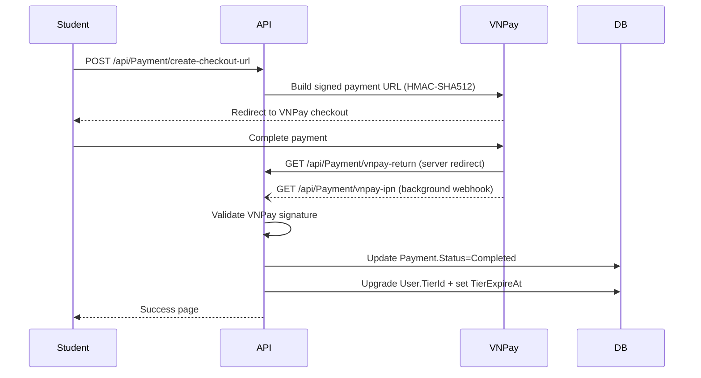

# Architecture Reference — AI Study Hub

> **Cập nhật**: 2026-06-28
> **Base URL (dev - HTTP)**: `http://localhost:5171` · **HTTPS**: `https://localhost:7265` · **SignalR**: `/hubs/notifications`
> **AI provider**: OpenAI SDK (`text-embedding-3-small` + `gpt-4o-mini`) + Qdrant
> **Layer count**: 3 (API / Business / Data) — strictly enforced

## High Level Architecture

AI Study Hub uses an MVC 3-Layer architecture with strict separation between HTTP concerns, business logic, and data persistence.

```mermaid
flowchart TD
    Client[Client Applications]
    Swagger[Swagger / OpenAPI]

    subgraph Presentation["Presentation Layer - AIStudyHub.API"]
        Controllers[19 REST Controllers]
        Hubs[SignalR Hubs - NotificationsHub]
        GlobalException[GlobalExceptionMiddleware]
        FluentValidationFilter[FluentValidationFilter]
        Jwt[JWT + Google/GitHub OAuth]
        RateLimiter[Rate Limiting]
        SwaggerCfg[Swagger Configuration]
    end

    subgraph Business["Business Layer - AIStudyHub.Business"]
        Services[16+ Business Services]
        ModuleServices["ModuleServices: Document, Vote, Report, Flashcard, Quiz, Question, Answer, Submission, Notification, Payment, Subject, Tier, Gamification, FlashcardReview, Recommendation"]
        AI_Chat[AIChatService]
        AI_QuizGen[QuizAiService]
        AI_FlashGen[FlashcardAiService]
        AI_Orch[SemanticKernelOrchestrator]
        AI_KM[KernelMemoryService]
        AI_Hybrid[HybridSearchService]
        AI_Vector[QdrantVectorService]
        AI_Embed[EmbeddingService]
        AI_BM25[BM25SparseGenerator]
        AI_Rerank[RerankingService]
        AI_Faith[FaithfulnessFilter]
        AI_Grounding[GroundingVerifier]
        AI_Confidence[ConfidenceScorer]
        AI_LocalLLM[LocalAIService]
        Guardrails[Guardrails Options]
        DTOs["21 Module DTOs (+Gamification, FlashcardReview, Recommendations, UserStats)"]
        Validators[FluentValidation Validators]
        Mappings[AutoMapper Profiles]
        MediatR[MediatR CQRS Handlers]
        Workers[4 Background Services]
        Behaviors[MediatR Pipeline Behaviors]
        RT[IRealTimeNotificationService - SignalR push]
    end

    subgraph Data["Data Access Layer - AIStudyHub.Data"]
        UnitOfWork[Unit of Work]
        Repositories[GenericRepository + UnitOfWork]
        DbContext[ApplicationDbContext]
        Configurations[EF Core Fluent Configurations]
        Migrations["21 EF Core Migrations"]
        SeedData[Admin Seed Extensions]
        Entities["21 Entity Classes (incl. UserStats, FlashcardReview, StudyLog)"]
        Enums["8 Enums (incl. ActivityType, ShareStatus)"]
    end

    Database[(SQL Server)]

    Client --> Controllers
    Client -. WebSocket .-> Hubs
    Swagger --> Controllers
    Controllers --> Jwt
    Controllers --> Services
    Services --> RT
    RT --> Hubs
    GlobalException --> Controllers
    Services --> AI_Orch
    Services --> AI_Chat
    Services --> AI_QuizGen
    Services --> AI_FlashGen
    AI_Orch --> AI_Hybrid
    AI_Orch --> AI_KM
    AI_Orch --> AI_LocalLLM
    AI_Orch --> AI_Faith
    AI_Orch --> AI_Grounding
    AI_Orch --> AI_Confidence
    AI_Hybrid --> AI_Vector
    AI_Hybrid --> AI_Embed
    AI_Hybrid --> AI_BM25
    AI_Hybrid --> AI_Rerank
    Services --> DTOs
    Services --> Validators
    Services --> Mappings
    Services --> MediatR
    Services --> UnitOfWork
    UnitOfWork --> Repositories
    Repositories --> DbContext
    DbContext --> Configurations
    DbContext --> SeedData
    DbContext --> Entities
    DbContext --> Enums
    DbContext --> Database
```



## Solution Structure

```text
AIStudyHub.slnx
├── AIStudyHub.API
│   ├── Controllers/              (19 REST controllers)
│   ├── DTOs/
│   ├── Extensions/               (JwtExtensions, SwaggerExtensions, RateLimitExtensions)
│   ├── Hubs/                     (NotificationsHub - SignalR implementation)
│   ├── Middleware/               (GlobalExceptionMiddleware, FluentValidationFilter)
│   ├── Swagger/
│   ├── Program.cs
│   └── appsettings.json
├── AIStudyHub.Business
│   ├── AI/
│   │   ├── Chat/                (AIChatService)
│   │   ├── Generators/          (QuizAiService, FlashcardAiService)
│   │   ├── Guardrails/          (FaithfulnessFilter, GroundingVerifier, ConfidenceScorer)
│   │   ├── LLM/                 (LocalAIService)
│   │   ├── Orchestration/        (SemanticKernelOrchestrator, KernelMemoryService)
│   │   ├── Search/              (HybridSearchService, RerankingService, Bm25SparseGenerator)
│   │   └── VectorStore/         (QdrantVectorService, EmbeddingService)
│   ├── Behaviors/               (MediatR pipeline behaviors)
│   ├── Configuration/           (RetrievalOptions, KernelMemoryOptions, SemanticKernelOptions, GuardrailsOptions)
│   ├── DTOs/                   (21 module DTO sets - incl. Gamification, FlashcardReviews, Recommendations, UserStats)
│   ├── Features/               (MediatR CQRS — Auth, Users)
│   ├── Hubs/                   (INotificationsHub abstraction - signal target)
│   ├── Interfaces/
│   │   ├── AI/                 (Chat, Generators, Guardrails, LLM, Orchestration, Search, VectorStore)
│   │   └── Services/           (All service interfaces - incl. IGamificationService, IFlashcardReviewService, IRecommendationService)
│   ├── Mappings/              (AutoMapper profiles)
│   ├── Options/               (Jwt, Smtp, VnPay, Rag, ExternalAuth, Cleanup, etc.)
│   ├── Services/              (ModuleServices, AuthService, UserService, VnPayService, EmailService,
│   │                          LocalFileStorageService, DocumentProcessingService, DocumentProcessingQueue,
│   │                          GamificationService, FlashcardReviewService, RecommendationService,
│   │                          RealTimeNotificationService, BusinessServiceExtensions)
│   ├── Validators/            (FluentValidation module validators)
│   └── Workers/              (DocumentBackgroundProcessor, TierExpirationCleanupService,
│                             UnverifiedAccountCleanupService, DailyStreakResetWorker)
├── AIStudyHub.Data
│   ├── Configurations/        (EntityConfigurations)
│   ├── Entities/             (21 entities + BaseEntity - incl. UserStats, FlashcardReview, StudyLog)
│   ├── Enums/               (8 enums - incl. ActivityType, ShareStatus)
│   ├── Extensions/           (AdminSeedExtensions, DataAccessExtensions)
│   ├── Interfaces/          (IGenericRepository, IUnitOfWork)
│   ├── Repositories/        (GenericRepository, UnitOfWork)
│   └── Migrations/          (21 EF Core migrations)
├── docs/                     (FRONTEND_GUIDE.md, EF_MIGRATION_COMMANDS.md, ...)
├── AGENT.md                  (coding conventions & rules)
├── ARCHITECTURE.md           (this file)
└── README.md
```

## Layer Responsibilities

### Presentation Layer

Project: `AIStudyHub.API`

Responsibilities:
- Expose 19 REST HTTP endpoints.
- Configure Swagger/OpenAPI with JWT Bearer support and file upload support.
- Configure JWT + Google + GitHub OAuth authentication.
- Configure rate limiting (auth endpoints: 5 req/15min per IP).
- Configure global exception and validation middleware.
- Register all dependencies from Business and Data layers.
- Serve static files (uploaded documents) from `wwwroot` (request path `/uploads`).
- Host SignalR hubs (`Hubs/NotificationsHub`) and map them at top-level routes (e.g. `/hubs/notifications`).
- Return HTTP responses and handle API-level concerns only.

Must not:
- Contain business rules.
- Access EF Core directly.
- Return entity classes.
- Contain SQL or repository logic.
- Inject SignalR `Hub` types into business services (use `IRealTimeNotificationService` instead).

### Business Layer

Project: `AIStudyHub.Business`

Responsibilities:
- Define DTOs and service interfaces.
- Implement all business services and workflows.
- Implement the full AI pipeline (L3-L5): embeddings, vector store, hybrid search, reranking, LLM orchestration, guardrails, quiz/flashcard generation.
- Define FluentValidation validators.
- Define AutoMapper profiles.
- Define MediatR CQRS handlers for Auth and Users.
- Implement background hosted services.
- Configure AI pipeline options.

Must not:
- Reference ASP.NET Core controller or HTTP-specific types.
- Use `DbContext` directly.

### Data Access Layer

Project: `AIStudyHub.Data`

Responsibilities:
- Define `ApplicationDbContext`.
- Define EF Core Fluent API configurations for all 18 entities.
- Implement repositories and Unit of Work.
- Register persistence dependencies.
- Manage migrations and seed data.
- Persist entities to SQL Server.

Must not:
- Contain business workflows.
- Return DTOs.
- Depend on API controllers.

## Database Design

Database engine: SQL Server.

ORM: Entity Framework Core 8 Code First.

### Entities (21)

All entities inherit from `BaseEntity` (Id: Guid, CreatedAt, UpdatedAt), **except** `User` which inherits `IdentityUser<Guid>` and carries the ASP.NET Identity columns implicitly.

| Entity | Table | Key Fields |
|--------|-------|-----------|
| `User` | `Users` | FullName, DateOfBirth, CurrentStorageCapacity, CurrentAiTokenUsage, Status, Role, IsActive, TierId, TierExpireAt |
| `RefreshToken` | `RefreshTokens` | TokenHash, ExpiresAt, RevokedAt, ReplacedByTokenHash |
| `OtpRecord` | `OtpRecords` | Email, OtpHash, OtpType, ExpiresAt, UsedAt, FailedAttempts, LockedUntil |
| `Subject` | `Subjects` | OwnerUserId (required), SubjectCode (unique per owner), SubjectName, Description |
| `TierMembership` | `TierMembership` | TierName, StorageLimitMb, AiTokens |
| `TierUser` | `TierUser` | UserId, TierMembershipId (join table) |
| `Document` | `Document` | UserId, SubjectId, Title, FileLink, FileName, FileExtension, FileType, FileSizeBytes, SharedUsers, ShareStatus, Status |
| `DocumentChunk` | `DocumentChunk` | DocumentId, ChunkJson, EmbeddingJson, VectorId, OrderIndex, Vector |
| `Vote` | `Votes` | UserId, DocumentId, Type (up/down) |
| `Report` | `Reports` | UserId, DocumentId, Reason, Status (workflow), Category |
| `Flashcard` | `Flashcard` | DocumentId, Front, Back |
| `FlashcardReview` | `FlashcardReview` | UserId, FlashcardId, EaseFactor, Interval, Repetitions, NextReviewDate (SM-2 state) |
| `Quiz` | `Quiz` | DocumentId, Title |
| `Question` | `Question` | QuizId, Title, Type, Position |
| `Answer` | `Answer` | QuestionId, SelectedOption, IsCorrect |
| `QuizSubmission` | `QuizSubmission` | UserId, QuizId, Answers, Score, MaxScore, TotalCorrect, GradedAt, SubmittedAt |
| `ChatSession` | `ChatSession` | UserId, DocumentId, SessionTitle |
| `ChatMessage` | `ChatMessage` | ChatSessionId, Sender, Content |
| `Notification` | `Notification` | UserId, Message, IsRead, Type |
| `Payment` | `Payment` | UserId, TierId, PaymentInfo, PaymentDate, Amount, TransactionId, Status |
| `UserStats` | `UserStats` | UserId (unique), TotalXp, CurrentLevel, CurrentStreak, BestStreak, LastActivityDate |
| `StudyLog` | `StudyLog` | UserId, ActivityType, DocumentId?, SubjectCode?, IsCorrect, TimeSpentSeconds?, XpEarned |

### Enums (8)

`DocumentStatus` (Draft/Published/Archived/Banned/Processing/Failed), `NotificationType` (incl. Document/Quiz/FlashcardsReady/StreakAtRisk/TierUpgraded/Payment variants), `PaymentStatus`, `QuestionType` (SingleChoice/MultipleChoice/TrueFalse), `UserRole` (Student/Admin), `ReportStatus`, `VoteType` (Upvote/Downvote), **`ActivityType`** (FlashcardReview / QuizSubmit / DocumentUpload / ChatMessage), **`ShareStatus`** (Private / Public).

### Entity Relationships

Note: `User` inherits `IdentityUser<Guid>` — Identity columns (NormalizedEmail, NormalizedUserName, PasswordHash, SecurityStamp, ConcurrencyStamp, TwoFactorEnabled, LockoutEnd, LockoutEnabled, AccessFailedCount) are inherited implicitly.



## AI Architecture

### RAG & AI Generation Flows

#### L1 — Document Ingestion Pipeline



#### L2-L5 — Legacy RAG Query Flow (Chat with Document)

> Current API contract: `POST /api/AI/rag/ask` is search-only and returns reranked chunks. Chat answer generation uses `POST /api/Chat/messages`. The sequence below documents the orchestration used by the chat flow, not the search-only endpoint.



#### L6 — Flashcard Generation Flow

```mermaid
sequenceDiagram
    participant Client
    participant Controller as FlashcardController
    participant FlashSvc as FlashcardAiService
    participant KM as KernelMemoryService
    participant LLM as LocalAIService
    participant DB as DbContext

    Client->>Controller: POST /api/AI/flashcards/generate?docId={guid} { numberOfFlashcards }
    Controller->>FlashSvc: GenerateFlashcardsAsync(docId, request, userId)

    FlashSvc->>FlashSvc: Require owner, Done status, and nonempty processed context
    Note over Controller,FlashSvc: numberOfFlashcards is required integer 1..20

    FlashSvc->>KM: SearchAsync("", filter=documentId, limit=1000)
    Note over KM: Retrieves all chunks for document
    KM-->>FlashSvc: MemoryAnswer.Results[]

    FlashSvc->>FlashSvc: BuildContext(citations)
    Note over FlashSvc: Concatenates all partition.Text<br/>Limited to 30,000 chars

    loop Batch generation (batchSize=5, maxAttempts=80)
        FlashSvc->>LLM: SendMessageAsync(batchPrompt, temp=0.2)
        Note over LLM: System: Extract N facts → JSON flashcards<br/>"front": question ending with ?<br/>"back": short factual answer

        LLM-->>FlashSvc: aiText (raw JSON string)

        FlashSvc->>FlashSvc: ParseFlashcardArray(aiText)
        Note over FlashSvc: 3-stage parser:<br/>1. Extract balanced [...] JSON array<br/>2. JsonDocument.Parse<br/>3. Streaming fallback for malform

        FlashSvc->>FlashSvc: Normalize & dedupe<br/>Enforce: front=question, back=answer<br/>Reject placeholders
    end

    Note over FlashSvc,DB: Require exactly requested count; otherwise 422 and no rows
    FlashSvc->>DB: Insert exactly requested Flashcard entities
    FlashSvc-->>Controller: FlashcardResponseDto[]
    Controller-->>Client: 200 OK
```

#### L6 — Quiz Generation Flow

```mermaid
sequenceDiagram
    participant Client
    participant Controller as QuizController
    participant QuizSvc as QuizAiService
    participant Qdrant as QdrantVectorService
    participant LLM as LocalAIService
    participant DB as DbContext

    Client->>Controller: POST /api/AI/quizzes/generate?docId={guid} { numberOfQuestions }
    Controller->>QuizSvc: GenerateAndPersistQuizAsync(docId, request, userId)

    QuizSvc->>QuizSvc: Require owner, Done status, and nonempty processed context
    Note over Controller,QuizSvc: numberOfQuestions is required integer 1..20

    QuizSvc->>Qdrant: GetPayloadsByDocumentIdAsync(documentId)
    Note over Qdrant: REST scroll API<br/>Returns all payload dicts for doc
    Qdrant-->>QuizSvc: List<Dictionary<string,string>>

    QuizSvc->>QuizSvc: Sort by chunkIndex<br/>Fix Mojibake (UTF-8→Latin-1→UTF-8)
    Note over QuizSvc: Mojibake pattern detection:<br/>"Ã", "Ä", "áº" sequences

    QuizSvc->>QuizSvc: Concatenate chunks as context

    loop Batch generation (batchSize=3, maxAttempts=60)
        QuizSvc->>LLM: SendMessageAsync(batchPrompt, temp=0.2)
        Note over LLM: System: Read TEXT → JSON quiz<br/>Exactly N questions<br/>Each: questionTitle + 4 answers<br/>Exactly 1 isCorrect=true

        LLM-->>QuizSvc: aiText (raw JSON string)

        QuizSvc->>QuizSvc: ParseQuizPayload(aiText)
        Note over QuizSvc: 3-stage parser:<br/>1. Extract balanced {...} object<br/>2. JsonDocument.Parse<br/>3. Streaming per question fallback

        QuizSvc->>QuizSvc: Normalize & dedupe<br/>Reject placeholders, enforce 1 correct
    end

    QuizSvc->>DB: Insert Quiz → Questions → Answers
    Note over QuizSvc,DB: Require exactly requested count; otherwise 422 and no rows
    QuizSvc-->>Controller: QuizResponseDto
    Controller-->>Client: 200 OK
```

### AI Components

| Component | Implementation | Purpose |
|-----------|---------------|---------|
| `IOpenAIService` | `OpenAIService` | Chat completion + embeddings via OpenAI SDK (`ChatClient`, `EmbeddingClient`) |
| `IEmbeddingService` | `EmbeddingService` | Wraps `IOpenAIService.CreateEmbeddingsFromTexts` for dense vector generation |
| `IVectorStoreService` | `QdrantVectorService` | Dense/sparse upsert, ANN search, hybrid RRF search via REST API, collection management |
| `ISparseVectorGenerator` | `Bm25SparseGenerator` | BM25 sparse vectors via FNV-1a 32-bit word hashing + sub-linear TF-IDF scoring |
| `IHybridSearchService` | `HybridSearchService` | Orchestrates dense + sparse search with prefetch RRF fusion in Qdrant |
| `IRerankingService` | `RerankingService` | Positional decay re-ranking: `Score × (1.0 - index × 0.1)` |
| `IKernelMemoryService` | `KernelMemoryService` | Document import (chunking + tagging), search, Q&A via `Microsoft.KernelMemory` |
| `ISemanticKernelOrchestrator` | `SemanticKernelOrchestrator` | Full L2–L5 RAG pipeline orchestration (search → rerank → LLM → guardrails → response) |
| `IFaithfulnessFilter` | `FaithfulnessFilter` | Detects evasive answers ("cannot find", "I don't know") despite available context |
| `IGroundingVerifier` | `GroundingVerifier` | Word-overlap grounding score (source words vs answer words coverage) |
| `IConfidenceScorer` | `ConfidenceScorer` | Combined confidence: grounding × faithfulness × length × threshold bonus, clamped [0,1] |
| `IQuizAiService` | `QuizAiService` | Batch-prompt quiz generation (3 questions/batch, 3 duplicate-then-abort policy, 3-stage JSON parser) |
| `IFlashcardAiService` | `FlashcardAiService` | Batch-prompt flashcard generation (5 cards/batch, Kernel Memory context, deduplication) |
| `IDocumentProcessingService` | `DocumentProcessingService` | Text extraction from PDF (PdfPig), DOCX (OpenXML), TXT/MD; sentence-split chunking with overlap |
| `IDocumentProcessingQueue` | `DocumentProcessingQueue` | Bounded in-process dispatch queue; durable `Processing` document records are recovered and re-enqueued at startup |
| `DocumentBackgroundProcessor` | `DocumentBackgroundProcessor` | `BackgroundService` — resumes durable active `Processing` documents, dequeues jobs, calls KernelMemory import + generates dense/sparse vectors → Qdrant, then sets `Done` or `Failed` |

### AI / LLM Configuration

Configuration file: `AIStudyHub.API/appsettings.json` → `RagOptions`.

| Setting | Default | Description |
|---------|---------|-------------|
| `OpenAIApiKey` | *(required)* | API key for OpenAI-compatible endpoint |
| `OpenAIChatModel` | `gpt-4o-mini` | Chat completion model (supports o1, gpt-5 families with special temperature handling) |
| `OpenAIEmbeddingModel` | `text-embedding-3-small` | Embedding model via OpenAI SDK |

| `VectorDbUrl` | `http://localhost:6333` | Qdrant REST URL |
| `VectorDbCollectionName` | `ai-study-hub` | Qdrant collection name |
| `VectorDbVectorSize` | `1536` | Dense vector dimension (matches `text-embedding-3-small` output) |

**Vector DB:** Qdrant at `http://localhost:6333` with hybrid (dense + sparse named vector) collection support.

## Request Flow

### Standard Service Flow (Simple CRUD)

```text
Client -> Controller -> Service -> Repository -> DbContext -> SQL Server
```

### CQRS Flow (Auth, Users)

```text
Client -> Controller -> MediatR -> Command/Query Handler -> Repository -> DbContext -> SQL Server
```

### AI Document Ingestion Flow

See **L1 — Document Ingestion Pipeline** sequence diagram above.

### AI Query Flow (RAG)

See **L2-L5 — RAG Query Flow (Chat with Document)** sequence diagram above.

### Spaced Repetition Flow (SM-2)



### Gamification Flow (XP / Level / Streak)



### Real-time Push Flow (SignalR)

```text
Client connects:  ws(s)://localhost:5171/hubs/notifications?access_token=<JWT>
  -> Server upgrades + auth validates token
Client -> Server: invoke("JoinGroup", userId)        // userId is a STRING
Server: store connection in group(userId)

Server -> Client: ReceiveNotification(RealTimeNotification {
  userId, title, body, type, timestamp, payload
})
```

Logout: client calls `invoke("LeaveGroup", userId)` before disposing the connection.

The `IRealTimeNotificationService.PushToUserAsync` abstraction in `AIStudyHub.Business` wraps the `INotificationsHub` SignalR context so business services can push events without referencing `HubContext` or `Microsoft.AspNetCore.SignalR` directly.

## Authentication Flow

```text
Client -> AuthController
  -> AuthService.RegisterAsync (create user, send OTP)
  -> VerifyRegistrationOtpAsync (validate OTP)
  -> AuthService.LoginAsync (validate credentials, issue JWT + refresh token)
  -> RefreshTokenAsync (rotate refresh token)
  -> ExternalCallback (Google/GitHub OAuth)
  -> ForgotPasswordAsync / ResetPasswordAsync (OTP flow)
  -> ChangePasswordAsync / LogoutAsync
```

JWT tokens: short-lived access tokens (60 min default) + long-lived refresh tokens (7 days), stored as SHA-256 hashes in the database.

## Subject Ownership Contract

`GET`, `POST`, `PUT`, and `DELETE /api/Subject` are authenticated student operations. The current JWT user owns the results and all writes. Subject operations have no Admin override.

Missing or foreign IDs return `404`. A Subject referenced by a Document cannot be deleted and returns `409`. Document creation accepts only a Subject owned by the requesting student.

## Payment Flow



## Coding Standards

- Use C# 12-compatible style where supported by .NET 8.
- Use nullable reference types.
- Prefer async APIs for I/O.
- Include `CancellationToken` in async controller, service, and repository methods.
- Use constructor injection.
- Keep controllers thin.
- Keep service methods focused on one use case.
- Return DTOs from services and controllers.
- Do not expose entities from API responses.
- Use PascalCase for public members and types.
- Use camelCase for locals and parameters.
- Use explicit access modifiers.
- Avoid static state for request-specific behavior.
- Avoid circular project references.

## Repository Change Policy

These rules are architectural constraints and apply to every feature, bug fix, and refactor.

### Migration History

- A new EF Core migration may be created when an approved schema change requires one.
- Every migration that already exists in the repository is immutable.
- Never edit, rename, move, regenerate, squash, or delete an existing migration `.cs` file, designer file, migration name, timestamp, ordering, or historical model operation.
- Never run `dotnet ef migrations remove` against a committed migration.
- `ApplicationDbContextModelSnapshot.cs` may change only as the generated result of adding a new migration. Never edit it manually to rewrite migration history.
- Inspect every newly generated migration before accepting it and confirm that it contains only the schema changes required by the current feature.
- Applying migrations to a database, dropping a database, or resetting database data requires explicit authorization from the repository owner.

### Testing and Verification

- Do not recreate the deleted `AIStudyHub.Tests` project.
- Do not create unit-test projects, unit-test files, test fixtures, mocks, test packages, or test-only production hooks when adding or fixing features.
- Do not add xUnit, NUnit, MSTest, Moq, FluentAssertions, or equivalent unit-testing dependencies unless the repository owner explicitly reverses this policy.
- Create integration or end-to-end test projects only when the repository owner explicitly requests them.
- Do not create, run, require, or recommend smoke tests.
- Agents may run `dotnet build` to verify that the solution compiles.
- Functional verification is performed manually by the repository owner.
- Every feature handoff must list the manual flows that the repository owner should verify.

## Dependency Injection Strategy

DI registration locations:

- API services: `AIStudyHub.API/Program.cs`
- JWT + OAuth: `AIStudyHub.API/Extensions/JwtExtensions.cs`
- Swagger: `AIStudyHub.API/Extensions/SwaggerExtensions.cs`
- Rate limiting: `AIStudyHub.API/Extensions/RateLimitExtensions.cs`
- Business services: `AIStudyHub.Business/Services/BusinessServiceExtensions.cs`
- Data access: `AIStudyHub.Data/Extensions/DataAccessExtensions.cs`

Lifetimes:

- Controllers: framework-created.
- Services: scoped.
- Repositories: scoped.
- Unit of Work: scoped.
- DbContext: scoped.
- Validators: registered from assembly.
- AutoMapper: registered from Business assembly.
- Kernel Memory: singleton.
- Document Processing Queue: singleton.
- **Real-time notification service**: singleton (wraps `IHubContext<NotificationsHub, INotificationsHub>` which is itself singleton).
- **Gamification / FlashcardReview / Recommendation services**: scoped (depend on scoped repositories).
- **SignalR Hub class**: transient (per-connection).

Rules:

- Register abstractions, not only concrete classes.
- Business services should depend on interfaces.
- Data access should be hidden behind repository and Unit of Work abstractions.
- `IKernelMemory` is singleton but wraps scoped `IServiceProvider` for scoped dependencies.

## Error Handling Strategy

Global exception handling is centralized in `GlobalExceptionMiddleware`.

Rules:

- Controllers should not use broad try/catch blocks.
- Validation failures (`ValidationException`) return `400 BadRequest`.
- Authentication failures return `401 Unauthorized`.
- Authorization failures return `403 Forbidden`.
- Missing resources (`KeyNotFoundException`) return `404 NotFound`.
- Business conflicts (`InvalidOperationException`) return `409 Conflict`.
- Unexpected failures return `500 InternalServerError`.
- Production error responses must not expose stack traces.
- Error responses are consistent JSON: `{ "statusCode": ..., "message": "..." }`.
- `FluentValidationFilter` intercepts requests before action execution.

## Logging Strategy

Logging provider: Serilog.

Configuration file: `AIStudyHub.API/appsettings.json`.

Rules:

- Use structured logging with message templates.
- Use request logging middleware (`UseSerilogRequestLogging`).
- Log unhandled exceptions in global exception middleware.
- Add contextual logs around important workflows: AI generation, payment processing, document processing.
- Do not log: passwords, password hashes, JWTs, API keys, payment secrets, raw card data, private document contents.

Recommended log levels:

- `Information`: normal business events, startup configuration.
- `Warning`: suspicious or recoverable issues (e.g., document processing failure, expired tier).
- `Error`: failed operations requiring investigation.
- `Debug`: local development diagnostics only.

## Background Services

1. **DocumentBackgroundProcessor** (`BackgroundService`)
   - Accepts uploads only after file and `Processing` document persistence; content above exactly 5,242,880 bytes is rejected with `413 Payload Too Large`.
   - Reads from `IDocumentProcessingQueue` (bounded in-process dispatch queue) and recovers active `Processing` documents from persistence at startup.
   - Processes: text extraction, Kernel Memory import, embedding, Qdrant upsert.
   - Updates document status to `Done` or `Failed`; recovery marks the document `Failed` when its stored source file is missing.
   - Graceful error handling per job.
   - On completion, pushes `ReceiveNotification` with `type=Document` so FE can show "Document ready".

2. **TierExpirationCleanupService** (`BackgroundService`)
   - Runs every `TierExpirationCheckIntervalHours` (default 24h).
   - Finds users where `TierExpireAt < UtcNow` and not on Free tier.
   - Downgrades to Free tier, clears expiration date.

3. **UnverifiedAccountCleanupService** (`BackgroundService`)
   - Runs daily at midnight UTC.
   - Finds users where `!EmailConfirmed && CreatedAt < cutoffDate` (default 7 days).
   - Cascades deletes: OtpRecords, Qdrant vectors, files, DocumentChunks, Documents, Flashcards, UserRoles, Notifications, User.

4. **DailyStreakResetWorker** (`BackgroundService`)
   - Runs daily (configurable schedule).
   - For every `UserStats` row where `LastActivityDate < UtcNow.Date.AddDays(-1)`, sets `CurrentStreak = 0`.
   - Best streak is preserved.
   - When a user is about to lose their streak (last activity 23h ago, end-of-day approaching), a one-time `StreakAtRisk` notification is pushed via SignalR.

## Future Scalability

Recommended evolution paths:

- Add caching (Redis) for frequently accessed public document metadata.
- Add health checks for SQL Server and Qdrant.
- Add rate limiting on AI and upload endpoints.
- Add API versioning before public clients depend on the API.
- Add observability with metrics (Prometheus) and distributed tracing.
- Add object storage (Azure Blob / S3) for production file storage.
- Add audit logging for admin and payment actions.
- Add an external message queue (RabbitMQ / Azure Queue) for multi-instance dispatch and coordination.
- Replace the public `/api/Gamification/award-xp` endpoint with a server-to-server auth scheme (mTLS or shared HMAC) before going to production.
- Split AI provider implementations behind interfaces for multi-provider support.
- Keep the current 3-layer architecture unless scaling requirements justify a larger architecture.
