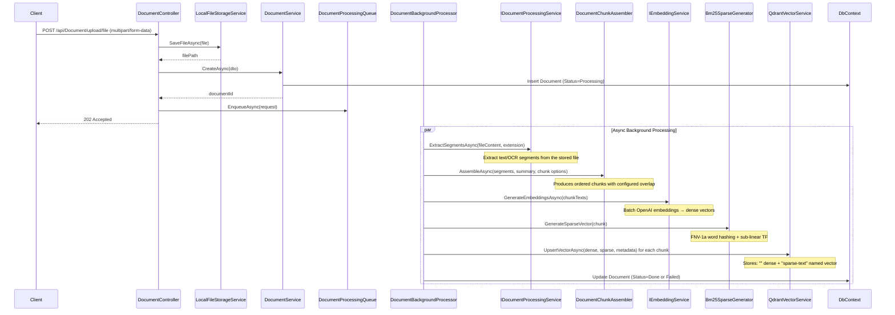
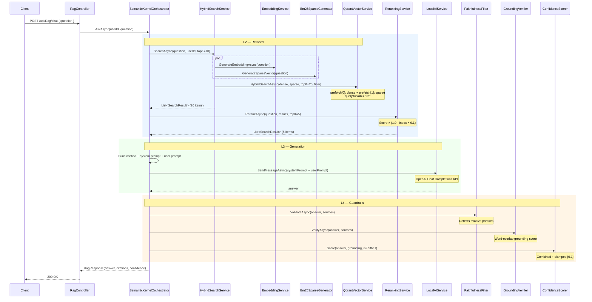
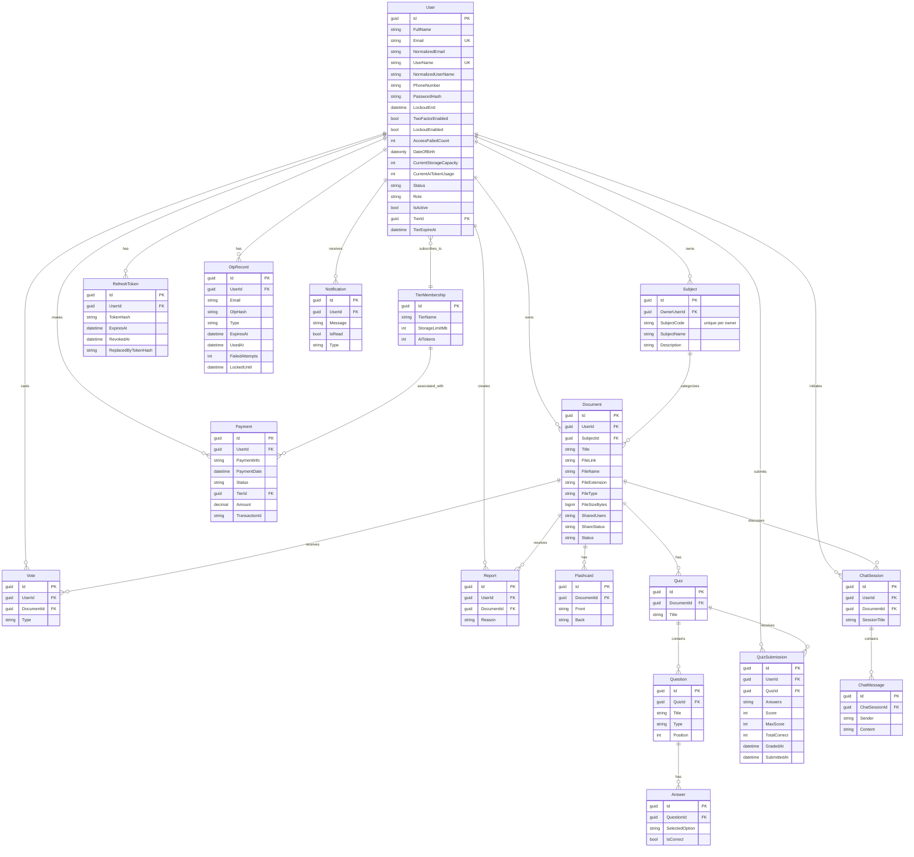

# AI Study Hub

AI Study Hub is a production-ready ASP.NET Core 8 Web API for AI-assisted learning document management. The system uses a clean 3-layer architecture (API / Business / Data), SQL Server persistence, JWT authentication, and a full RAG pipeline powered by local AI models.

## Tech Stack

| Category | Technology |
|----------|-----------|
| Framework | ASP.NET Core 8 Web API |
| Database | SQL Server + Entity Framework Core 8 Code First |
| AI - Embedding | OpenAI SDK (`EmbeddingClient` / `text-embedding-3-small`) |
| AI - Vector Store | Qdrant (local vector DB) |
| AI - LLM Orchestration | Semantic Kernel + Microsoft Kernel Memory |
| AI - Generators | OpenAI SDK (`ChatClient` / `gpt-4o-mini`) |
| AI - Search | Hybrid search (dense embeddings + BM25 sparse, reranked with Reciprocal Rank Fusion) |
| AI - Guardrails | Faithfulness filter, grounding verifier, confidence scorer |
| Authentication | JWT Bearer + Refresh Tokens + OTP (email verification / password reset) |
| External Auth | Google OAuth, GitHub OAuth |
| ORM Mapping | AutoMapper |
| Validation | FluentValidation (with global action filter) |
| Logging | Serilog (console + rolling file) |
| Payment | VNPay gateway |
| Background Jobs | `BackgroundService` (document processing queue, tier cleanup, unverified-account cleanup) |
| Patterns | Repository + Unit of Work, CQRS via MediatR (Auth, Users) |

## Architecture

Three layers with strict separation of concerns:

```text
Client
  -> AIStudyHub.API        (Controllers, Middleware, JWT, Swagger, DI registration)
  -> AIStudyHub.Business   (Services, AI pipeline, DTOs, Validators, Mappings)
  -> AIStudyHub.Data       (EF Core DbContext, Repositories, UnitOfWork, Migrations, Seed)
  -> SQL Server
```

## Project Overview

### AIStudyHub.API
Presentation layer. Hosts 19 REST controllers + the SignalR `NotificationsHub`, configures middleware pipeline, JWT + OAuth authentication, rate limiting, Serilog, Swagger/OpenAPI, and static file serving.

### AIStudyHub.Business
Business layer. Contains the entire AI pipeline (L3-L5), 16+ business services, FluentValidation modules, AutoMapper profiles, MediatR CQRS handlers for Auth and Users, **gamification / spaced-repetition / recommendation services**, the `RealTimeNotificationService` SignalR wrapper, and **4 background hosted services**.

### AIStudyHub.Data
Data access layer. Holds **21 entity classes** (all inheriting `BaseEntity`, except `User` which inherits `IdentityUser<Guid>`), **8 enums**, Fluent API configurations, generic Repository + UnitOfWork, and **21 EF Core migrations**.

## Main Modules

| Module | Description |
|--------|-------------|
| **Authentication** | Register with email OTP verification, login with JWT + refresh tokens, password reset, Google/GitHub OAuth, logout |
| **Subject Management** | Authenticated students create, list, update, and delete only their own Subjects |
| **User Management** | CRUD, profile update, tier info, document sharing |
| **Document Management** | Upload (multipart/form-data), text extraction (PDF/DOCX/TXT/MD), chunking, versioning, sharing, vote/report |
| **RAG Pipeline** | Hybrid search (dense + sparse BM25 via Qdrant RRF), reranking, Semantic Kernel orchestration, guardrails (faithfulness, grounding, confidence), document Q&A, summarization |
| **Flashcard Generation** | AI-powered flashcard creation from document chunks, auto-persisted |
| **Spaced Repetition Review** | SM-2 algorithm — per-user schedule (ease factor / interval / repetitions), due-today list, daily counts |
| **Quiz Generation** | AI-powered multiple-choice quiz creation, auto-persisted with questions and answers |
| **Quiz Submission** | Submit answers, auto-grading, score tracking |
| **AI Chat** | Session-based chat with document context, RAG-augmented responses |
| **Gamification** | XP / level / current-best streak, leaderboard, activity logging via `StudyLog` |
| **Recommendations** | Per-subject mastery analytics + AI-driven study suggestions |
| **Notifications** | DB-backed list + real-time push via SignalR `/hubs/notifications` |
| **Payments** | VNPay checkout, webhook processing, tier upgrade on success |
| **Tier Memberships** | Subscription tiers with storage and AI token quotas |
| **Admin** | Dashboard data, document reindexing, user/document/report moderation |

## AI Architecture

See full sequence diagrams in [`ARCHITECTURE.md`](ARCHITECTURE.md). Key flows:

#### L1 — Document Ingestion Pipeline



#### L2-L5 — RAG Query Flow (Chat with Document)



#### L6 — Flashcard Generation

```mermaid
sequenceDiagram
    participant Client
    participant Ctrl as FlashcardController
    participant Svc as FlashcardAiService
    participant Store as QdrantVectorService
    participant LLM as LocalAIService
    participant DB as DbContext

    Client->>Ctrl: POST /api/AI/flashcards/generate?docId={guid} { numberOfFlashcards }
    Ctrl->>Svc: GenerateFlashcardsAsync(docId, request, userId)
    Svc->>Store: GetPayloadsByDocumentIdAsync(documentId)
    Store-->>Svc: ordered chunk payloads
    Svc->>Svc: BuildContext(chunk payloads) — max 20k chars

    loop Up to four model calls (remaining requested cards; batch cap 20)
        Svc->>LLM: SendMessageAsync(batchPrompt, temp=0.2)
        Note over LLM: Extract N facts → JSON flashcards
        LLM-->>Svc: aiText (raw JSON)
        Svc->>Svc: ParseFlashcardArray (3-stage parser)<br/>Normalize + dedupe + enforce front/back rules
    end

    Svc->>DB: Insert Flashcard entities
    Svc-->>Ctrl: FlashcardResponseDto[]
    Ctrl-->>Client: 200 OK
```

#### L6 — Quiz Generation

```mermaid
sequenceDiagram
    participant Client
    participant Ctrl as QuizController
    participant Svc as QuizAiService
    participant Qdrant as QdrantVectorService
    participant LLM as LocalAIService
    participant DB as DbContext

    Client->>Ctrl: POST /api/AI/quizzes/generate?docId={guid} { numberOfQuestions }
    Ctrl->>Svc: GenerateAndPersistQuizAsync(docId, request, userId)
    Svc->>Qdrant: GetPayloadsByDocumentIdAsync(documentId)
    Note over Qdrant: REST scroll API → all chunks
    Qdrant-->>Svc: List<Dictionary<string,string>>
    Svc->>Svc: Sort by chunkIndex + FixMojibake<br/>Concatenate chunks as context

    loop Up to four model calls (remaining count with bounded buffer; batch cap 15)
        Svc->>LLM: SendMessageAsync(batchPrompt, temp=0.2)
        Note over LLM: Read TEXT → JSON quiz<br/>N questions × 4 answers, 1 correct
        LLM-->>Svc: aiText (raw JSON)
        Svc->>Svc: ParseQuizPayload (3-stage parser)<br/>Normalize + dedupe + enforce SingleChoice
    end

    Svc->>DB: Insert Quiz → Questions → Answers
    Svc-->>Ctrl: QuizResponseDto
    Ctrl-->>Client: 200 OK
```

### Local AI Requirements

| Model | Purpose |
|-------|---------|
| `text-embedding-3-small` | Text embeddings (1536 dimensions via OpenAI SDK) |
| `gpt-4o-mini` (or custom) | LLM chat completions and content generation |

**Vector DB:** Qdrant at `http://localhost:6333` with hybrid (dense + sparse named vector `sparse-text`) collection.

## Solution Structure

```text
AIStudyHub.slnx
├── AIStudyHub.API
│   ├── Controllers/          (19 controllers)
│   ├── DTOs/
│   ├── Extensions/           (JWT, Swagger, Rate Limiting)
│   ├── Hubs/                 (NotificationsHub)
│   ├── Middleware/           (GlobalException, FluentValidation filter)
│   ├── Swagger/
│   ├── Program.cs
│   └── appsettings.json
├── AIStudyHub.Business
│   ├── AI/
│   │   ├── Chat/             (AIChatService)
│   │   ├── Generators/       (QuizAiService, FlashcardAiService)
│   │   ├── Guardrails/       (Faithfulness, Grounding, Confidence)
│   │   ├── LLM/              (LocalAIService)
│   │   ├── Orchestration/    (SemanticKernelOrchestrator, KernelMemoryService)
│   │   ├── Search/           (HybridSearch, Reranking, BM25 sparse)
│   │   └── VectorStore/      (QdrantVectorService, EmbeddingService)
│   ├── Behaviors/            (MediatR pipeline behaviors)
│   ├── Configuration/        (Retrieval, KernelMemory, SemanticKernel, Guardrails options)
│   ├── DTOs/                 (21 module DTOs - incl. Gamification, FlashcardReview, Recommendations, UserStats)
│   ├── Features/             (MediatR CQRS - Auth, Users)
│   ├── Hubs/                 (INotificationsHub abstraction)
│   ├── Interfaces/           (AI + Service interfaces)
│   ├── Mappings/             (AutoMapper profiles)
│   ├── Options/              (JWT, SMTP, VnPay, Rag, etc.)
│   ├── Services/             (Business services + VnPay + Email + FileStorage + Gamification + FlashcardReview + Recommendation + RealTimeNotification)
│   ├── Validators/           (FluentValidation modules)
│   └── Workers/              (DocumentProcessor, TierCleanup, UnverifiedCleanup, DailyStreakReset)
├── AIStudyHub.Data
│   ├── Configurations/       (EF Core Fluent API for 21 entities)
│   ├── Entities/             (21 entities + BaseEntity - incl. UserStats, FlashcardReview, StudyLog)
│   ├── Enums/                (8 enums - incl. ActivityType, ShareStatus)
│   ├── Extensions/           (DataAccess DI, AdminSeed)
│   ├── Interfaces/            (Repository + UnitOfWork interfaces)
│   ├── Repositories/         (GenericRepository, UnitOfWork)
│   └── Migrations/           (21 EF Core migrations)
├── AIStudyHub.Tests/
├── docs/
│   ├── FRONTEND_GUIDE.md         (frontend integration guide)
│   └── EF_MIGRATION_COMMANDS.md  (database migration cheatsheet)
├── .github/workflows/
├── .gitignore
├── README.md
```

## Database Entities (18)

All entities inherit from `BaseEntity` (Id: Guid, CreatedAt, UpdatedAt), except `User` which inherits `IdentityUser<Guid>` (has additional Identity columns: NormalizedEmail, NormalizedUserName, PasswordHash, SecurityStamp, ConcurrencyStamp, TwoFactorEnabled, LockoutEnd, LockoutEnabled, AccessFailedCount).



## API Controllers (19)

| Controller | Route | Description |
|------------|-------|-------------|
| `AuthController` | `/api/Auth` | Register, login, OTP, OAuth, JWT refresh |
| `UserController` | `/api/User` | Profile, tier, sharing |
| `DocumentController` | `/api/Document` | Full lifecycle: upload, metadata CRUD, share, download, preview, full delete, reprocess, chunks |
| `ChatController` | `/api/Chat` | Sessions and messages |
| `FlashcardController` | `/api/Flashcard` | CRUD only. AI generation at `/api/AI/flashcards/generate` |
| `FlashcardReviewController` | `/api/FlashcardReview` | SM-2 spaced repetition: due list, due count, submit review, user stats |
| `QuizController` | `/api/Quiz` | CRUD + sub-resources (questions, answers). AI generation at `/api/AI/quizzes/generate` |
| `QuestionController` | `/api/Question` | GetById only. GetAll/CRUD removed — use Quiz sub-resources |
| `QuizSubmissionController` | `/api/QuizSubmission` | Submission results, ownership-protected |
| `VoteController` | `/api/Vote` | Upvote/downvote documents, ownership-protected |
| `ReportController` | `/api/Report` | Document violation reports (workflow status) |
| `NotificationController` | `/api/Notification` | User notifications |
| `SubjectController` | `/api/Subject` | Authenticated, student-owned Subject CRUD; no Admin override |
| `PaymentController` | `/api/Payment` | VNPay checkout and webhook |
| `TierMembershipController` | `/api/TierMembership` | Subscription tiers |
| `AIController` | `/api/AI` | RAG query, summarization, AI flashcard/quiz generation |
| `GamificationController` | `/api/Gamification` | XP / level / streak stats, leaderboard, award-xp |
| `RecommendationsController` | `/api/Recommendations` | Per-subject mastery + AI study suggestions |
| `AdminController` | `/api/Admin` | Reindexing and moderation |
| **SignalR Hub** | `/hubs/notifications` | Real-time push (`ReceiveNotification` event) |

**Removed:** `DocumentUploadController` (merged into `DocumentController`), `AnswerController` (answers accessed via Quiz sub-resources), `RagController` (merged into `AIController`).

## Background Workers

1. **DocumentBackgroundProcessor** — dequeues uploaded documents, extracts text/OCR segments, assembles chunks, generates batch embeddings and sparse vectors, upserts directly to Qdrant, updates DB status, and pushes a `ReceiveNotification` event when done.
2. **TierExpirationCleanupService** — runs every 24h, downgrades expired subscriptions to Free tier.
3. **UnverifiedAccountCleanupService** — runs daily, removes accounts older than 7 days that are still unverified.
4. **DailyStreakResetWorker** — runs daily, resets `CurrentStreak` to 0 for users whose `LastActivityDate` is older than yesterday, and pushes a `StreakAtRisk` notification when a streak is about to lapse.

## Prerequisites

- .NET 8 SDK
- SQL Server
- OpenAI API Key for embedding and chat models
- [Qdrant](https://qdrant.tech) running locally (`docker run -p 6333:6333 -p 6334:6334 qdrant/qdrant`)
- EF Core CLI tools (optional)

## Configuration

Create `AIStudyHub.API/appsettings.json` from the example. Key sections:

```json
{
  "ConnectionStrings": {
    "DefaultConnection": "Server=localhost;Database=AIStudyHub;Trusted_Connection=True;TrustServerCertificate=True;"
  },
  "Jwt": {
    "Issuer": "AIStudyHub",
    "Audience": "AIStudyHub.Client",
    "SecretKey": "CHANGE_THIS",
    "ExpirationMinutes": 60,
    "RefreshTokenExpirationDays": 7
  },
  "Rag": {
    "OpenAIApiKey": "sk-...",
    "OpenAIChatModel": "gpt-5-mini",
    "OpenAIEmbeddingModel": "text-embedding-3-small"
  },
  "Qdrant": {
    "Url": "http://localhost:6333",
    "CollectionName": "aistudyhub-docs",
    "VectorSize": 768
  },
  "Smtp": {
    "Host": "smtp.example.com",
    "Port": 587,
    "UserName": "...",
    "Password": "..."
  },
  "VnPay": {
    "TmnCode": "...",
    "HashSecret": "...",
    "BaseUrl": "https://sandbox.vnpayment.vn",
    "ReturnUrl": "https://yourdomain.com/api/Payment/vnpay-return"
  },
  "ExternalAuth": {
    "Google": { "ClientId": "...", "ClientSecret": "..." },
    "GitHub": { "ClientId": "...", "ClientSecret": "..." }
  }
}
```

**Do not commit real credentials.** Use user secrets, environment variables, or a secure secret store.

### Document upload limit

File content is capped at exactly `5,242,880` bytes (5 MiB); an upload above
that limit returns `413 Payload Too Large`. The API returns `202 Accepted` only
after the file and its `Processing` document record have been persisted and the
processing work has been queued. It does not wait for extraction or embedding.

The background processor transitions the document to `Done` or `Failed`. On
application startup, it resumes active `Processing` documents from their
persisted records; if a stored source file is missing, the document is marked
`Failed`.

Copy or merge the `DocumentStorage` section from
`AIStudyHub.API/appsettings.DocumentStorage.example.json` into your ignored runtime
`AIStudyHub.API/appsettings.json`. The maximum file size is exactly 5 MiB
(`5242880` bytes); the API permits a 6 MiB multipart request body for form-data
overhead.

### AI generation contract

`POST /api/AI/flashcards/generate?docId={guid}` requires the integer body field
`numberOfFlashcards`; `POST /api/AI/quizzes/generate?docId={guid}` likewise
requires `numberOfQuestions`. Each value is inclusive from `1` through `20`—no
default count is applied. Generation is allowed only for the caller's own
document when its status is `Done` and its processed context is nonempty.

On success, flashcard generation persists and returns exactly the requested
number of flashcards. Quiz generation persists exactly the requested number of
questions, but its create response contains quiz metadata with `questions: null`
rather than question items; clients fetch `GET /api/Quiz/{id}` for the persisted
questions and answers. If bounded AI generation cannot produce the exact count,
the API returns `422 Unprocessable Entity` and persists no partial flashcard,
quiz, question, or answer rows.

## Getting Started

```bash
# Restore and build
dotnet build AIStudyHub.slnx

# Run the API
dotnet run --project AIStudyHub.API

# Swagger UI
https://localhost:{port}/swagger
```

## Database Migrations

```bash
# Add a migration
dotnet ef migrations add <Name> --project AIStudyHub.Data --startup-project AIStudyHub.API

# Apply to database
dotnet ef database update --project AIStudyHub.Data --startup-project AIStudyHub.API
```

## Security Notes

- JWT Bearer authentication on all protected endpoints
- Admin endpoints require `[Authorize(Roles = "Admin")]`
- OTP-based email verification for registration and password reset
- Ownership checks in services for student-owned resources
- VNPay webhook signature validation
- Passwords hashed via ASP.NET Identity
- Do not expose `PasswordHash`, OTP codes, JWT secrets, or payment credentials in responses or logs

## Logging

Serilog configured for console and rolling file output (`logs/`). Structured logging throughout. Runtime logs ignored by Git.

## Documentation

- [Agent Guide](AGENT.md) — coding conventions and rules (root-level `AGENT.md`)
- [Architecture Reference](ARCHITECTURE.md) — architecture deep-dive with diagrams (root-level `ARCHITECTURE.md`)
- [Frontend Integration Guide](docs/FRONTEND_GUIDE.md) — REST + SignalR contract for frontend devs
- [EF Migration Commands](docs/EF_MIGRATION_COMMANDS.md) — database migration cheatsheet

## Status

Fully implemented production-ready backend. All core modules are wired up and functional.
