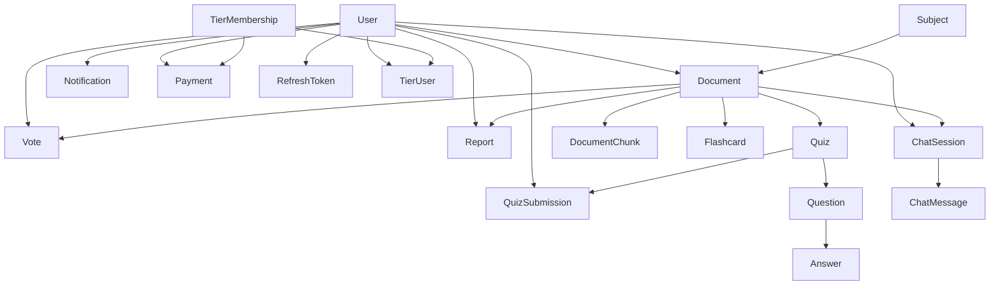

# API Specification

## 1. Document Purpose

This document defines the current and required backend API surface for the BE-SWP project based on the source code in:

- `AIStudyHub.Data`
- `AIStudyHub.Business`
- `AIStudyHub.API`

The source code is treated as the primary source of truth. Where the codebase is incomplete, the specification explicitly labels inferred behavior and assumptions.

This document is intended for:

- Backend developers implementing missing business logic and APIs
- Frontend developers integrating against the backend
- QA engineers deriving test cases and coverage
- Product owners reviewing system behavior and scope

---

## 2. System Purpose

AI Study Hub is an authenticated learning platform centered around user-owned study documents. Users can upload and organize learning materials by subject, interact with documents through AI chat sessions, derive quizzes and flashcards from documents, participate in light community moderation through voting and reporting, and manage membership/payment-related functionality.

At a product level, the system appears to combine:

- Learning content storage
- AI-assisted study support
- Assessment generation
- Subscription or tier-based usage management
- Community feedback and moderation

### Primary Business Goal

Provide a personal and collaborative study environment where users can:

- manage academic documents,
- use AI to study those documents,
- generate study assets such as quizzes and flashcards,
- interact with shared content,
- and potentially upgrade their membership for additional limits.

---

## 3. User Roles

The source code seeds three roles in `ApplicationDbContext` and uses role-based authorization in the API:

- `Student`
- `Educator`
- `Admin`

### 3.1 Student

Assumed to be the default end user.

Capabilities inferred from domain model:

- Register and log in
- Manage own account
- Upload and manage own documents
- Chat with documents
- Create and submit quizzes
- Create and review flashcards
- Vote and report documents
- Receive notifications
- Purchase or upgrade membership tiers

### 3.2 Educator

Not yet functionally differentiated in controllers or services, but present in the domain.

Assumed capabilities:

- Everything a student can do
- Higher-volume or higher-quality content ownership
- Potential future moderation, sharing, or subject/document curation responsibilities

### 3.3 Admin

Explicitly recognized by `[Authorize(Roles = "Admin")]` in `AdminController`.

Current capability in code:

- Access `/api/admin/dashboard`

Expected capability by domain implication:

- Review users, documents, reports, payments, and tier operations
- Manage moderation and operational visibility

### Assumption

The role model is currently shallow in implementation. Only `Admin` is enforced in API authorization. `Student` and `Educator` currently behave the same at runtime unless future business logic is added.

---

## 4. Core Modules

### 4.1 Authentication & Identity

Responsible for:

- registration
- login
- JWT issuance
- refresh tokens
- admin seed account
- role claims in JWT

Relevant files:

- `AIStudyHub.API/Controllers/AuthController.cs`
- `AIStudyHub.Business/Services/AuthService.cs`
- `AIStudyHub.Data/Entities/User.cs`
- `AIStudyHub.Data/Entities/RefreshToken.cs`

### 4.2 User Management

Responsible for:

- CRUD operations on users
- role assignment updates
- activation/status changes
- AI token and storage usage tracking fields

Relevant files:

- `AIStudyHub.API/Controllers/UserController.cs`
- `AIStudyHub.Business/Services/UserService.cs`

### 4.3 Subject Catalog

Responsible for categorizing documents by academic subject.

Relevant files:

- `AIStudyHub.Data/Entities/Subject.cs`
- `ApplicationDbContext.Subjects`

Note: no controller currently exists for subjects.

### 4.4 Document Management

Responsible for:

- document ownership
- metadata
- sharing fields
- subject association
- status lifecycle
- document chunk storage for AI retrieval

Relevant files:

- `AIStudyHub.Data/Entities/Document.cs`
- `AIStudyHub.Data/Entities/DocumentChunk.cs`
- `AIStudyHub.API/Controllers/DocumentController.cs`

### 4.5 AI Chat

Responsible for:

- chat session creation per document
- message storage
- future AI conversation orchestration

Relevant files:

- `AIStudyHub.API/Controllers/ChatController.cs`
- `AIStudyHub.Business/Interfaces/Services/IAIChatService.cs`
- `AIStudyHub.Business/Services/AIChatService.cs`

Note: implementation is currently missing.

### 4.6 Quiz & Assessment

Responsible for:

- quiz definitions derived from documents
- questions and answers
- quiz submissions and scoring

Relevant files:

- `Quiz`, `Question`, `Answer`, `QuizSubmission` entities
- DTOs in `AIStudyHub.Business/DTOs/Quizzes`, `Questions`, `Answers`, `QuizSubmissions`

Note: controllers exist only for `Quiz`; controllers for `Question`, `Answer`, `QuizSubmission` are missing.

### 4.7 Flashcards

Responsible for:

- study card generation and retrieval from documents

Relevant files:

- `AIStudyHub.API/Controllers/FlashcardController.cs`
- `AIStudyHub.Data/Entities/Flashcard.cs`

### 4.8 Community Feedback & Moderation

Responsible for:

- voting on documents
- reporting documents
- lightweight content trust signals

Relevant files:

- `Vote`, `Report` entities
- `VoteController`, `ReportController`

### 4.9 Notifications

Responsible for:

- storing in-app notification messages
- read/unread state

Relevant files:

- `Notification` entity
- `NotificationController`

### 4.10 Membership & Payments

Responsible for:

- membership tiers
- user-tier assignments
- payment records
- AI token and storage entitlement modeling

Relevant files:

- `TierMembership`, `TierUser`, `Payment`
- `PaymentController`

Note: no controllers currently exist for tier membership management.

### 4.11 Administration

Responsible for:

- admin-only operational access
- future dashboard and moderation workflows

Relevant files:

- `AIStudyHub.API/Controllers/AdminController.cs`

---

## 5. Folder Structure Summary

### API Layer

- `AIStudyHub.API/Controllers`
- `AIStudyHub.API/Extensions`
- `AIStudyHub.API/Middleware`

### Business Layer

- `AIStudyHub.Business/DTOs`
- `AIStudyHub.Business/Validators`
- `AIStudyHub.Business/Interfaces/Services`
- `AIStudyHub.Business/Services`
- `AIStudyHub.Business/Mappings`
- `AIStudyHub.Business/Features`
- `AIStudyHub.Business/Behaviors`
- `AIStudyHub.Business/Options`

### Data Layer

- `AIStudyHub.Data/Entities`
- `AIStudyHub.Data/Configurations`
- `AIStudyHub.Data/Enums`
- `AIStudyHub.Data/Repositories`
- `AIStudyHub.Data/Interfaces`
- `AIStudyHub.Data/Extensions`
- `AIStudyHub.Data/Migrations`

---

## 6. Entity Relationship Summary

### 6.1 High-Level Relationship Map




### 6.2 Relationship Details

- A `User` owns many `Document` records.
- A `Document` belongs to one `Subject`.
- A `Document` may have many `DocumentChunk` records for AI retrieval.
- A `Document` may have many `Flashcard`, `Quiz`, `Vote`, `Report`, and `ChatSession` records.
- A `Quiz` belongs to one `Document` and has many `Question` records.
- A `Question` has many `Answer` records.
- A `QuizSubmission` belongs to one `User` and one `Quiz`.
- A `Payment` belongs to one `User` and optionally one `TierMembership`.
- A `TierUser` links `User` to `TierMembership` as membership history or assignment.
- A `ChatSession` belongs to a `User` and a `Document`, and has many `ChatMessage` records.
- A `RefreshToken` belongs to a `User`.

### 6.3 Ownership Model

Most business entities are user-owned directly or indirectly:

- direct ownership: `Document`, `Payment`, `Notification`, `QuizSubmission`, `ChatSession`
- interaction ownership: `Vote`, `Report`
- indirect ownership through document: `Flashcard`, `Quiz`, `Question`, `Answer`

### Assumption

Because service-level ownership checks are mostly not implemented, this specification treats ownership rules as required business behavior rather than guaranteed current behavior.

---

## 7. Existing Enums and Meaning

### `DocumentStatus`

- `Draft`
- `Published`
- `Archived`

### `PaymentStatus`

- `Pending`
- `Completed`
- `Failed`
- `Refunded`

### `QuestionType`

- `SingleChoice`
- `MultipleChoice`
- `TrueFalse`
- `ShortAnswer`

Note: `QuestionType` exists in code but is no longer used by the simplified `Question` entity shape.

### `ReportStatus`

- `Pending`
- `Reviewed`
- `Resolved`
- `Rejected`

Note: `ReportStatus` exists in code but is no longer used by the simplified `Report` entity shape.

### `NotificationType`

- `System`
- `Document`
- `Quiz`
- `Payment`

Note: `NotificationType` exists in code but is no longer used by the simplified `Notification` entity shape.

### `UserRole`

- `Student`
- `Educator`
- `Admin`

Note: roles are currently stored on `User.Role` as strings, while Identity role enforcement uses actual Identity roles.

### `VoteType`

- `Upvote`
- `Downvote`

Mapped in EF to strings:

- `Upvote` -> `up`
- `Downvote` -> `down`

---

## 8. Existing Constants and Configuration Rules

There is no dedicated constants folder, but the following configuration-driven rules exist:

### JWT

From `JwtOptions`:

- `Issuer`
- `Audience`
- `SecretKey`
- `ExpirationMinutes`
- `RefreshTokenExpirationDays`

### Identity Password Policy

Configured in `AddDataAccess`:

- Minimum length: 8
- Require digit: true
- Require lowercase: true
- Require uppercase: true
- Require non-alphanumeric: false

### Default Role Seed

- `Student`
- `Educator`
- `Admin`

### Admin Seed

Configured through `AdminSeed` settings and executed at startup.

---

## 9. Existing Services and Current Implementation State

### Implemented Services

- `AuthService`
- `UserService`

### Present but Unimplemented or Stubbed

- `AIChatService`
- `DocumentService`
- `VoteService`
- `ReportService`
- `FlashcardService`
- `QuizService`
- `QuestionService`
- `AnswerService`
- `QuizSubmissionService`
- `NotificationService`
- `PaymentService`

### Implication

The controller surface is significantly ahead of the business implementation. Many existing routes are contract shells and should not be treated as fully operational product features.

---

# TASK 1 - DOMAIN ANALYSIS

## 10. Domain Analysis

### 10.1 What the System Does

The system is an AI-assisted study platform for storing learning documents and building study interactions around them.

Its intended lifecycle appears to be:

1. user registers and authenticates,
2. user uploads or records academic documents under a subject,
3. document may be shared with others,
4. AI features operate on document content through chunks,
5. derivative study artifacts such as quizzes and flashcards are created,
6. users can interact with content through votes and reports,
7. tier and payment structures control platform capacity and limits.

### 10.2 Main Business Capabilities

- Identity and session management
- User profile management
- Subject-based content organization
- Document storage and metadata management
- AI document chat sessions and messages
- Quiz creation and submission
- Flashcard creation
- Community voting and reporting
- Notification delivery
- Membership and payment tracking
- Admin monitoring

### 10.3 Relationships Between Modules

- Authentication controls access to all other modules except public auth endpoints.
- User management underpins all ownership rules.
- Documents are the central domain object that connects to chat, quizzes, flashcards, voting, and reporting.
- Membership and payments affect storage and AI token consumption.
- Notifications reflect system activity across modules.

### 10.4 Assumed Business Rules

The following are inferred and should be validated with stakeholders:

1. A user should only manage their own documents unless a document is shared or the user is an admin.
2. A user should only access chat sessions they own.
3. Quizzes and flashcards are intended to be derived from documents, not standalone content.
4. Votes and reports are intended for documents that may be discoverable by other users.
5. Membership tiers define platform limits such as storage and AI token allowances.
6. Payments represent user purchases or membership transactions.
7. Notifications are user-specific and should not be globally visible.
8. Admins should have broader cross-tenant visibility than standard users.

### 10.5 Ownership Rules

Required ownership rules inferred from entities:

- `Document.UserId` defines primary content ownership.
- `ChatSession.UserId` defines session ownership.
- `Vote.UserId` and `Report.UserId` define interaction ownership.
- `Payment.UserId` and `Notification.UserId` define user-private records.
- `QuizSubmission.UserId` defines a private learning result.

### 10.6 Permissions

Current implementation:

- public: auth endpoints only
- authenticated: most controllers
- admin-only: admin dashboard endpoint

Required business permission model:

- user can access own user profile and possibly public profile data
- user can manage own content
- shared document consumers can read allowed shared content
- admins can review platform-wide records

---

# TASK 2 - BUSINESS FLOW ANALYSIS

## 11. Workflow: User Registration

### Purpose

Create a new platform account.

### Actor

Guest user.

### Preconditions

- User is not authenticated.
- Email is not already registered.
- Password satisfies identity policy.

### Main Flow

1. Client sends `RegisterRequestDto` to `POST /api/auth/register`.
2. Validator checks full name, email format, and password length.
3. `AuthService` normalizes email.
4. Service ensures email is unique.
5. Service creates `User` with default values:
  - `CurrentStorageCapacity = 0`
  - `CurrentAiTokenUsage = 0`
  - `Status = active`
  - `Role = student`
6. Identity creates the user.
7. Service assigns `Student` role.
8. Service issues JWT and refresh token.
9. API returns `AuthResponseDto`.

### Alternative Flow

- Email already exists -> `409 Conflict`
- Validation fails -> `400 Bad Request`
- Identity creation fails -> `409 Conflict`

### Validation Rules

- Full name required, max 255
- Email required, valid format, max 255
- Password required, min 8, max 100

### Business Rules

- Email is treated case-insensitively.
- New users are active by default.
- New users start with zero AI token usage and zero storage usage.

### Security Rules

- Public endpoint
- Password must never be returned
- JWT must be signed using configured secret

---

## 12. Workflow: User Login

### Purpose

Authenticate an existing user and issue tokens.

### Actor

Registered user.

### Preconditions

- Account exists
- Password is correct
- Account is active

### Main Flow

1. Client sends `LoginRequestDto` to `POST /api/auth/login`.
2. Service normalizes email.
3. Service locates user by email.
4. Password is validated through Identity.
5. Service checks `IsActive` and `Status`.
6. Service issues access token and refresh token.
7. API returns `AuthResponseDto`.

### Alternative Flow

- Invalid email or password -> `401 Unauthorized`
- Inactive user -> `401 Unauthorized`

### Validation Rules

- Email required and valid
- Password required

### Business Rules

- Only active users can log in.
- Roles must be emitted as role claims for authorization.

### Security Rules

- Public endpoint
- Must not reveal whether email or password specifically failed

---

## 13. Workflow: Refresh Token

### Purpose

Obtain a new access token and rotated refresh token.

### Actor

Authenticated session holder with refresh token.

### Preconditions

- Refresh token exists
- Refresh token is active
- Associated user is active

### Main Flow

1. Client sends `RefreshTokenRequestDto`.
2. Service hashes incoming refresh token.
3. Service loads `RefreshToken` including `User`.
4. Service validates token activity and user status.
5. Existing token is revoked and linked to replacement.
6. New refresh token is generated and stored.
7. New JWT is generated.
8. API returns new `AuthResponseDto`.

### Alternative Flow

- Invalid token -> `401 Unauthorized`
- Inactive user -> `401 Unauthorized`

### Validation Rules

- Refresh token required

### Business Rules

- Refresh token rotation should be one-time-use.
- Old token should become unusable after rotation.

### Security Rules

- Public endpoint by transport, but token possession required
- Refresh token storage must remain hashed only

---

## 14. Workflow: User Management

### Purpose

Allow authenticated access to user records and lifecycle management.

### Actor

Authenticated user, admin.

### Preconditions

- Valid JWT

### Main Flow

1. Client calls user endpoints.
2. Controller routes through MediatR.
3. Handlers delegate to `UserService`.
4. `UserService` performs reads or identity-backed writes.

### Alternative Flow

- User not found -> `404 Not Found`
- Duplicate email on create -> `409 Conflict`

### Validation Rules

- `CreateUserRequestDto` and `UpdateUserRequestDto` validators apply

### Business Rules

- Role changes should update both user record and Identity role assignments.
- Status changes should affect `IsActive`.

### Security Rules

- Current code allows any authenticated user to call all user CRUD endpoints.
- Required rule: normal users should not manage arbitrary users.
- Admin-only or self-only restrictions should be introduced.

---

## 15. Workflow: Upload Document

### Purpose

Create a new study document owned by a user under a subject.

### Actor

Authenticated user.

### Preconditions

- Valid JWT
- Subject exists
- User is allowed to create documents

### Main Flow

1. Client sends `CreateDocumentRequestDto`.
2. API validates user id, subject id, title, and metadata lengths.
3. Service should verify subject exists.
4. Service should verify caller matches `UserId` or is admin.
5. Service creates `Document`.
6. Optional ingestion process should create `DocumentChunk` records.
7. API returns created `DocumentResponseDto`.

### Alternative Flow

- Subject not found -> `404 Not Found`
- Ownership mismatch -> `403 Forbidden`
- Quota exceeded -> `409 Conflict`

### Validation Rules

- `UserId` required
- `SubjectId` required
- `Title` required, max 255
- file metadata length constraints apply

### Business Rules

- `SubjectId` is required
- Document must belong to exactly one user
- Sharing mode is governed by `ShareStatus` and `SharedUsers`
- `Status` lifecycle should be controlled and not arbitrary

### Security Rules

- Only owner or admin should create on behalf of a user
- File link and metadata should be sanitized

---

## 16. Workflow: Search and Browse Documents

### Purpose

Allow users to list and retrieve document records.

### Actor

Authenticated user.

### Preconditions

- Valid JWT

### Main Flow

1. Client requests document list or single document.
2. Service should filter by ownership or sharing permissions.
3. Service returns document metadata.

### Alternative Flow

- Document not found -> `404 Not Found`
- Access denied -> `403 Forbidden`

### Validation Rules

- Guid format for id routes

### Business Rules

- A user should not see all documents globally unless intended.
- Public/shared browsing rules are currently missing and should be defined.

### Security Rules

- List endpoints must enforce visibility filtering.
- Current generic CRUD design does not enforce this yet.

---

## 17. Workflow: Share Document

### Purpose

Allow a document owner to make a document accessible to others.

### Actor

Document owner, admin.

### Preconditions

- User owns the document or is admin
- Document exists

### Main Flow

1. Owner updates document sharing fields via document update endpoint.
2. `ShareStatus` is set to a mode such as `private` or shared equivalent.
3. `SharedUsers` stores shared recipient identifiers.
4. Consumers may then access the document based on sharing logic.

### Alternative Flow

- Unauthorized owner -> `403 Forbidden`
- Invalid shared user format -> `400 Bad Request`

### Validation Rules

- `ShareStatus` required, max 20

### Business Rules

- Share model is currently string-based and underdefined.
- Shared users likely need a more explicit relational design.

### Security Rules

- Only document owner or admin may modify sharing.
- Shared access must not expose private content broadly.

---

## 18. Workflow: Chat With Document

### Purpose

Allow a user to create an AI chat session against a document and store messages.

### Actor

Authenticated user.

### Preconditions

- User can access the target document
- Document exists
- AI service or orchestration layer is available

### Main Flow

1. Client creates session using `CreateChatSessionRequestDto`.
2. Service verifies document visibility.
3. Session is stored with `UserId`, `DocumentId`, `SessionTitle`.
4. Client posts a message using `CreateChatMessageRequestDto`.
5. Service maps request to `ChatMessage` with sender `user`.
6. Future AI logic should generate assistant response(s).
7. Session messages are retrievable via `GET /api/chat/sessions/{sessionId}/messages`.

### Alternative Flow

- Document inaccessible -> `403 Forbidden`
- Session not found -> `404 Not Found`
- AI provider failure -> `502 Bad Gateway` or `500 Internal Server Error`

### Validation Rules

- `UserId` required
- `DocumentId` required
- `SessionTitle` required, max 64
- `Message` required

### Business Rules

- Session should belong to one user and one document.
- Chat history should be private unless collaboration is later introduced.
- AI token usage should likely be tracked per message or response.

### Security Rules

- Only the session owner or admin should access messages.
- Prompt content may contain sensitive academic content and should be protected.

---

## 19. Workflow: Generate Quiz

### Purpose

Create a quiz based on a document.

### Actor

Authenticated user.

### Preconditions

- User can access document
- Document exists
- Quiz creation process exists

### Main Flow

1. Client creates quiz using document id.
2. Quiz is associated with `DocumentId`.
3. Questions and answers are created under the quiz.
4. API returns created quiz and related artifacts.

### Alternative Flow

- Document not found -> `404 Not Found`
- Access denied -> `403 Forbidden`
- AI generation failure -> `502 Bad Gateway`

### Validation Rules

- `DocumentId` required
- `Title` required, max 255

### Business Rules

- Quiz is document-scoped.
- Questions should not exist independently of a quiz.
- The system currently lacks question/answer controllers despite entities existing.

### Security Rules

- Only owner, shared user, or admin should create quiz from a document.

---

## 20. Workflow: Generate Flashcards

### Purpose

Create flashcards from document content.

### Actor

Authenticated user.

### Preconditions

- User can access document
- Document exists

### Main Flow

1. Client creates flashcard(s) associated with a document.
2. Flashcards are stored under `DocumentId`.
3. API returns created records.

### Alternative Flow

- Document not found -> `404 Not Found`
- Access denied -> `403 Forbidden`

### Validation Rules

- `DocumentId` required
- `Front` required
- `Back` required

### Business Rules

- Flashcards are document-derived study aids.
- Bulk generation API is currently missing.

### Security Rules

- Only authorized users may create flashcards for a document.

---

## 21. Workflow: Submit Quiz

### Purpose

Submit user answers for a quiz and persist score.

### Actor

Authenticated user.

### Preconditions

- Quiz exists
- User can access quiz/document

### Main Flow

1. Client submits serialized answers.
2. System stores submission with `UserId`, `QuizId`, `Answers`, `Score`, `SubmittedAt`.
3. Response returns submission summary.

### Alternative Flow

- Quiz not found -> `404 Not Found`
- Access denied -> `403 Forbidden`
- Invalid answer payload -> `400 Bad Request`

### Validation Rules

- `UserId` required
- `QuizId` required
- `Score` between 0 and 100 if supplied

### Business Rules

- Score may be nullable until evaluation occurs.
- Each submission should likely be immutable once finalized.

### Security Rules

- Only submitting user or admin should view a submission.
- Score calculation should not trust raw client score in production.

---

## 22. Workflow: Vote Document

### Purpose

Allow a user to express positive or negative feedback on a document.

### Actor

Authenticated user.

### Preconditions

- Document exists
- User can view the document

### Main Flow

1. User posts a vote with `DocumentId` and `VoteType`.
2. Service ensures uniqueness of `(UserId, DocumentId)`.
3. Vote is created or updated.

### Alternative Flow

- Duplicate create attempt -> `409 Conflict`
- Document not found -> `404 Not Found`

### Validation Rules

- `UserId` required
- `DocumentId` required
- `Type` must be valid enum

### Business Rules

- One vote per user per document.
- Vote changes should probably be implemented as update.

### Security Rules

- Caller should not be able to spoof another `UserId`.

---

## 23. Workflow: Report Document

### Purpose

Allow a user to report problematic content.

### Actor

Authenticated user.

### Preconditions

- Document exists
- User can see the document

### Main Flow

1. User posts a report with `UserId`, `DocumentId`, and optional `Reason`.
2. Report is stored.
3. Admin review flow should consume reports later.

### Alternative Flow

- Document not found -> `404 Not Found`
- Access denied -> `403 Forbidden`

### Validation Rules

- `UserId` required
- `DocumentId` required

### Business Rules

- Reporting should create moderation signals.
- A richer report status workflow may be needed; enum exists but entity no longer stores status.

### Security Rules

- Caller identity should be derived from JWT, not trusted from request body alone.

---

## 24. Workflow: Notification Management

### Purpose

Deliver and track simple user notifications.

### Actor

Authenticated user, system, admin.

### Preconditions

- User exists

### Main Flow

1. Notification is created for a target user.
2. User retrieves notifications.
3. User marks notifications read through update.

### Alternative Flow

- Notification not found -> `404 Not Found`
- Unauthorized access -> `403 Forbidden`

### Validation Rules

- `UserId` required on create
- `Message` required

### Business Rules

- Notifications are user-private.
- `IsRead` defaults to `false`.

### Security Rules

- Users should only access their own notifications unless admin.

---

## 25. Workflow: Upgrade Membership

### Purpose

Assign or change a user’s tier membership.

### Actor

Authenticated user, admin, payment workflow.

### Preconditions

- Tier exists
- Payment or entitlement condition satisfied

### Main Flow

1. User selects tier.
2. Payment is created and processed.
3. `TierUser` relation is created or updated.
4. User entitlements such as storage and AI token allowances should take effect.

### Alternative Flow

- Tier not found -> `404 Not Found`
- Payment failure -> `409 Conflict` or `402 Payment Required` in future design

### Validation Rules

- Tier id must be valid

### Business Rules

- Tiers define `StorageLimitMb` and `AiTokens`.
- Membership history may need start/end dates, which are currently missing.

### Security Rules

- Only admin/system should mutate tier assignments directly unless self-service flow is clearly defined.

---

## 26. Workflow: Create Payment

### Purpose

Store a payment or billing transaction.

### Actor

Authenticated user, payment provider callback, system.

### Preconditions

- User exists
- Optional target tier exists

### Main Flow

1. Payment record is created with `PaymentInfo`, `PaymentDate`, `Status`, and optional `TierId`.
2. System later marks payment completed or failed.
3. Successful payment may trigger tier assignment.

### Alternative Flow

- Tier not found -> `404 Not Found`
- Invalid payment data -> `400 Bad Request`

### Validation Rules

- `UserId` required
- `PaymentInfo` required

### Business Rules

- `PaymentInfo` is too generic and likely contains provider details.
- Payment completion should be authoritative for tier upgrade.

### Security Rules

- Users should only see their own payments unless admin.
- Payment status changes should not be openly writable by end users.

---

## 27. Workflow: Admin Dashboard

### Purpose

Provide operational visibility and moderation capability.

### Actor

Admin.

### Preconditions

- Valid admin JWT role claim

### Main Flow

1. Admin calls `/api/admin/dashboard`.
2. API authorizes via role.
3. Future implementation should aggregate counts and operational indicators.

### Alternative Flow

- Non-admin -> `403 Forbidden`

### Validation Rules

- None

### Business Rules

- Dashboard should summarize users, content, reports, payments, and usage.

### Security Rules

- Admin-only endpoint
- Must not expose secrets or sensitive token material

---

# TASK 3 - COMPLETE API LIST

## 28. Existing Implemented Controller Inventory

### Public Auth APIs

- `POST /api/auth/register`
- `POST /api/auth/login`
- `POST /api/auth/refresh-token`

### Authenticated User APIs

- `GET /api/user`
- `GET /api/user/{id}`
- `POST /api/user`
- `PUT /api/user/{id}`
- `DELETE /api/user/{id}`

### Authenticated Document APIs

- `GET /api/document`
- `GET /api/document/{id}`
- `POST /api/document`
- `PUT /api/document/{id}`
- `DELETE /api/document/{id}`

### Authenticated Chat APIs

- `GET /api/chat/sessions`
- `POST /api/chat/sessions`
- `GET /api/chat/sessions/{sessionId}/messages`
- `POST /api/chat/messages`

### Authenticated Flashcard APIs

- `GET /api/flashcard`
- `GET /api/flashcard/{id}`
- `POST /api/flashcard`
- `PUT /api/flashcard/{id}`
- `DELETE /api/flashcard/{id}`

### Authenticated Notification APIs

- `GET /api/notification`
- `GET /api/notification/{id}`
- `POST /api/notification`
- `PUT /api/notification/{id}`
- `DELETE /api/notification/{id}`

### Authenticated Payment APIs

- `GET /api/payment`
- `GET /api/payment/{id}`
- `POST /api/payment`
- `PUT /api/payment/{id}`
- `DELETE /api/payment/{id}`

### Authenticated Quiz APIs

- `GET /api/quiz`
- `GET /api/quiz/{id}`
- `POST /api/quiz`
- `PUT /api/quiz/{id}`
- `DELETE /api/quiz/{id}`

### Authenticated Report APIs

- `GET /api/report`
- `GET /api/report/{id}`
- `POST /api/report`
- `PUT /api/report/{id}`
- `DELETE /api/report/{id}`

### Authenticated Vote APIs

- `GET /api/vote`
- `GET /api/vote/{id}`
- `POST /api/vote`
- `PUT /api/vote/{id}`
- `DELETE /api/vote/{id}`

### Admin APIs

- `GET /api/admin/dashboard`

## 29. Required Additional APIs Missing from Current Controllers

Based on entities, DTOs, and domain behavior, the project still requires explicit APIs for:

- Subjects
- Tier memberships
- Tier assignments
- Questions
- Answers
- Quiz submissions
- Document search/filter/public discovery
- Document sharing management
- AI generation triggers for quizzes and flashcards
- Document chunk ingestion/management (internal or admin)
- My profile / current user profile
- My notifications
- My payments
- My documents
- Admin moderation and analytics

---

## 30. API Specification by Module

## 30.1 Authentication Module

### API Name

Register User

### Endpoint

`POST /api/auth/register`

### Authorization

Public

### Purpose

Create a new platform account and immediately return tokens.

### Request DTO

`RegisterRequestDto`

```json
{
  "fullName": "Nguyen Van A",
  "email": "student@example.com",
  "password": "Password123",
  "dateOfBirth": "2004-10-21"
}
```

### Response DTO

`AuthResponseDto`

```json
{
  "user": {
    "id": "guid",
    "fullName": "Nguyen Van A",
    "email": "student@example.com",
    "dateOfBirth": "2004-10-21",
    "currentStorageCapacity": 0,
    "currentAiTokenUsage": 0,
    "status": "active",
    "role": "student",
    "createdAt": "2026-06-10T03:00:00Z",
    "updatedAt": null
  },
  "accessToken": "jwt",
  "accessTokenExpiresAt": "2026-06-10T04:00:00Z",
  "refreshToken": "opaque-token",
  "refreshTokenExpiresAt": "2026-06-17T03:00:00Z"
}
```

### Business Rules

- Email must be unique.
- New user defaults to active student.

### Validation Rules

- Full name required, max 255
- Email valid, max 255
- Password min 8, max 100

### Possible Errors

- `400` validation error
- `409` email already registered or identity conflict
- `500` unexpected error

---

### API Name

Login User

### Endpoint

`POST /api/auth/login`

### HTTP Method

POST

### Authorization

Public

### Purpose

Authenticate an existing user and issue a new JWT and refresh token.

### Request DTO

`LoginRequestDto`

```json
{
  "email": "student@example.com",
  "password": "Password123"
}
```

### Response DTO

`AuthResponseDto`

Same shape as registration response.

### Business Rules

- Only active users may log in.

### Validation Rules

- Email required and valid
- Password required

### Possible Errors

- `400` validation error
- `401` invalid credentials or inactive account

---

### API Name

Refresh Access Token

### Endpoint

`POST /api/auth/refresh-token`

### HTTP Method

POST

### Authorization

Public

### Purpose

Rotate refresh token and issue a fresh access token.

### Request DTO

`RefreshTokenRequestDto`

```json
{
  "refreshToken": "opaque-token"
}
```

### Response DTO

`AuthResponseDto`

### Business Rules

- Refresh tokens are hashed and rotated.

### Validation Rules

- Refresh token required

### Possible Errors

- `400` validation error
- `401` invalid or revoked refresh token

---

## 30.2 User Module

### API Name

Get Users

### Endpoint

`GET /api/user`

### HTTP Method

GET

### Authorization

Authenticated

### Purpose

Return list of users.

### Request DTO

None

### Response DTO

Array of `UserResponseDto`

### Business Rules

- Current implementation returns all users.
- Recommended final behavior: admin-only or limited projection.

### Validation Rules

- JWT required

### Possible Errors

- `401` unauthenticated
- `403` forbidden in final design

---

### API Name

Get User By Id

### Endpoint

`GET /api/user/{id}`

### HTTP Method

GET

### Authorization

Authenticated

### Purpose

Retrieve a single user.

### Response DTO

`UserResponseDto`

### Business Rules

- Final design should enforce self-or-admin access.

### Possible Errors

- `401`
- `403`
- `404`

---

### API Name

Create User

### Endpoint

`POST /api/user`

### HTTP Method

POST

### Authorization

Authenticated

### Purpose

Create a user via authenticated management flow.

### Request DTO

`CreateUserRequestDto`

```json
{
  "fullName": "Nguyen Van B",
  "email": "teacher@example.com",
  "password": "Password123",
  "dateOfBirth": "1990-05-10",
  "currentStorageCapacity": 0,
  "currentAiTokenUsage": 0,
  "status": "active",
  "role": "educator"
}
```

### Response DTO

`UserResponseDto`

### Business Rules

- Role string should map to Identity role.
- Recommended final behavior: admin-only.

### Validation Rules

Per `CreateUserRequestDtoValidator`

### Possible Errors

- `400`
- `409`

---

### API Name

Update User

### Endpoint

`PUT /api/user/{id}`

### HTTP Method

PUT

### Authorization

Authenticated

### Purpose

Update user profile or account settings.

### Request DTO

`UpdateUserRequestDto`

```json
{
  "fullName": "Nguyen Van B Updated",
  "dateOfBirth": "1990-05-10",
  "currentStorageCapacity": 10,
  "currentAiTokenUsage": 25,
  "status": "active",
  "role": "educator"
}
```

### Response DTO

`UserResponseDto`

### Business Rules

- Role changes should synchronize with Identity roles.

### Possible Errors

- `400`
- `404`
- `409`

---

### API Name

Delete User

### Endpoint

`DELETE /api/user/{id}`

### HTTP Method

DELETE

### Authorization

Authenticated

### Purpose

Delete a user account.

### Response DTO

None

### Business Rules

- Recommended final behavior: self-delete with confirmation or admin delete.

### Possible Errors

- `401`
- `403`
- `404`

---

### API Name

Get My Profile

### Endpoint

`GET /api/user/me`

### HTTP Method

GET

### Authorization

Authenticated

### Purpose

Return current user profile without needing user id.

### Request DTO

None

### Response DTO

`UserResponseDto`

### Business Rules

- Should derive user id from JWT claim.

### Validation Rules

- Valid JWT

### Possible Errors

- `401`

---

## 30.3 Subject Module

### API Name

Get Subjects

### Endpoint

`GET /api/subject`

### HTTP Method

GET

### Authorization

Authenticated

### Purpose

List available academic subjects.

### Request DTO

None

### Response DTO

Recommended DTO:

```json
[
  {
    "id": "guid",
    "subjectCode": "MATH101",
    "subjectName": "Calculus",
    "description": "Basic calculus"
  }
]
```

### Business Rules

- Subjects are shared reference data.

### Validation Rules

- JWT required

### Possible Errors

- `401`

---

### API Name

Get Subject By Id

### Endpoint

`GET /api/subject/{id}`

### HTTP Method

GET

### Authorization

Authenticated

### Purpose

Retrieve a subject.

### Response DTO

Subject DTO

### Possible Errors

- `401`
- `404`

---

### API Name

Create Subject

### Endpoint

`POST /api/subject`

### HTTP Method

POST

### Authorization

Admin

### Purpose

Create a new subject.

### Request DTO

Recommended:

```json
{
  "subjectCode": "PHY101",
  "subjectName": "Physics",
  "description": "Introductory physics"
}
```

### Response DTO

Subject DTO

### Business Rules

- Subject code must be unique.

### Possible Errors

- `400`
- `401`
- `403`
- `409`

---

### API Name

Update Subject

### Endpoint

`PUT /api/subject/{id}`

### HTTP Method

PUT

### Authorization

Admin

### Purpose

Update subject metadata.

### Possible Errors

- `400`
- `403`
- `404`

---

### API Name

Delete Subject

### Endpoint

`DELETE /api/subject/{id}`

### HTTP Method

DELETE

### Authorization

Admin

### Purpose

Delete a subject if no dependent documents block it.

### Possible Errors

- `403`
- `404`
- `409`

---

## 30.4 Document Module

### API Name

Get Documents

### Endpoint

`GET /api/document`

### HTTP Method

GET

### Authorization

Authenticated

### Purpose

List visible documents.

### Request DTO

Query params recommended:

- `subjectId`
- `status`
- `ownerId`
- `search`
- `page`
- `pageSize`

### Response DTO

Array of `DocumentResponseDto`

### Example Response

```json
[
  {
    "id": "guid",
    "userId": "guid",
    "subjectId": "guid",
    "title": "Linear Algebra Notes",
    "fileLink": "https://...",
    "fileName": "algebra.pdf",
    "fileExtension": ".pdf",
    "fileType": "application/pdf",
    "sharedUsers": "userA,userB",
    "shareStatus": "private",
    "status": "Published",
    "createdAt": "2026-06-10T03:00:00Z",
    "updatedAt": null
  }
]
```

### Business Rules

- Final behavior must filter by owner, sharing, or admin access.

### Validation Rules

- Page values positive
- Valid enum for status if used

### Possible Errors

- `401`
- `403`

---

### API Name

Get Document By Id

### Endpoint

`GET /api/document/{id}`

### HTTP Method

GET

### Authorization

Authenticated

### Purpose

Retrieve document details.

### Response DTO

`DocumentResponseDto`

### Business Rules

- Must enforce ownership or sharing visibility.

### Possible Errors

- `401`
- `403`
- `404`

---

### API Name

Create Document

### Endpoint

`POST /api/document`

### HTTP Method

POST

### Authorization

Authenticated

### Purpose

Create a new document.

### Request DTO

`CreateDocumentRequestDto`

```json
{
  "userId": "guid",
  "subjectId": "guid",
  "title": "Linear Algebra Notes",
  "fileLink": "https://storage/doc.pdf",
  "fileName": "doc.pdf",
  "fileExtension": ".pdf",
  "fileType": "application/pdf",
  "sharedUsers": null,
  "shareStatus": "private"
}
```

### Response DTO

`DocumentResponseDto`

### Business Rules

- Caller should match `userId` unless admin.
- Subject must exist.
- Storage quota should be checked.

### Validation Rules

Per `CreateDocumentRequestDtoValidator`

### Possible Errors

- `400`
- `403`
- `404`
- `409`

---

### API Name

Update Document

### Endpoint

`PUT /api/document/{id}`

### HTTP Method

PUT

### Authorization

Authenticated

### Purpose

Update document metadata and sharing settings.

### Request DTO

`UpdateDocumentRequestDto`

```json
{
  "title": "Linear Algebra Notes - Updated",
  "fileLink": "https://storage/doc-v2.pdf",
  "fileName": "doc-v2.pdf",
  "fileExtension": ".pdf",
  "fileType": "application/pdf",
  "sharedUsers": "userA,userB",
  "shareStatus": "shared",
  "status": "Published"
}
```

### Response DTO

`DocumentResponseDto`

### Business Rules

- Only owner or admin should update.

### Possible Errors

- `400`
- `403`
- `404`

---

### API Name

Delete Document

### Endpoint

`DELETE /api/document/{id}`

### HTTP Method

DELETE

### Authorization

Authenticated

### Purpose

Delete a document and dependent content according to cascade rules.

### Business Rules

- Only owner or admin should delete.
- Consider soft delete in future.

### Possible Errors

- `403`
- `404`

---

### API Name

Get My Documents

### Endpoint

`GET /api/document/my`

### HTTP Method

GET

### Authorization

Authenticated

### Purpose

List current user-owned documents.

### Response DTO

Array of `DocumentResponseDto`

### Business Rules

- Uses JWT claim identity instead of request body user id.

### Possible Errors

- `401`

---

### API Name

Search Documents

### Endpoint

`GET /api/document/search`

### HTTP Method

GET

### Authorization

Authenticated

### Purpose

Search visible documents by text and filters.

### Request DTO

Query parameters:

- `keyword`
- `subjectId`
- `status`
- `shareStatus`
- `page`
- `pageSize`

### Response DTO

Paged `DocumentResponseDto` list

### Business Rules

- Search scope must respect visibility rules.

### Possible Errors

- `400`
- `401`

---

## 30.5 Chat Module

### API Name

Get Chat Sessions

### Endpoint

`GET /api/chat/sessions`

### HTTP Method

GET

### Authorization

Authenticated

### Purpose

Retrieve current user’s chat sessions.

### Response DTO

Array of `ChatSessionResponseDto`

```json
[
  {
    "id": "guid",
    "userId": "guid",
    "documentId": "guid",
    "sessionTitle": "Study Session 1",
    "createdAt": "2026-06-10T03:00:00Z",
    "updatedAt": null
  }
]
```

### Business Rules

- Must be filtered to current user unless admin.

### Possible Errors

- `401`

---

### API Name

Create Chat Session

### Endpoint

`POST /api/chat/sessions`

### HTTP Method

POST

### Authorization

Authenticated

### Purpose

Start a chat session for a document.

### Request DTO

`CreateChatSessionRequestDto`

```json
{
  "userId": "guid",
  "documentId": "guid",
  "sessionTitle": "Exam Review"
}
```

### Response DTO

`ChatSessionResponseDto`

### Business Rules

- Caller should match `userId` unless admin.
- Caller must be allowed to access document.

### Validation Rules

- `UserId` required
- `DocumentId` required
- `SessionTitle` required, max 64

### Possible Errors

- `400`
- `403`
- `404`

---

### API Name

Get Session Messages

### Endpoint

`GET /api/chat/sessions/{sessionId}/messages`

### HTTP Method

GET

### Authorization

Authenticated

### Purpose

Retrieve message history for a chat session.

### Response DTO

Array of `ChatMessageResponseDto`

```json
[
  {
    "id": "guid",
    "chatSessionId": "guid",
    "sender": "user",
    "content": "Explain the theorem",
    "createdAt": "2026-06-10T03:05:00Z",
    "updatedAt": null
  }
]
```

### Business Rules

- Session owner or admin only.

### Possible Errors

- `401`
- `403`
- `404`

---

### API Name

Create Chat Message

### Endpoint

`POST /api/chat/messages`

### HTTP Method

POST

### Authorization

Authenticated

### Purpose

Create a user chat message and trigger AI response logic.

### Request DTO

`CreateChatMessageRequestDto`

```json
{
  "sessionId": "guid",
  "message": "Summarize chapter 2"
}
```

### Response DTO

`ChatMessageResponseDto`

### Business Rules

- Service should verify session ownership.
- AI token usage should likely be consumed.
- Final product may return both user message and assistant response.

### Validation Rules

- `SessionId` required
- `Message` required

### Possible Errors

- `400`
- `403`
- `404`
- `502`

---

## 30.6 Quiz Module

### API Name

Get Quizzes

### Endpoint

`GET /api/quiz`

### HTTP Method

GET

### Authorization

Authenticated

### Purpose

List quizzes visible to the caller.

### Response DTO

Array of `QuizResponseDto`

### Possible Errors

- `401`

---

### API Name

Get Quiz By Id

### Endpoint

`GET /api/quiz/{id}`

### HTTP Method

GET

### Authorization

Authenticated

### Purpose

Retrieve a quiz.

### Response DTO

`QuizResponseDto`

### Possible Errors

- `401`
- `403`
- `404`

---

### API Name

Create Quiz

### Endpoint

`POST /api/quiz`

### HTTP Method

POST

### Authorization

Authenticated

### Purpose

Create a quiz under a document.

### Request DTO

`CreateQuizRequestDto`

```json
{
  "documentId": "guid",
  "title": "Midterm Practice"
}
```

### Response DTO

`QuizResponseDto`

### Business Rules

- Document must exist and be accessible.

### Validation Rules

- `DocumentId` required
- `Title` required, max 255

### Possible Errors

- `400`
- `403`
- `404`

---

### API Name

Update Quiz

### Endpoint

`PUT /api/quiz/{id}`

### HTTP Method

PUT

### Authorization

Authenticated

### Purpose

Update quiz metadata.

### Request DTO

`UpdateQuizRequestDto`

```json
{
  "title": "Midterm Practice Updated"
}
```

### Response DTO

`QuizResponseDto`

### Possible Errors

- `400`
- `403`
- `404`

---

### API Name

Delete Quiz

### Endpoint

`DELETE /api/quiz/{id}`

### HTTP Method

DELETE

### Authorization

Authenticated

### Purpose

Delete a quiz and child questions/answers by cascade.

### Possible Errors

- `403`
- `404`

---

### API Name

Generate Quiz From Document

### Endpoint

`POST /api/quiz/generate`

### HTTP Method

POST

### Authorization

Authenticated

### Purpose

Trigger quiz generation from document content.

### Request DTO

Recommended:

```json
{
  "documentId": "guid",
  "title": "Generated Quiz",
  "questionCount": 10
}
```

### Response DTO

Recommended combined response:

- `QuizResponseDto`
- generated questions and answers

### Business Rules

- AI or content generation should use document chunks.
- Caller must have access to document.

### Possible Errors

- `400`
- `403`
- `404`
- `502`

---

## 30.7 Question Module

### API Name

Get Questions By Quiz

### Endpoint

`GET /api/question?quizId={quizId}`

### HTTP Method

GET

### Authorization

Authenticated

### Purpose

List questions for a quiz.

### Response DTO

Array of `QuestionResponseDto`

### Possible Errors

- `401`
- `403`
- `404`

---

### API Name

Get Question By Id

### Endpoint

`GET /api/question/{id}`

### HTTP Method

GET

### Authorization

Authenticated

### Purpose

Retrieve a question.

### Response DTO

`QuestionResponseDto`

### Possible Errors

- `401`
- `403`
- `404`

---

### API Name

Create Question

### Endpoint

`POST /api/question`

### HTTP Method

POST

### Authorization

Authenticated

### Purpose

Create question under a quiz.

### Request DTO

`CreateQuestionRequestDto`

```json
{
  "quizId": "guid",
  "title": "What is the derivative of x^2?"
}
```

### Response DTO

`QuestionResponseDto`

### Validation Rules

- `QuizId` required
- `Title` required

### Possible Errors

- `400`
- `403`
- `404`

---

### API Name

Update Question

### Endpoint

`PUT /api/question/{id}`

### HTTP Method

PUT

### Authorization

Authenticated

### Purpose

Update question content.

### Request DTO

`UpdateQuestionRequestDto`

```json
{
  "title": "Updated question text"
}
```

### Response DTO

`QuestionResponseDto`

### Possible Errors

- `400`
- `403`
- `404`

---

### API Name

Delete Question

### Endpoint

`DELETE /api/question/{id}`

### HTTP Method

DELETE

### Authorization

Authenticated

### Purpose

Delete question and its answers.

### Possible Errors

- `403`
- `404`

---

## 30.8 Answer Module

### API Name

Get Answers By Question

### Endpoint

`GET /api/answer?questionId={questionId}`

### HTTP Method

GET

### Authorization

Authenticated

### Purpose

Retrieve answers for a question.

### Response DTO

Array of `AnswerResponseDto`

### Possible Errors

- `401`
- `403`
- `404`

---

### API Name

Create Answer

### Endpoint

`POST /api/answer`

### HTTP Method

POST

### Authorization

Authenticated

### Purpose

Create answer option under a question.

### Request DTO

`CreateAnswerRequestDto`

```json
{
  "questionId": "guid",
  "selectedOption": "2x",
  "isCorrect": true
}
```

### Response DTO

`AnswerResponseDto`

### Validation Rules

- `QuestionId` required
- `SelectedOption` required

### Possible Errors

- `400`
- `403`
- `404`

---

### API Name

Update Answer

### Endpoint

`PUT /api/answer/{id}`

### HTTP Method

PUT

### Authorization

Authenticated

### Purpose

Update answer text or correctness.

### Request DTO

`UpdateAnswerRequestDto`

```json
{
  "selectedOption": "2x",
  "isCorrect": true
}
```

### Response DTO

`AnswerResponseDto`

### Possible Errors

- `400`
- `403`
- `404`

---

### API Name

Delete Answer

### Endpoint

`DELETE /api/answer/{id}`

### HTTP Method

DELETE

### Authorization

Authenticated

### Purpose

Delete answer option.

### Possible Errors

- `403`
- `404`

---

## 30.9 Quiz Submission Module

### API Name

Get My Quiz Submissions

### Endpoint

`GET /api/quiz-submission/my`

### HTTP Method

GET

### Authorization

Authenticated

### Purpose

List current user's quiz submissions.

### Response DTO

Array of `QuizSubmissionResponseDto`

### Possible Errors

- `401`

---

### API Name

Get Quiz Submission By Id

### Endpoint

`GET /api/quiz-submission/{id}`

### HTTP Method

GET

### Authorization

Authenticated

### Purpose

Retrieve a submission.

### Response DTO

`QuizSubmissionResponseDto`

### Business Rules

- Only owner or admin may read.

### Possible Errors

- `401`
- `403`
- `404`

---

### API Name

Create Quiz Submission

### Endpoint

`POST /api/quiz-submission`

### HTTP Method

POST

### Authorization

Authenticated

### Purpose

Submit quiz answers.

### Request DTO

`CreateQuizSubmissionRequestDto`

```json
{
  "userId": "guid",
  "quizId": "guid",
  "answers": "{\"q1\":\"a2\"}",
  "score": 80
}
```

### Response DTO

`QuizSubmissionResponseDto`

### Business Rules

- In final design, server should compute score instead of trusting client score.

### Validation Rules

- `UserId` required
- `QuizId` required
- `Score` if supplied must be between 0 and 100

### Possible Errors

- `400`
- `403`
- `404`

---

## 30.10 Flashcard Module

### API Name

Get Flashcards

### Endpoint

`GET /api/flashcard`

### HTTP Method

GET

### Authorization

Authenticated

### Purpose

List flashcards visible to the user.

### Response DTO

Array of `FlashcardResponseDto`

---

### API Name

Get Flashcard By Id

### Endpoint

`GET /api/flashcard/{id}`

### HTTP Method

GET

### Authorization

Authenticated

### Purpose

Retrieve a flashcard.

### Response DTO

`FlashcardResponseDto`

---

### API Name

Create Flashcard

### Endpoint

`POST /api/flashcard`

### HTTP Method

POST

### Authorization

Authenticated

### Purpose

Create a flashcard for a document.

### Request DTO

`CreateFlashcardRequestDto`

```json
{
  "documentId": "guid",
  "front": "Definition of derivative",
  "back": "Instantaneous rate of change"
}
```

### Response DTO

`FlashcardResponseDto`

### Validation Rules

- `DocumentId` required
- `Front` required
- `Back` required

### Possible Errors

- `400`
- `403`
- `404`

---

### API Name

Update Flashcard

### Endpoint

`PUT /api/flashcard/{id}`

### HTTP Method

PUT

### Authorization

Authenticated

### Purpose

Update flashcard content.

### Request DTO

`UpdateFlashcardRequestDto`

```json
{
  "front": "Updated front",
  "back": "Updated back"
}
```

### Response DTO

`FlashcardResponseDto`

---

### API Name

Delete Flashcard

### Endpoint

`DELETE /api/flashcard/{id}`

### HTTP Method

DELETE

### Authorization

Authenticated

### Purpose

Delete flashcard.

---

### API Name

Generate Flashcards From Document

### Endpoint

`POST /api/flashcard/generate`

### HTTP Method

POST

### Authorization

Authenticated

### Purpose

Generate flashcards from a document using AI or document chunking.

### Request DTO

Recommended:

```json
{
  "documentId": "guid",
  "count": 10
}
```

### Response DTO

Array of `FlashcardResponseDto`

### Possible Errors

- `400`
- `403`
- `404`
- `502`

---

## 30.11 Vote Module

### API Name

Get Votes

### Endpoint

`GET /api/vote`

### HTTP Method

GET

### Authorization

Authenticated

### Purpose

List votes.

### Response DTO

Array of `VoteResponseDto`

### Business Rules

- Final design should likely scope to current user, document, or admin.

---

### API Name

Get Vote By Id

### Endpoint

`GET /api/vote/{id}`

### HTTP Method

GET

### Authorization

Authenticated

### Purpose

Retrieve a vote record.

### Response DTO

`VoteResponseDto`

---

### API Name

Create Vote

### Endpoint

`POST /api/vote`

### HTTP Method

POST

### Authorization

Authenticated

### Purpose

Create vote on document.

### Request DTO

`CreateVoteRequestDto`

```json
{
  "userId": "guid",
  "documentId": "guid",
  "type": 1
}
```

### Response DTO

`VoteResponseDto`

### Business Rules

- One vote per user per document.

### Validation Rules

- `UserId` required
- `DocumentId` required
- `Type` enum valid

### Possible Errors

- `400`
- `403`
- `404`
- `409`

---

### API Name

Update Vote

### Endpoint

`PUT /api/vote/{id}`

### HTTP Method

PUT

### Authorization

Authenticated

### Purpose

Change an existing vote.

### Request DTO

`UpdateVoteRequestDto`

```json
{
  "type": 2
}
```

### Response DTO

`VoteResponseDto`

---

### API Name

Delete Vote

### Endpoint

`DELETE /api/vote/{id}`

### HTTP Method

DELETE

### Authorization

Authenticated

### Purpose

Remove vote.

---

## 30.12 Report Module

### API Name

Get Reports

### Endpoint

`GET /api/report`

### HTTP Method

GET

### Authorization

Authenticated

### Purpose

Retrieve reports.

### Business Rules

- Final design should likely be admin-only or owner-restricted.

---

### API Name

Get Report By Id

### Endpoint

`GET /api/report/{id}`

### HTTP Method

GET

### Authorization

Authenticated

### Purpose

Retrieve a report.

---

### API Name

Create Report

### Endpoint

`POST /api/report`

### HTTP Method

POST

### Authorization

Authenticated

### Purpose

Create report for document.

### Request DTO

`CreateReportRequestDto`

```json
{
  "userId": "guid",
  "documentId": "guid",
  "reason": "Inappropriate content"
}
```

### Response DTO

`ReportResponseDto`

### Validation Rules

- `UserId` required
- `DocumentId` required

### Possible Errors

- `400`
- `403`
- `404`

---

### API Name

Update Report

### Endpoint

`PUT /api/report/{id}`

### HTTP Method

PUT

### Authorization

Authenticated

### Purpose

Update report content.

### Request DTO

`UpdateReportRequestDto`

```json
{
  "reason": "Updated reason"
}
```

### Response DTO

`ReportResponseDto`

### Business Rules

- In final design, admin moderation should likely use status fields instead.

---

### API Name

Delete Report

### Endpoint

`DELETE /api/report/{id}`

### HTTP Method

DELETE

### Authorization

Authenticated

### Purpose

Delete report.

---

## 30.13 Notification Module

### API Name

Get Notifications

### Endpoint

`GET /api/notification`

### HTTP Method

GET

### Authorization

Authenticated

### Purpose

List notifications.

### Response DTO

Array of `NotificationResponseDto`

### Business Rules

- Final behavior should return only current user's notifications unless admin.

---

### API Name

Get Notification By Id

### Endpoint

`GET /api/notification/{id}`

### HTTP Method

GET

### Authorization

Authenticated

### Purpose

Retrieve a notification.

---

### API Name

Create Notification

### Endpoint

`POST /api/notification`

### HTTP Method

POST

### Authorization

Authenticated or System/Admin

### Purpose

Create a notification for a user.

### Request DTO

`CreateNotificationRequestDto`

```json
{
  "userId": "guid",
  "message": "Your payment has completed"
}
```

### Response DTO

`NotificationResponseDto`

### Validation Rules

- `UserId` required
- `Message` required

### Possible Errors

- `400`
- `403`
- `404`

---

### API Name

Update Notification

### Endpoint

`PUT /api/notification/{id}`

### HTTP Method

PUT

### Authorization

Authenticated

### Purpose

Update notification read state or content.

### Request DTO

`UpdateNotificationRequestDto`

```json
{
  "message": "Your payment has completed",
  "isRead": true
}
```

### Response DTO

`NotificationResponseDto`

### Business Rules

- End users should usually only toggle `IsRead`, not rewrite message content.

---

### API Name

Delete Notification

### Endpoint

`DELETE /api/notification/{id}`

### HTTP Method

DELETE

### Authorization

Authenticated

### Purpose

Delete notification.

---

## 30.14 Payment Module

### API Name

Get Payments

### Endpoint

`GET /api/payment`

### HTTP Method

GET

### Authorization

Authenticated

### Purpose

List payments.

### Response DTO

Array of `PaymentResponseDto`

### Business Rules

- Final design should scope to current user or admin.

---

### API Name

Get Payment By Id

### Endpoint

`GET /api/payment/{id}`

### HTTP Method

GET

### Authorization

Authenticated

### Purpose

Retrieve a payment record.

### Response DTO

`PaymentResponseDto`

---

### API Name

Create Payment

### Endpoint

`POST /api/payment`

### HTTP Method

POST

### Authorization

Authenticated

### Purpose

Create payment record.

### Request DTO

`CreatePaymentRequestDto`

```json
{
  "userId": "guid",
  "paymentInfo": "VNPay transaction payload",
  "paymentDate": "2026-06-10T03:00:00Z",
  "tierId": "guid"
}
```

### Response DTO

`PaymentResponseDto`

### Validation Rules

- `UserId` required
- `PaymentInfo` required

### Possible Errors

- `400`
- `403`
- `404`

---

### API Name

Update Payment

### Endpoint

`PUT /api/payment/{id}`

### HTTP Method

PUT

### Authorization

Authenticated

### Purpose

Update payment data or status.

### Request DTO

`UpdatePaymentRequestDto`

```json
{
  "paymentInfo": "Updated provider payload",
  "status": 2,
  "tierId": "guid"
}
```

### Response DTO

`PaymentResponseDto`

### Business Rules

- End users should not arbitrarily mark payments completed.

---

### API Name

Delete Payment

### Endpoint

`DELETE /api/payment/{id}`

### HTTP Method

DELETE

### Authorization

Authenticated or Admin

### Purpose

Delete payment record if allowed by policy.

---

### API Name

Get My Payments

### Endpoint

`GET /api/payment/my`

### HTTP Method

GET

### Authorization

Authenticated

### Purpose

List current user's payments.

### Response DTO

Array of `PaymentResponseDto`

---

## 30.15 Membership & Tier Module

### API Name

Get Tiers

### Endpoint

`GET /api/tier`

### HTTP Method

GET

### Authorization

Authenticated

### Purpose

List membership tiers.

### Example Response

```json
[
  {
    "id": "guid",
    "tierName": "Premium",
    "storageLimitMb": 2048,
    "aiTokens": 50000
  }
]
```

### Business Rules

- Tiers are catalog data and should be visible to users evaluating upgrade options.

---

### API Name

Get Tier By Id

### Endpoint

`GET /api/tier/{id}`

### HTTP Method

GET

### Authorization

Authenticated

### Purpose

Retrieve a membership tier.

---

### API Name

Create Tier

### Endpoint

`POST /api/tier`

### HTTP Method

POST

### Authorization

Admin

### Purpose

Create new membership tier.

### Request DTO

Recommended:

```json
{
  "tierName": "Premium",
  "storageLimitMb": 2048,
  "aiTokens": 50000
}
```

### Possible Errors

- `400`
- `403`
- `409`

---

### API Name

Assign Tier To User

### Endpoint

`POST /api/tier-user`

### HTTP Method

POST

### Authorization

Admin or system workflow

### Purpose

Assign a tier to a user.

### Request DTO

Recommended:

```json
{
  "userId": "guid",
  "tierMembershipId": "guid"
}
```

### Business Rules

- In self-service purchase flow this should likely happen after successful payment.

---

### API Name

Get My Active Tier

### Endpoint

`GET /api/tier-user/my`

### HTTP Method

GET

### Authorization

Authenticated

### Purpose

Get current user's tier assignment.

---

## 30.16 Admin Module

### API Name

Get Admin Dashboard

### Endpoint

`GET /api/admin/dashboard`

### HTTP Method

GET

### Authorization

Admin

### Purpose

Operational summary for admins.

### Response DTO

Recommended:

```json
{
  "totalUsers": 100,
  "totalDocuments": 250,
  "totalReports": 5,
  "pendingPayments": 2,
  "activeSubscriptions": 45
}
```

### Business Rules

- Admin only.
- Should aggregate moderation, content, user, and payment metrics.

### Possible Errors

- `401`
- `403`

---

### API Name

Get Reports Queue

### Endpoint

`GET /api/admin/reports`

### HTTP Method

GET

### Authorization

Admin

### Purpose

List moderation reports.

---

### API Name

Get Users Overview

### Endpoint

`GET /api/admin/users`

### HTTP Method

GET

### Authorization

Admin

### Purpose

List users for operational management.

---

### API Name

Get Payments Overview

### Endpoint

`GET /api/admin/payments`

### HTTP Method

GET

### Authorization

Admin

### Purpose

List and filter payment records.

---

# TASK 4 - IMPLEMENTATION PRIORITY

## 31. Phase Classification

### Phase 1 - Critical Foundation

Includes:

- Auth APIs
- Current user profile APIs
- User lifecycle restrictions
- Subject APIs
- Core document CRUD with ownership enforcement
- Global error handling hardening
- JWT and Identity correctness

### Why This Phase Exists

These APIs establish authentication, identity, and secure ownership boundaries. Without them, every downstream module remains unsafe or unusable.

### Phase 2 - Core Features

Includes:

- Document search and listing
- Document sharing management
- Vote APIs
- Report APIs
- Notification APIs

### Why This Phase Exists

These features make document management and collaboration usable as a real product instead of a personal storage shell.

### Phase 3 - AI Features

Includes:

- Chat session/message implementation
- Document chunk ingestion pipeline
- Quiz generation APIs
- Flashcard generation APIs
- Quiz submission scoring pipeline

### Why This Phase Exists

These capabilities are the platform differentiator and likely the primary product value proposition.

### Phase 4 - Community Features

Includes:

- Shared document discovery
- Moderation visibility
- richer notification flows
- possible public/community browsing rules

### Why This Phase Exists

These features increase engagement, trust, and collaboration after the platform becomes functionally stable.

### Phase 5 - Subscription & Payment

Includes:

- Tier catalog APIs
- Tier assignment APIs
- Payment provider integration flows
- AI token/storage entitlement enforcement

### Why This Phase Exists

Monetization and quota enforcement should come after core study functionality is stable and measurable.

### Phase 6 - Admin Features

Includes:

- Admin dashboard
- report queue
- user oversight
- payment oversight
- subject/tier management improvements

### Why This Phase Exists

Administrative visibility and governance complete the operational maturity of the platform.

---

# TASK 5 - FRONTEND CONTRACT

## 32. Frontend Integration Contract Summary

This section gives frontend developers immediate payload guidance for the most important APIs.

### 32.1 Auth

#### `POST /api/auth/register`

Request:

```json
{
  "fullName": "Nguyen Van A",
  "email": "student@example.com",
  "password": "Password123",
  "dateOfBirth": "2004-10-21"
}
```

Response:

```json
{
  "user": {
    "id": "guid",
    "fullName": "Nguyen Van A",
    "email": "student@example.com",
    "dateOfBirth": "2004-10-21",
    "currentStorageCapacity": 0,
    "currentAiTokenUsage": 0,
    "status": "active",
    "role": "student",
    "createdAt": "2026-06-10T03:00:00Z",
    "updatedAt": null
  },
  "accessToken": "jwt",
  "accessTokenExpiresAt": "2026-06-10T04:00:00Z",
  "refreshToken": "opaque-token",
  "refreshTokenExpiresAt": "2026-06-17T03:00:00Z"
}
```

#### `POST /api/auth/login`

Request:

```json
{
  "email": "student@example.com",
  "password": "Password123"
}
```

Response: same shape as register response.

#### `POST /api/auth/refresh-token`

Request:

```json
{
  "refreshToken": "opaque-token"
}
```

Response: same shape as register response.

### 32.2 User

#### `GET /api/user/{id}`

Response:

```json
{
  "id": "guid",
  "fullName": "Nguyen Van A",
  "email": "student@example.com",
  "dateOfBirth": "2004-10-21",
  "currentStorageCapacity": 10,
  "currentAiTokenUsage": 120,
  "status": "active",
  "role": "student",
  "createdAt": "2026-06-10T03:00:00Z",
  "updatedAt": null
}
```

#### `PUT /api/user/{id}`

Request:

```json
{
  "fullName": "Updated User",
  "dateOfBirth": "2004-10-21",
  "currentStorageCapacity": 10,
  "currentAiTokenUsage": 150,
  "status": "active",
  "role": "student"
}
```

Response: `UserResponseDto`

### 32.3 Document

#### `POST /api/document`

Request:

```json
{
  "userId": "guid",
  "subjectId": "guid",
  "title": "Linear Algebra Notes",
  "fileLink": "https://storage/doc.pdf",
  "fileName": "doc.pdf",
  "fileExtension": ".pdf",
  "fileType": "application/pdf",
  "sharedUsers": null,
  "shareStatus": "private"
}
```

Response:

```json
{
  "id": "guid",
  "userId": "guid",
  "subjectId": "guid",
  "title": "Linear Algebra Notes",
  "fileLink": "https://storage/doc.pdf",
  "fileName": "doc.pdf",
  "fileExtension": ".pdf",
  "fileType": "application/pdf",
  "sharedUsers": null,
  "shareStatus": "private",
  "status": "Draft",
  "createdAt": "2026-06-10T03:00:00Z",
  "updatedAt": null
}
```

#### `PUT /api/document/{id}`

Request:

```json
{
  "title": "Updated Notes",
  "fileLink": "https://storage/doc-v2.pdf",
  "fileName": "doc-v2.pdf",
  "fileExtension": ".pdf",
  "fileType": "application/pdf",
  "sharedUsers": "userA,userB",
  "shareStatus": "shared",
  "status": "Published"
}
```

Response: `DocumentResponseDto`

### 32.4 Chat

#### `POST /api/chat/sessions`

Request:

```json
{
  "userId": "guid",
  "documentId": "guid",
  "sessionTitle": "Exam Review"
}
```

Response:

```json
{
  "id": "guid",
  "userId": "guid",
  "documentId": "guid",
  "sessionTitle": "Exam Review",
  "createdAt": "2026-06-10T03:00:00Z",
  "updatedAt": null
}
```

#### `POST /api/chat/messages`

Request:

```json
{
  "sessionId": "guid",
  "message": "Summarize chapter 2"
}
```

Response:

```json
{
  "id": "guid",
  "chatSessionId": "guid",
  "sender": "user",
  "content": "Summarize chapter 2",
  "createdAt": "2026-06-10T03:01:00Z",
  "updatedAt": null
}
```

### 32.5 Quiz

#### `POST /api/quiz`

Request:

```json
{
  "documentId": "guid",
  "title": "Midterm Practice"
}
```

Response:

```json
{
  "id": "guid",
  "documentId": "guid",
  "title": "Midterm Practice",
  "createdAt": "2026-06-10T03:00:00Z",
  "updatedAt": null
}
```

### 32.6 Flashcard

#### `POST /api/flashcard`

Request:

```json
{
  "documentId": "guid",
  "front": "Definition of derivative",
  "back": "Instantaneous rate of change"
}
```

Response:

```json
{
  "id": "guid",
  "documentId": "guid",
  "front": "Definition of derivative",
  "back": "Instantaneous rate of change",
  "createdAt": "2026-06-10T03:00:00Z",
  "updatedAt": null
}
```

### 32.7 Payment

#### `POST /api/payment`

Request:

```json
{
  "userId": "guid",
  "paymentInfo": "VNPay payload",
  "paymentDate": "2026-06-10T03:00:00Z",
  "tierId": "guid"
}
```

Response:

```json
{
  "id": "guid",
  "userId": "guid",
  "paymentInfo": "VNPay payload",
  "paymentDate": "2026-06-10T03:00:00Z",
  "status": "Pending",
  "tierId": "guid",
  "createdAt": "2026-06-10T03:00:00Z",
  "updatedAt": null
}
```

### 32.8 Notification

#### `POST /api/notification`

Request:

```json
{
  "userId": "guid",
  "message": "Your payment has completed"
}
```

Response:

```json
{
  "id": "guid",
  "userId": "guid",
  "message": "Your payment has completed",
  "isRead": false,
  "createdAt": "2026-06-10T03:00:00Z",
  "updatedAt": null
}
```

### 32.9 Vote

#### `POST /api/vote`

Request:

```json
{
  "userId": "guid",
  "documentId": "guid",
  "type": 1
}
```

Response:

```json
{
  "id": "guid",
  "userId": "guid",
  "documentId": "guid",
  "type": 1,
  "createdAt": "2026-06-10T03:00:00Z",
  "updatedAt": null
}
```

### 32.10 Report

#### `POST /api/report`

Request:

```json
{
  "userId": "guid",
  "documentId": "guid",
  "reason": "Inappropriate content"
}
```

Response:

```json
{
  "id": "guid",
  "userId": "guid",
  "documentId": "guid",
  "reason": "Inappropriate content",
  "createdAt": "2026-06-10T03:00:00Z",
  "updatedAt": null
}
```

---

# TASK 6 - ARCHITECTURE REVIEW

## 33. Architectural Issues

### 33.1 Controllers Exist Before Services

Many controllers are wired to stub services inherited from `CrudService` that still throw `NotImplementedException`. This creates a false sense of completion in the API layer.

### 33.2 Generic CRUD Base Leaks Domain Rules

`CrudControllerBase` assumes all modules are simple CRUD resources with identical access patterns. That is not suitable for:

- user security
- document visibility
- payments
- moderation
- AI chat
- quiz submission scoring

### 33.3 Ownership Enforcement Is Missing

Request DTOs include `UserId` on many endpoints, but ownership is not consistently derived from JWT claims. This allows future spoofing risk if services are implemented naively.

### 33.4 Simplified Entities Lost Important Workflow State

Recent schema simplification removed business fields such as:

- report status
- notification type
- question type
- quiz timing and passing score

This makes several expected workflows harder to implement or audit.

## 34. Design Flaws

### 34.1 Role Stored as String While Enum and Identity Role Both Exist

The system currently mixes:

- `UserRole` enum
- Identity roles
- `User.Role` string

This creates duplication and synchronization risk.

### 34.2 SharedUsers as String

`Document.SharedUsers` is a string field instead of a relational join table. This makes validation, searching, auditing, and permission checking brittle.

### 34.3 PaymentInfo as Unstructured Blob

`PaymentInfo` is too generic. Payment workflows usually need strongly typed fields like provider, amount, currency, transaction id, and external reference.

### 34.4 QuizSubmission.Answers as Serialized String

Storing answers as raw string reduces queryability, validation, and analytics quality.

### 34.5 FullName Unique Index

`UserConfiguration` makes `FullName` unique, which is a questionable product rule and likely invalid in real systems.

## 35. Technical Risks

### 35.1 AI Token Usage Is Tracked But Not Enforced

`CurrentAiTokenUsage` exists, but no service currently enforces quota, replenishment, or period reset.

### 35.2 Storage Capacity Is Tracked But Not Enforced

`CurrentStorageCapacity` exists, but no upload accounting logic is visible.

### 35.3 Refresh Token Table Growth

Refresh tokens are rotated and retained. Without cleanup jobs, this table may grow indefinitely.

### 35.4 Migration Churn Risk

The schema has already undergone strong simplification changes. Further rapid shape changes may destabilize API contracts and data migration safety.

## 36. Missing APIs

Missing but required APIs include:

- subject CRUD
- question CRUD
- answer CRUD
- quiz submission CRUD or at least submit/get-my-submissions
- tier catalog and tier assignment APIs
- current-user endpoints (`/me`)
- document search APIs
- document sharing APIs
- quiz generation API
- flashcard generation API
- admin moderation endpoints
- admin payment monitoring endpoints

## 37. Missing Business Logic

Not implemented or incomplete:

- `DocumentService`
- `VoteService`
- `ReportService`
- `FlashcardService`
- `QuizService`
- `QuestionService`
- `AnswerService`
- `QuizSubmissionService`
- `NotificationService`
- `PaymentService`
- `AIChatService`

Also missing:

- document access control
- sharing resolution logic
- quiz scoring engine
- AI orchestration
- tier entitlement application
- payment confirmation workflow

## 38. Missing Entities

Potential missing entities for a mature version of the product:

- `DocumentShare` join table
- `PaymentTransaction` or `PaymentProviderEvent`
- `UserSubscription` with active period and expiry
- `QuizAttemptAnswer` normalized table
- `AuditLog`
- `AdminActionLog`
- `AiUsageLog`
- `DocumentTag`
- `Bookmark` or `Favorite`

## 39. Security Risks

### 39.1 ID Spoofing Risk

Many request DTOs accept `UserId` from client input. Services must ignore or validate this against JWT claims.

### 39.2 Missing Authorization Granularity

Most routes only require authentication, not ownership or role-specific checks.

### 39.3 No Rate Limiting

Auth and future AI endpoints should have rate limiting, especially login and chat endpoints.

### 39.4 No Explicit File Access Security Model

Document file links may expose external storage locations without signed URL governance.

### 39.5 Notification and Payment Visibility Risk

Without ownership filters, authenticated users may be able to view or mutate private records if services are implemented generically.

## 40. Scalability Risks

### 40.1 No Pagination Contracts

List endpoints currently return `IReadOnlyList<T>` with no pagination envelope.

### 40.2 No Query Optimization Strategy

Generic repositories with `GetAllAsync()` can lead to full table scans and unbounded list returns.

### 40.3 Serialized Large Fields

Fields like `PaymentInfo`, `SharedUsers`, `ChunkJson`, `EmbeddingJson`, and `Answers` may grow large and reduce query efficiency.

### 40.4 AI Workloads Likely Need Async Processing

Chat, quiz generation, flashcard generation, and document chunking may require background processing and queue-based orchestration.

## 41. Performance Risks

### 41.1 Reflection in CrudControllerBase

`GetResponseId` uses reflection for `CreatedAtAction`, which is minor but avoidable.

### 41.2 Eager Unbounded Reads

Generic repository reads everything with no pagination or filtering defaults.

### 41.3 Missing Caching

Reference data like subjects and tiers are good candidates for caching.

### 41.4 Potential N+1 Risks in Future Implementations

Once services load document-related aggregates, naive repository usage may cause N+1 problems if projections are not designed carefully.

---

## 42. Recommended Next Steps

1. Lock down authorization and ownership rules before implementing remaining CRUD services.
2. Add `Subject`, `Question`, `Answer`, `QuizSubmission`, and `Tier` controllers/services.
3. Replace string-based sharing with a relational share model.
4. Redesign payment schema to include structured billing fields.
5. Define AI workflows explicitly, including token accounting and chunk ingestion.
6. Add paginated list response envelopes.
7. Introduce `/me` endpoints for user-scoped resources.
8. Expand admin APIs for moderation and monitoring.
9. Restore or redesign missing moderation and quiz state fields where product needs them.
10. Add QA scenarios for ownership, role enforcement, and token rotation.

---

## 43. Assumption Log

This document makes the following explicit assumptions because the codebase is incomplete:

1. Documents are intended to support both private and shared access.
2. Quizzes and flashcards are intended to be document-derived AI learning artifacts.
3. Membership tiers influence AI and storage quotas.
4. End users should not be able to operate on arbitrary users’ data even though many current endpoints do not yet enforce this.
5. Admin dashboard will evolve into an operational console.
6. Search, generation, and moderation APIs are required even if not yet implemented in code.

These assumptions should be validated with product stakeholders before implementation begins.