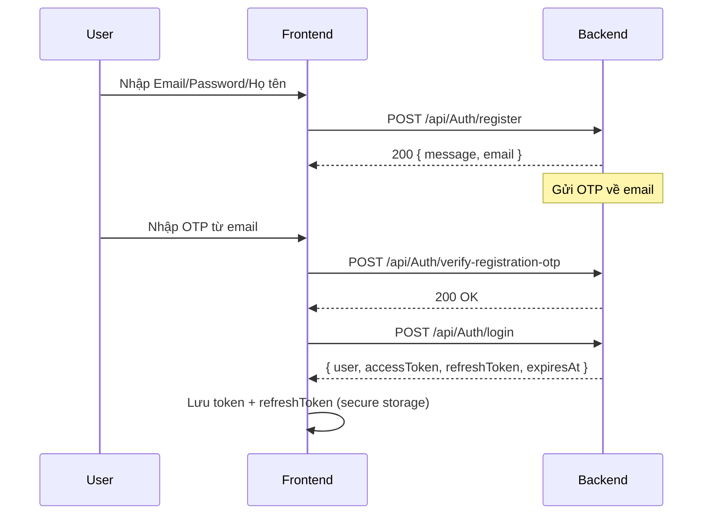
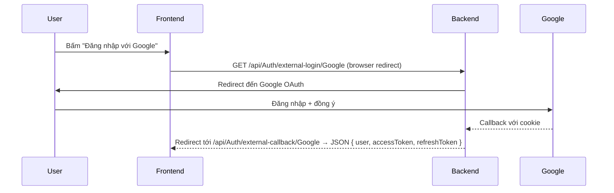
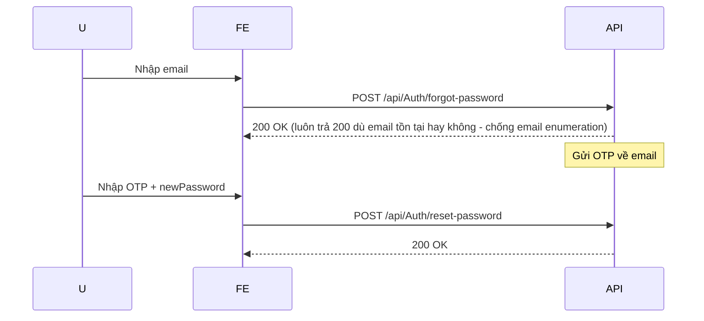
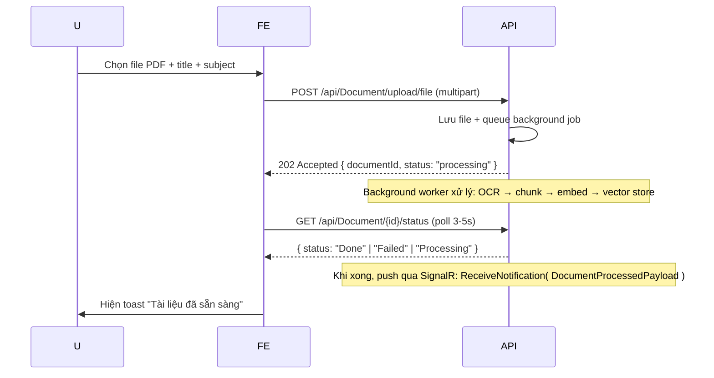
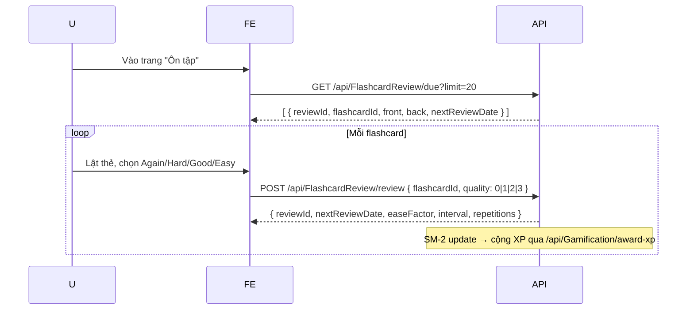
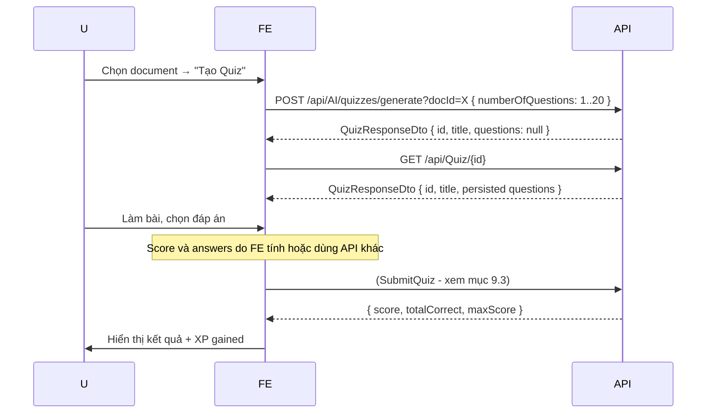
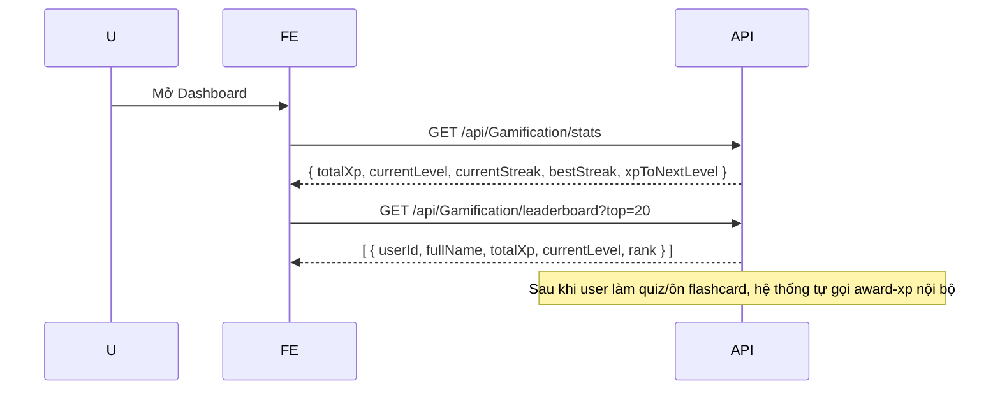
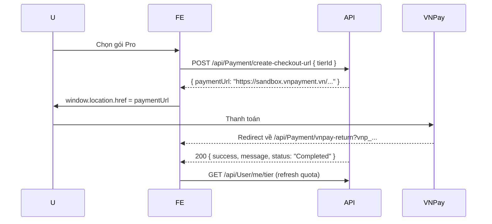
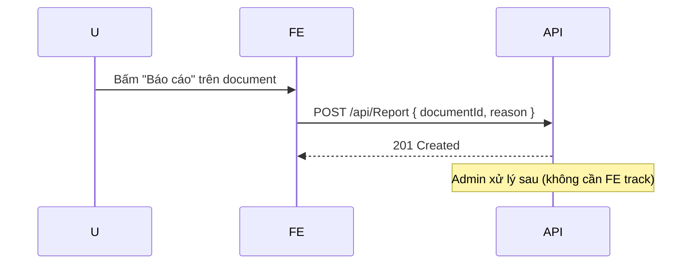
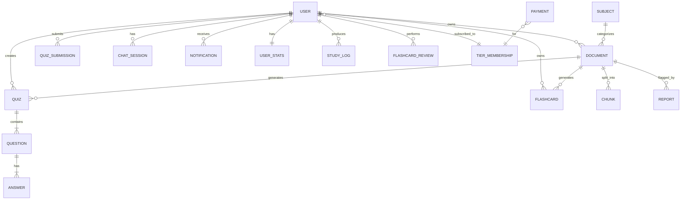

# AIStudyHub - Frontend Integration Guide

## AI Notebook session reload and persistent citations

Frontend route khuyen nghi: `/ai-notebook/{sessionId}`.

Khi mo route hoac refresh trang, Frontend dung `sessionId` de goi:

```http
GET /api/Chat/sessions/{sessionId}/messages
GET /api/Chat/sessions/{sessionId}/documents
```

Backend tra `404` neu session khong ton tai hoac khong thuoc user dang dang nhap. Khong tu dong chon Notebook moi nhat khi URL da co `sessionId`.

Moi assistant message tra `citations` la mot array khong null. Marker `[n]` duoc tra bang truong `citationIndex`, khong suy ra tu vi tri phan tu trong array. Khi click `[n]`, Frontend tim citation co `citationIndex === n`, sau do dung `documentId` cua citation do de mo tai lieu.

Contract citation giong nhau cho ca response tao message va response lich su:

```json
{
  "citationIndex": 1,
  "documentId": "d9b8775b-45f4-4a4d-a257-43ea7e730fda",
  "source": "document.pdf",
  "snippet": "Exact source text",
  "pageNumber": 12,
  "relevance": 0.91,
  "matchType": "hybrid",
  "isHighlightable": true,
  "reason": null
}
```

Sau khi tim dung citation, Frontend chuyen den `pageNumber` neu co va chi highlight `snippet` khi `isHighlightable` la `true`. Neu khong highlight duoc, van mo dung tai lieu/trang va co the hien thi `reason`. `documentId` luon la GUID tai lieu that, khong phai so marker nhu `"1"`.

Message tao truoc migration persistent citations khong duoc backfill va se tra `citations: []`.

> **Phiên bản**: cập nhật 2026-07-18
> **Backend**: ASP.NET Core 8 Web API
> **Auth**: JWT Bearer (access + refresh) + External (Google, GitHub)
> **Real-time**: SignalR tại `/hubs/notifications`
> **Database**: EF Core (citation contract mới nhất: `20260718140849_CompleteChatCitationFlow`)

Document này chia làm 3 phần:
1. **Phần 1 (mục 1-5)**: Mô tả luồng nghiệp vụ bằng ngôn ngữ dễ hiểu cho BA/QC/Frontend dev.
2. **Phần 1.5 (mục 5.5)**: Bảng ánh xạ **Tính năng UI ↔ API cần gọi** (quick reference khi code).
3. **Phần 2 (mục 6-31)**: Spec kỹ thuật chi tiết từng endpoint (request/response/status code/auth).

---

# Phần 1 - Luồng nghiệp vụ (Non-technical)

## 1. Tổng quan hệ thống

AIStudyHub là nền tảng học tập cá nhân hoá bằng AI với 4 trụ cột chính:

| Trụ cột | Mô tả |
|---|---|
| **Tài liệu (Document)** | User upload file PDF/Word/TXT/MD → hệ thống OCR, chunk, vector hoá để phục vụ RAG. |
| **AI Hỏi đáp (RAG Chat)** | Hỏi đáp theo tài liệu của user, có trích dẫn nguồn và độ tin cậy. |
| **Flashcard + Spaced Repetition (SM-2)** | Tạo flashcard (thủ công hoặc AI), ôn tập theo lịch SM-2 tự động. |
| **Quiz + Gamification** | Sinh quiz từ tài liệu bằng AI, chấm điểm, cộng XP/level/streak, có leaderboard. |

Hệ thống có 3 tier thành viên (mặc định `Free`, `Pro`) với quota storage và AI tokens khác nhau, thanh toán qua VNPay.

---

## 2. Các nhân vật (Actors) & Phân quyền

| Vai trò | Mô tả |
|---|---|
| **Guest** | Xem trang chủ, trang giới thiệu tier, đăng ký/đăng nhập, OAuth Google/GitHub. |
| **User (thường)** | Upload tài liệu, quản lý Subject riêng, chat AI, làm quiz, ôn flashcard, nâng cấp tier, vote/share tài liệu công khai. |
| **Admin** | Quản lý TierMembership, Report, refund payment, reindex toàn bộ tài liệu; không có quyền vượt phạm vi môn học riêng của student. |

---

## 3. Luồng nghiệp vụ chính

### 3.1. Đăng ký - xác thực email - đăng nhập



> **Lưu ý cho FE**: Sau khi login, **mọi request** phải đính kèm `Authorization: Bearer <accessToken>`. Khi accessToken hết hạn → gọi `POST /api/Auth/refresh-token` để lấy cặp token mới (dùng refreshToken cũ).

### 3.2. OAuth (Google/GitHub)



> **Lưu ý**: Trên web, nhớ `window.location.href` sang `external-login/{provider}` thay vì fetch. Backend dùng cookie để handshake, nên cần `credentials: 'include'` ở các request sau.

### 3.3. Quên mật khẩu



### 3.4. Upload tài liệu - xử lý AI - nhận thông báo real-time



> **Lưu ý FE**: Status `5 = Processing`, `2 = Done`. Phải connect SignalR và join group `userId` **trước** khi upload để không miss notification.

### 3.5. Ôn tập Flashcard (Spaced Repetition - SM-2)



> **Chất lượng (quality)**: `0 = Again` (quên hoàn toàn), `1 = Hard` (sai, nhớ khi thấy đáp án), `2 = Good` (đúng, khó khăn), `3 = Easy` (đúng, dễ dàng).

### 3.6. Làm Quiz (sinh bằng AI + nộp bài chấm điểm)



### 3.7. Gamification (XP, Level, Streak, Leaderboard)



### 3.8. Nâng cấp Tier (VNPay)



> **Quan trọng**: `/api/Payment/vnpay-return` là **public endpoint** (AllowAnonymous). FE phải xử lý cả 3 trường hợp: `success=true`, `success=false`, `invalid signature`.

### 3.9. Báo cáo tài liệu vi phạm



---

## 4. Quy tắc Auth (Rule of thumb)

| Endpoint | Auth | Ghi chú |
|---|---|---|
| `POST /api/Auth/*` (register, login, refresh, OTP, forgot/reset) | ❌ Public | |
| `GET /api/TierMembership`, `GET /api/TierMembership/{id}` | ❌ Public | Trang giá hiển thị cho cả guest |
| `GET /api/Payment/vnpay-return` | ❌ Public | VNPay redirect, không cần token |
| `GET /api/Auth/external-login/{provider}`, `GET /external-callback/{provider}` | ❌ Public | OAuth handshake |
| Tất cả các endpoint còn lại | ✅ Bearer token | |
| Các endpoint có `[Authorize(Roles = "Admin")]` | ✅ Bearer + Role=Admin | |

---

## 5. WebSocket / Real-time (SignalR)

| Thuộc tính | Giá trị |
|---|---|
| Endpoint | `ws://localhost:5171/hubs/notifications` (HTTP) hoặc `wss://localhost:7265/hubs/notifications` (HTTPS) |
| Auth | Bearer token trong query string: `?access_token=...` (SignalR không đọc được header từ browser) |
| Method client gọi khi connect | `invoke("JoinGroup", userId)` với `userId` là **string** (FE dùng `String(userId)`) |
| Method client gọi khi logout | `invoke("LeaveGroup", userId)` |
| Event server push | `ReceiveNotification` với payload `RealTimeNotification` |

### Payload mẫu (server → client):

```json
{
  "userId": "guid",
  "title": "Document processed",
  "body": "\"Slide_Tuan3.pdf\" is ready.",
  "type": 2,
  "timestamp": "2026-06-28T10:30:00Z",
  "payload": { "documentId": "guid", "title": "Slide_Tuan3.pdf" }
}
```

### Các `type` payload:

| `type` enum | Khi nào | `payload` shape |
|---|---|---|
| `2` Document | Document xử lý xong | `{ documentId, title }` |
| `3` Quiz | Quiz AI sinh xong | `{ quizId, title }` |
| `3` Quiz | Flashcards mới sẵn sàng | `{ documentId, title, count }` |
| `1` System | Streak sắp mất (chưa học trong ngày) | `{ currentStreak, hoursRemaining }` |
| `9` TierUpgraded | User lên level mới | `{ newLevel, totalXp }` |

> **Lưu ý FE**: Vì BE đang đẩy `type` là số (int enum), FE nên map số → label dễ hiểu cho user.

---

## 5.5. Bảng ánh xạ: Tính năng → Endpoint cần gọi (Quick Reference)

> **Mục đích của bảng này**: Khi FE muốn build một màn hình/chức năng, tra bảng này để biết gọi API nào. Mỗi dòng là **một use-case hoàn chỉnh** - chỉ cần làm theo thứ tự các bước.

### 5.5.1. Auth & Profile

| Tính năng UI | Gọi API theo thứ tự | Ghi chú |
|---|---|---|
| **Trang đăng ký** | 1. `POST /api/Auth/register` → 2. `POST /api/Auth/verify-registration-otp` | Sau bước 2, FE có thể tự gọi luôn `POST /api/Auth/login` để user vào app mượt hơn |
| **Trang đăng nhập (email/pw)** | `POST /api/Auth/login` | Lưu `accessToken` + `refreshToken` vào storage |
| **Nút "Đăng nhập với Google"** | `window.location = /api/Auth/external-login/Google` | Backend redirect, không cần fetch |
| **Quên mật khẩu** | 1. `POST /api/Auth/forgot-password` → 2. `POST /api/Auth/reset-password` | Sau bước 2, redirect về trang login |
| **Đổi mật khẩu (trong Settings)** | `POST /api/Auth/change-password` | Cần user đang đăng nhập |
| **Đăng xuất** | 1. `connection.invoke("LeaveGroup", userId)` (SignalR) → 2. `POST /api/Auth/logout { refreshToken }` → 3. Clear storage | Bước 1 để tránh nhận notification sau khi logout |
| **Refresh token tự động** | `POST /api/Auth/refresh-token { refreshToken }` | Implement trong axios interceptor khi gặp 401 |
| **Hiển thị user info (header)** | `GET /api/User/me/tier` (lấy tier info + quota) hoặc dùng `user` object đã có trong login response | Không cần gọi riêng, response login đã có đủ |
| **Sửa profile (tên, ngày sinh)** | `PUT /api/Body { fullName, dateOfBirth }` | Response 204, FE gọi lại `/me/tier` để refresh nếu cần |

### 5.5.2. Document (Tài liệu)

| Tính năng UI | Gọi API theo thứ tự | Ghi chú |
|---|---|---|
| **Trang danh sách tài liệu (có filter + phân trang)** | `GET /api/Document?pageIndex=1&pageSize=20&subjectId=&searchTerm=` | Hỗ trợ `subjectId` để lọc theo môn |
| **Upload file PDF/Word** | 1. `POST /api/Document/upload/file` (multipart) → 2. Poll `GET /api/Document/{id}/status` mỗi 3s HOẶC đợi SignalR `ReceiveNotification` với `type=2` | Bước 1 trả 202 ngay, không cần đợi xử lý xong |
| **Xem chi tiết document (metadata)** | `GET /api/Document/{id}` | Trả 403 nếu không phải owner và không public |
| **Xem file PDF inline** | `GET /api/Document/{id}/preview` (stream) | Dùng `<iframe src=...>` hoặc PDF.js |
| **Tải file về máy** | `GET /api/Document/{id}/download` (stream) | Có thể dùng `<a download>` |
| **Sửa tên / đổi shareStatus** | `PUT /api/Document/{id} { title, shareStatus }` | |
| **Chia sẻ cho người khác** | 1. `GET /api/User/shareable?keyword=` (gợi ý user) → 2. `POST /api/Document/{id}/share { sharedUserIds: [...] }` | Bước 1 cần để hiển thị dropdown chọn user |
| **Xoá tài liệu** | `DELETE /api/Document/{id}` | Response 204; FE refetch list sau khi xoá |
| **Xem lại nội dung text chunks (debug)** | `GET /api/Document/{id}/chunks` | Chỉ owner, chỉ dùng cho debug/admin |
| **Upload lại khi fail** | `POST /api/Document/{id}/reprocess` | Dùng khi status = 6 (Failed) |

### 5.5.3. AI & Chat

| Tính năng UI | Gọi API theo thứ tự | Ghi chú |
|---|---|---|
| **Hybrid search tài liệu** | `POST /api/AI/rag/ask { question, documentIds?, topK? }` | Trả `query`, `count`, `results[]`; không sinh AI answer |
| **Trang "Tóm tắt document"** | `POST /api/AI/rag/summarize { documentId }` | Trả `{ summary }` |
| **Trang "Tạo Quiz từ document"** | 1. `POST /api/AI/quizzes/generate?docId=X { numberOfQuestions: 10 }` → 2. Navigate user tới màn làm bài dùng `quiz.id` từ response | Validate 1≤n≤20 (BE check) |
| **Trang "Tạo Flashcard từ document"** | 1. `POST /api/AI/flashcards/generate?docId=X { numberOfFlashcards: 10 }` → 2. List sẽ tự cập nhật qua SignalR `type=3 payload={documentId,title,count}` | Nếu không nghe SignalR, refetch `GET /api/Flashcard/{docId}/flashcards` |
| **Danh sách chat session (sidebar)** | `GET /api/Chat/sessions` | |
| **Tạo session mới** | `POST /api/Chat/sessions { sessionTitle }` | |
| **Mở 1 session, xem messages** | `GET /api/Chat/sessions/{sessionId}/messages` | |
| **Gửi message trong session** | `POST /api/Chat/messages { sessionId, message }` | Response là message AI; citation marker dùng `citationIndex`, viewer dùng `documentId` |

### 5.5.4. Flashcard & Spaced Repetition

| Tính năng UI | Gọi API theo thứ tự | Ghi chú |
|---|---|---|
| **Trang "Ôn tập hôm nay"** | 1. `GET /api/FlashcardReview/due?limit=20` (lấy list) → 2. Loop: `POST /api/FlashcardReview/review { flashcardId, quality }` cho mỗi card | Badge counter cho header: `GET /api/FlashcardReview/due/count` |
| **Badge "X flashcard cần ôn" (header)** | `GET /api/FlashcardReview/due/count` | Lightweight, poll mỗi 60s |
| **Trang "Tất cả flashcard"** | `GET /api/Flashcard?pageIndex=1&pageSize=20&searchTerm=` | Có phân trang + search |
| **Xem flashcard của 1 document** | `GET /api/Flashcard/{docId}/flashcards` | |
| **Tạo flashcard thủ công** | `POST /api/Flashcard { documentId, front, back }` | |
| **Sửa flashcard** | `PUT /api/Flashcard/{id} { front, back }` | |
| **Xoá flashcard** | `DELETE /api/Flashcard/{id}` | |
| **Trang stats cá nhân (mastery)** | `GET /api/FlashcardReview/stats/{userId}` (lấy `userId` từ token) | Trả `totalReviewed`, `dueNow`, `masteredCount`, `averageEaseFactor` |

### 5.5.5. Quiz (Làm bài kiểm tra)

| Tính năng UI | Gọi API theo thứ tự | Ghi chú |
|---|---|---|
| **Danh sách quiz (có phân trang)** | `GET /api/Quiz?pageIndex=1&pageSize=20&searchTerm=` | |
| **Xem chi tiết quiz (chưa có answers)** | `GET /api/Quiz/{id}/questions` | Trả list câu hỏi, không kèm đáp án đúng |
| **Xem lại 1 câu hỏi (kèm answers)** | `GET /api/Quiz/{quizId}/questions/{questionId}` | Kèm `answers[]` |
| **Làm bài → nộp bài** | `POST /api/Quiz/{id}/submit` (body: `CreateQuizSubmissionRequestDto` — `userId`/`quizId` trong body bị ignore, server tự lấy từ token + route) → trả `SubmitQuizResultDto` (submission + newAchievements) | Plan C3 / B.4.5 |
| **Xem lịch sử nộp bài của tôi** | `GET /api/QuizSubmission/{id}` (với id biết trước) | Hiện chưa có endpoint list submissions của user |
| **Xoá quiz** | `DELETE /api/Quiz/{id}` | Chỉ owner mới xoá được |

### 5.5.6. Gamification (XP, Level, Streak)

| Tính năng UI | Gọi API theo thứ tự | Ghi chú |
|---|---|---|
| **Widget "Level & XP" ở Dashboard** | `GET /api/Gamification/stats` | Trả `totalXp`, `currentLevel`, `currentStreak`, `bestStreak`, `xpToNextLevel` |
| **Trang "Bảng xếp hạng"** | `GET /api/Gamification/leaderboard?top=20&period=weekly\|monthly\|alltime` | `period` mặc định `alltime` nếu FE không truyền. Xem chi tiết ở mục 13.3. |
| **Xem stats của user khác (public profile)** | `GET /api/Gamification/stats/{userId}` | |
| **Hiển thị popup "Level Up!"** | Đợi SignalR event `ReceiveNotification` với `type=9` (TierUpgraded) và `payload={ newLevel, totalXp }` | KHÔNG cần gọi API, server tự push |

### 5.5.7. Recommendations (Gợi ý học tập)

| Tính năng UI | Gọi API | Ghi chú |
|---|---|---|
| **Trang "Phân tích của tôi" - độ thành thạo theo môn** | `GET /api/Recommendations/mastery` | Trả `[ { subjectCode, subjectName, masteryPercentage, totalAttempts, correctAttempts } ]` |
| **Trang "Nên học gì tiếp?"** | `GET /api/Recommendations/suggestions` | Trả `subjectMasteries` + `recommendations[]` (text) + `summary` |
| **Xem của user khác** | `GET /api/Recommendations/mastery/{userId}` hoặc `/suggestions/{userId}` | |

### 5.5.8. Tier & Payment (VNPay)

| Tính năng UI | Gọi API theo thứ tự | Ghi chú |
|---|---|---|
| **Trang "Bảng giá" (Pricing)** | `GET /api/TierMembership` | Public, không cần token |
| **Chi tiết 1 gói** | `GET /api/TierMembership/{id}` | Public |
| **Bấm "Nâng cấp Pro"** | 1. `POST /api/Payment/create-checkout-url { tierId }` → 2. `window.location = paymentUrl` | Backend trả URL VNPay |
| **Trang xử lý sau khi VNPay redirect về** | Đợi URL `/api/Payment/vnpay-return?vnp_...` load → tự động trả JSON → FE check `success` field | URL này user mở trực tiếp trong browser, FE chỉ cần render kết quả |
| **Hiển thị quota hiện tại** | `GET /api/User/me/tier` | Trả `currentStorageMb` + `currentAiTokensUsed` |
| **Lịch sử thanh toán của tôi** | `GET /api/Payment/my` | Trả list `PaymentResponseDto` |
| **Trang quản lý thanh toán (Admin)** | `GET /api/Payment` | Admin only |

### 5.5.9. Subject (Môn học)

| Tính năng UI | Gọi API | Ghi chú |
|---|---|---|
| **Danh sách / dropdown Subject của tôi** | `GET /api/Subject?offset=0&limit=100` | Chỉ trả về Subject của user trong JWT; cache 5 phút |
| **Tạo Subject** | `POST /api/Subject` | Subject được gán cho user trong JWT; cùng mã Subject có thể tồn tại cho student khác |
| **Chi tiết / sửa / xóa Subject** | `GET`, `PUT`, `DELETE /api/Subject/{id}` | Chỉ Subject của user trong JWT; Subject thiếu hoặc của user khác trả 404; xóa Subject đang được Document tham chiếu trả 409 |

### 5.5.10. Vote & Share

| Tính năng UI | Gọi API | Ghi chú |
|---|---|---|
| **Nút upvote/downvote trên document** | 1. `POST /api/Vote { documentId, type: 1 or 2 }` → 2. Update UI ngay (optimistic) | `type=1` upvote, `type=2` downvote |
| **Bỏ vote** | `DELETE /api/Vote/{id}` | Cần lưu `vote.id` từ response POST |
| **Hiển thị số vote** | Đã có sẵn trong `DocumentResponseDto.voteCount`, không cần gọi riêng | |

### 5.5.11. Notification (Chuông thông báo)

| Tính năng UI | Gọi API theo thứ tự | Ghi chú |
|---|---|---|
| **Hiển thị list notifications (bell icon)** | 1. `GET /api/Notification/my` (lấy list persistent) + 2. Đồng thời nghe SignalR `ReceiveNotification` để update real-time | Kết hợp cả 2 nguồn |
| **Badge "X chưa đọc"** | Filter `isRead === false` từ response `/api/Notification/my` | |
| **Bấm vào 1 notification** | 1. `POST /api/Notification/{id}/read` (mark read) → 2. Navigate tới `payload` link tương ứng | |
| **"Đánh dấu tất cả đã đọc"** | `POST /api/Notification/mark-all-read` | Response 204, FE refresh list |

### 5.5.12. Report (Báo cáo vi phạm)

| Tính năng UI | Gọi API | Ghi chú |
|---|---|---|
| **Modal "Báo cáo document"** | 1. `POST /api/Report { documentId, reason }` | Chỉ cần `documentId` + `reason`, userId tự lấy từ token |
| **Trang "Reports của tôi"** | `GET /api/Report/my-reports` | List các report user đã gửi |

### 5.5.13. Admin (chỉ dành cho role Admin)

| Tính năng UI | Gọi API | Ghi chú |
|---|---|---|
| **Trang quản lý Tier** | `GET /api/TierMembership`, `POST /api/TierMembership`, `PUT /api/TierMembership/{id}`, `DELETE /api/TierMembership/{id}` | |
| **Trang quản lý User** | `GET /api/User`, `GET /api/User/{id}`, `PUT /api/User/{id}/tier` (gán tier) | |
| **Trang quản lý Report** | `GET /api/Report/search?status=&category=&keyword=`, `PATCH /api/Report/{id}/status`, `POST /api/Report/bulk-status`, `POST /api/Report/documents/{id}/mark-non-flaggable` | |
| **Trang quản lý Payment** | `GET /api/Payment`, `GET /api/Payment/{id}`, `POST /api/Payment/{id}/refund` | |
| **Nút "Reindex toàn bộ"** | `POST /api/Admin/reindex` | Đẩy hết document vào background queue |
| **Xem tất cả QuizSubmission** | `GET /api/QuizSubmission` | |

### 5.5.14. SignalR - Khi nào cần connect

| Tình huống | Cần kết nối SignalR? | Lý do |
|---|---|---|
| User vừa login | ✅ Có | Bắt đầu nhận notification |
| User vừa upload document | ✅ Rất cần | Để biết khi nào document xử lý xong mà không phải poll |
| User đang xem trang "Ôn tập" | ❌ Không bắt buộc | Có thể poll `/due/count` thay thế |
| User mở Dashboard có widget XP | ❌ Không bắt buộc | Có thể fetch `/stats` mỗi 30s |
| User vừa thanh toán xong | ✅ Nên có | Có thể nhận event tier-upgrade hoặc payment-success |
| User logout | ✅ Có (để gọi LeaveGroup) | Tránh rò rỉ connection |

**Cách kết nối** (xem chi tiết mục 24):
```javascript
const connection = new signalR.HubConnectionBuilder()
  .withUrl(`/hubs/notifications?access_token=${encodeURIComponent(accessToken)}`)
  .withAutomaticReconnect()
  .build();

connection.on("ReceiveNotification", (n) => {
  // Dispatch vào store global để bell icon + toast update
  notificationStore.push(n);
});

await connection.start();
await connection.invoke("JoinGroup", String(currentUserId));
```

**Các event cần handle**:
| `type` | Label cho user | Action FE nên làm |
|---|---|---|
| `2` Document | "Tài liệu đã sẵn sàng" | Toast success + refetch list document |
| `3` Quiz (FlashcardsReady) | "X flashcard mới sẵn sàng" | Toast + refetch flashcard list |
| `3` Quiz (QuizReady) | "Quiz đã được tạo" | Toast + navigate tới quiz |
| `1` System (StreakAtRisk) | "Streak sắp mất, ôn ngay!" | Toast warning + link tới /review |
| `9` TierUpgraded (LevelUp) | "Bạn đã lên level X!" | Modal celebrate + animation |
| `4` Payment / `5` PaymentSucceeded | "Thanh toán thành công" | Toast + refetch tier info |

### 5.5.15. Tổng kết: Khi build màn hình mới, hỏi 3 câu hỏi

1. **Màn hình này cần data gì?** → Tra bảng 5.5.1-5.5.13 để biết gọi API nào.
2. **Có cần cập nhật real-time không?** → Tra bảng 5.5.14.
3. **Có phải admin không?** → Check cột "Auth" trong Phần 2 (mục 7-23).

---

# Phần 2 - Spec kỹ thuật (Technical)

## 6. Base URL & Conventions

| Mục | Giá trị |
|---|---|
| **Development - HTTP (mặc định)** | `http://localhost:5171` |
| **Development - HTTPS** | `https://localhost:7265` (HTTP fallback `http://localhost:5171`) |
| **IIS Express (profile phụ)** | `http://localhost:31922` (HTTPS `https://localhost:44385`) |
| **Swagger UI** | `http://localhost:5171/swagger` |
| **SignalR Hub** | `ws://localhost:5171/hubs/notifications` (HTTP) hoặc `wss://localhost:7265/hubs/notifications` (HTTPS) |
| **Static files (upload)** | `http://localhost:5171/uploads/{filename}` |
| Date format | ISO 8601 UTC (ví dụ `2026-06-28T10:30:00.000Z`) |
| ID format | UUID/GUID string |
| Auth header | `Authorization: Bearer <accessToken>` |
| Refresh token | Gửi trong body request (không phải cookie) |

> **Profile chạy** (`launchSettings.json`): chạy `dotnet run --launch-profile http` để mở `http://localhost:5171`, hoặc `--launch-profile https` để mở `https://localhost:7265`.
>
> **CORS**: Backend đọc `Cors:AllowedOrigins` từ `appsettings.Development.json`. Khi dev frontend chạy port khác (ví dụ Vite 5173, React 3000), phải thêm vào `appsettings.Development.json`:
> ```json
> "Cors": { "AllowedOrigins": [ "http://localhost:5173" ] }
> ```

### Response format chung

| Status | Ý nghĩa |
|---|---|
| `200 OK` | Thành công, body chứa data |
| `201 Created` | Tạo mới thành công (có `Location` header) |
| `202 Accepted` | Yêu cầu đã được nhận, xử lý bất đồng bộ (upload file) |
| `204 No Content` | Thành công, không có body (mark-as-read, delete) |
| `400 Bad Request` | Validation fail, body thường là `ValidationProblemDetails` với field `errors` |
| `401 Unauthorized` | Token thiếu/hết hạn |
| `403 Forbidden` | Token hợp lệ nhưng không đủ quyền (role/tier) |
| `404 Not Found` | Resource không tồn tại |
| `409 Conflict` | Document chưa sẵn sàng cho thao tác này |
| `413 Payload Too Large` | File content vượt giới hạn upload |
| `422 Unprocessable Entity` | AI không tạo được đúng số lượng item hợp lệ yêu cầu |
| `500 Internal Server Error` | Lỗi backend, FE hiện "Đã có lỗi xảy ra" |

### Error body mẫu (400):

```json
{
  "type": "https://tools.ietf.org/html/rfc9110#section-15.5.1",
  "title": "One or more validation errors occurred.",
  "status": 400,
  "errors": {
    "Email": ["The Email field is required."],
    "Password": ["The Password must be at least 6 characters long."]
  }
}
```

---

## 7. Authentication APIs (Public)

### 7.1. POST `/api/Auth/register`

Đăng ký tài khoản mới. Sau khi thành công, hệ thống gửi OTP về email.

**Auth**: Không

**Body**:
```json
{
  "fullName": "Nguyễn Văn A",
  "email": "user@example.com",
  "password": "Matkhau123"
}
```

**Responses**:
| Status | Body | Ý nghĩa |
|---|---|---|
| 200 | `{ "message": "string", "email": "string" }` | OK, OTP đã gửi |
| 400 | ValidationProblemDetails | Email trùng, password yếu, … |

### 7.2. POST `/api/Auth/verify-registration-otp`

Xác thực OTP đăng ký.

**Body**: `{ "email": "string", "otp": "string" }`

**Responses**:
| Status | Ý nghĩa |
|---|---|
| 200 | `{ "message": "Email verified successfully." }` |
| 400 | OTP sai/hết hạn |

### 7.3. POST `/api/Auth/resend-registration-otp`

Gửi lại OTP.

**Body**: `{ "email": "string" }`

**Response**: 200 `{ "message": "OTP sent successfully." }`

### 7.4. POST `/api/Auth/login`

**Rate limit**: Có áp dụng rate-limit (chống brute force).

**Body**: `{ "email": "string", "password": "string" }`

**Response 200**:
```json
{
  "user": {
    "id": "guid",
    "fullName": "string",
    "email": "string",
    "dateOfBirth": "2026-01-15",
    "currentStorageCapacity": 0,
    "currentAiTokenUsage": 0,
    "status": "string",
    "role": "string",
    "tierId": "guid",
    "tierName": "Free",
    "tierStorageLimitMb": 100,
    "tierAiTokens": 10000,
    "tierExpireAt": "2027-06-28T10:30:00Z",
    "createdAt": "2026-06-28T10:30:00Z",
    "updatedAt": null
  },
  "accessToken": "eyJhbGc...",
  "accessTokenExpiresAt": "2026-06-28T11:30:00Z",
  "refreshToken": "rt_abc123...",
  "refreshTokenExpiresAt": "2026-07-05T10:30:00Z"
}
```

**Errors**: 401 nếu sai email/password, 403 nếu tài khoản bị khoá.

### 7.5. POST `/api/Auth/refresh-token`

**Body**: `{ "refreshToken": "string" }`

**Response**: 200 - giống hệt login response (cặp token mới).

**Errors**: 401 nếu refresh token hết hạn/không hợp lệ.

### 7.6. POST `/api/Auth/forgot-password`

Luôn trả 200 dù email có tồn tại (chống enumeration).

**Body**: `{ "email": "string" }`

**Response**: 200 `{ "message": "If the email exists, an OTP has been sent." }`

### 7.7. POST `/api/Auth/reset-password`

**Body**:
```json
{
  "email": "string",
  "otp": "string",
  "newPassword": "MatkhauMoi123"
}
```

**Response**: 200 `{ "message": "Password reset successfully." }`

### 7.8. POST `/api/Auth/change-password`

**Auth**: Bearer

**Body**: `{ "currentPassword": "string", "newPassword": "string" }`

**Response**: 200 `{ "message": "Password changed successfully." }`

### 7.9. POST `/api/Auth/logout`

**Auth**: Bearer

**Body**: `{ "refreshToken": "string" }`

**Response**: 200 `{ "message": "Logged out successfully." }`

### 7.10. GET `/api/Auth/external-login/{provider}`

`provider`: `Google` hoặc `GitHub` (case-insensitive).

**Response**: 302 redirect sang OAuth provider.

> **FE integration**: Trên web, dùng `window.location.href = "/api/Auth/external-login/Google"`.

### 7.11. GET `/api/Auth/external-callback/{provider}`

Backend tự động redirect tới đây sau khi user xác thực với provider. Trả về JSON giống login response.

> **Quan trọng**: Vì backend dùng cookie tạm để handshake OAuth, response này thường đi kèm với việc set cookie hoặc redirect về trang frontend với token trong query string (tuỳ cấu hình). FE cần check contract thực tế với backend team.

---

## 8. User APIs (Authenticated)

### 8.1. GET `/api/User` (Admin only)

Lấy danh sách tất cả user.

**Response 200**:
```json
[
  {
    "id": "guid", "fullName": "string", "email": "string",
    "dateOfBirth": "2000-01-15",
    "currentStorageCapacity": 50, "currentAiTokenUsage": 1200,
    "status": "Active", "role": "User",
    "tierId": "guid", "tierName": "Free",
    "tierStorageLimitMb": 100, "tierAiTokens": 10000,
    "tierExpireAt": null,
    "createdAt": "...", "updatedAt": null
  }
]
```

### 8.2. GET `/api/User/{id}` (Admin only)

### 8.3. GET `/api/User/me/tier`

Thông tin tier hiện tại + mức dùng.

**Response 200**:
```json
{
  "tierId": "guid",
  "tierName": "Free",
  "storageLimitMb": 100,
  "aiTokens": 10000,
  "tierExpireAt": null,
  "currentStorageMb": 12,
  "currentAiTokensUsed": 350
}
```

### 8.4. GET `/api/User/shareable?keyword=...`

Danh sách user có thể share document (dùng cho picker trong modal "Share").

**Query**: `keyword` (optional) - tìm theo tên hoặc email.

**Response 200**:
```json
[
  { "id": "guid", "fullName": "string", "email": "string", "role": "User" }
]
```

> Caller sẽ bị loại khỏi kết quả.

### 8.5. PUT `/api/User/me`

User tự cập nhật profile.

**Body**: `{ "fullName": "string", "dateOfBirth": "2000-01-15" }`

**Response**: 204 No Content.

### 8.6. PUT `/api/User/{id}/tier` (Admin only)

Admin set tier cho user (dùng cho refund/khuyến mãi).

**Body**: `{ "tierId": "guid", "tierExpireAt": "2027-01-01T00:00:00Z" }`

**Response**: 204.

---

## 9. Document APIs (Authenticated)

### 9.1. GET `/api/Document`

Lấy documents của user hiện tại (phân trang).

**Query params**:
| Name | Type | Default | Description |
|---|---|---|---|
| `pageIndex` | int | 1 | Số trang (1-based) |
| `pageSize` | int | 20 | Số phần tử/trang |
| `searchTerm` | string | null | Tìm theo title |
| `sortBy` | string | null | Field name |
| `isDescending` | bool | false | |
| `subjectId` | guid | null | Lọc theo subject |

**Response 200** (`PagedResultDto<DocumentResponseDto>`):
```json
{
  "items": [
    {
      "id": "guid", "userId": "guid", "subjectId": "guid",
      "title": "string", "fileLink": "/uploads/abc.pdf",
      "fileName": "abc.pdf", "fileExtension": ".pdf",
      "fileType": "application/pdf", "fileSizeBytes": 1048576,
      "sharedUsers": "guid1,guid2", "shareStatus": "private",
      "status": 2, "voteCount": 5,
      "createdAt": "...", "updatedAt": null
    }
  ],
  "totalCount": 100, "offset": 0, "limit": 20
}
```

> **`status` mapping**: 1=Draft, 2=Done, 3=Archived, 4=Banned, 5=Processing, 6=Failed.

### 9.2. GET `/api/Document/{id}`

Lấy 1 document. Trả 404 nếu không phải của user và shareStatus ≠ "public".

### 9.3. PUT `/api/Document/{id}`

Cập nhật metadata (title, shareStatus, …). Không đổi file.

**Body**:
```json
{
  "title": "string",
  "fileName": "string",   // optional
  "fileExtension": "string",
  "fileType": "string",
  "shareStatus": "private" | "public" | "shared"
}
```

### 9.4. DELETE `/api/Document/{id}`

Xoá document + vector embeddings + file vật lý. Trừ storage của user.

**Response**: 204.

### 9.5. POST `/api/Document/{id}/share`

Share cho nhiều user.

**Body**: `{ "sharedUserIds": ["guid1", "guid2"] }`

**Response 200**:
```json
{ "documentId": "guid", "sharedUserIds": ["guid1", "guid2"] }
```

### 9.6. GET `/api/Document/{id}/download`

Stream file download (có range support).

### 9.7. GET `/api/Document/{id}/preview`

Stream file inline (cho PDF viewer).

### 9.8. GET `/api/Document/{id}/status`

**Response 200**: `{ "id": "guid", "Status": "Processing" }`

> Dùng để poll sau khi upload. Trả 403 nếu không phải owner.

### 9.9. GET `/api/Document/{id}/chunks`

Lấy text chunks (sau khi xử lý xong) - dùng cho debug.

**Response 200**:
```json
[
  { "id": "guid", "documentId": "guid", "content": "string", "orderIndex": 0, "vectorId": null, "score": 0 }
]
```

### 9.10. POST `/api/Document/upload/file`

**Content-Type**: `multipart/form-data`

**Form fields**:
| Field | Type | Required | Description |
|---|---|---|---|
| `file` | file | Yes | .pdf, .docx, .txt, .md |
| `title` | string | Yes | |
| `subjectId` | guid | Yes | Phải tồn tại trong `/api/Subject` |

**Errors**:
| Status | Khi nào |
|---|---|
| 400 | File trống, thiếu title, hoặc extension không hợp lệ |
| 404 | `subjectId` không tồn tại hoặc không thuộc user hiện tại |
| 413 | File content vượt `5,242,880` bytes (5 MiB) |
| 403 | Vượt quota storage của tier |
| 202 | Accepted - xử lý bất đồng bộ |

**Response 202**:
```json
{ "documentId": "guid", "status": "processing", "chunkCount": 0, "message": "Document is being processed in the background" }
```

`202` chỉ được trả sau khi file và Document `Processing` đã được lưu và queue; không chờ OCR/embed. Worker chuyển status sang `Done` hoặc `Failed`. Sau khi app restart, các Document active `Processing` được khôi phục; nếu file đã lưu bị mất thì Document chuyển sang `Failed`.

### 9.11. POST `/api/Document/{id}/reprocess`

Re-OCR + re-vector nếu job lỗi. Cùng response shape với upload.

---

## 10. AI APIs (Authenticated)

### 10.1. POST `/api/AI/rag/ask`

Hybrid search trên các tài liệu của user. Endpoint này không gọi chat LLM và không sinh câu trả lời AI.

**Body**:
```json
{
  "question": "string",
  "documentIds": ["optional-guid"],
  "topK": 10
}
```

`documentIds` và `topK` là tùy chọn. Nếu bỏ `documentIds`, hệ thống tìm trên toàn bộ tài liệu đã index của user.

**Response 200**:
```json
{
  "query": "string",
  "count": 1,
  "results": [
    {
      "content": "matching document text",
      "score": 0.85,
      "documentId": "guid",
      "fileName": "document.pdf",
      "pageNumber": 12,
      "chunkIndex": 22,
      "matchType": "semantic",
      "isHighlightable": true
    }
  ]
}
```

### 10.2. POST `/api/AI/rag/summarize`

**Body**: `{ "documentId": "guid" }`

**Response 200**: `{ "summary": "string" }`

### 10.3. POST `/api/AI/flashcards/generate?docId={guid}`

**Query**: `docId` (guid, required)

**Body**: `{ "numberOfFlashcards": 10 }`

**Response 200**: `[ FlashcardResponseDto ]`

`numberOfFlashcards` là integer **bắt buộc**, trong khoảng 1..20; không có default. Document phải thuộc user đang gọi, có status `Done`, và có processed context không rỗng. Thành công sẽ persist và trả **đúng** số flashcard yêu cầu. Thiếu/không phải integer/ngoài 1..20 trả 400; Document không tồn tại hoặc không thuộc user trả 404; chưa `Done` hoặc context rỗng trả 409. Nếu AI không tạo đủ đúng số item hợp lệ, trả 422 và không persist partial flashcard.

> Sau khi sinh, hệ thống gửi SignalR `ReceiveNotification` với `payload = { documentId, title, count }` để FE refresh danh sách.

### 10.4. POST `/api/AI/quizzes/generate?docId={guid}`

**Query**: `docId` (guid, required)

**Body**: `{ "numberOfQuestions": 5 }`

**Response 200**: `QuizResponseDto`
```json
{
  "id": "guid",
  "documentId": "guid",
  "title": "string",
  "createdAt": "...",
  "updatedAt": null,
  "questions": null
}
```

`numberOfQuestions` là integer **bắt buộc**, trong khoảng 1..20; không có default. Document phải thuộc user đang gọi, có status `Done`, và có processed context không rỗng. Thành công sẽ persist **đúng** số question yêu cầu, nhưng response generate chỉ trả metadata quiz và hiện phát `"questions": null`. FE cần gọi `GET /api/Quiz/{id}` để lấy câu hỏi/đáp án đã persist trước khi hiển thị hoặc làm bài. Thiếu/không phải integer/ngoài 1..20 trả 400; Document không tồn tại hoặc không thuộc user trả 404; chưa `Done` hoặc context rỗng trả 409. Nếu AI không tạo đủ đúng số question hợp lệ, trả 422 và không persist partial quiz, question, hoặc answer.

> **`type` mapping**: 1=SingleChoice, 2=MultipleChoice, 3=TrueFalse.

---

## 11. Flashcard APIs (Authenticated)

### 11.1. GET `/api/Flashcard/{docId}/flashcards`

Lấy tất cả flashcard của 1 document.

**Response 200**:
```json
[
  { "id": "guid", "documentId": "guid", "front": "string", "back": "string", "createdAt": "...", "updatedAt": null }
]
```

### 11.2. GET `/api/Flashcard?pageIndex=1&pageSize=20&searchTerm=...&sortBy=...&isDescending=false`

Phân trang tất cả flashcard của user.

### 11.3. GET `/api/Flashcard/{id}`

### 11.4. POST `/api/Flashcard`

**Body**: `{ "documentId": "guid", "front": "string", "back": "string" }`

**Response**: 201 Created + `FlashcardResponseDto`.

### 11.5. PUT `/api/Flashcard/{id}`

**Body**: `{ "front": "string", "back": "string" }`

### 11.6. DELETE `/api/Flashcard/{id}`

**Response**: 204.

---

## 12. Flashcard Review APIs (Authenticated) - SM-2 Spaced Repetition

### 12.1. POST `/api/FlashcardReview/review`

User submit 1 lượt review cho 1 flashcard. Hệ thống áp dụng thuật toán SM-2 và cộng XP.

**Body**:
```json
{ "flashcardId": "guid", "quality": 0 }
```

> `quality`: 0=Again (quên), 1=Hard (sai), 2=Good (đúng khó), 3=Easy (đúng dễ).

**Response 200**:
```json
{
  "reviewId": "guid",
  "flashcardId": "guid",
  "nextReviewDate": "2026-06-29T10:30:00Z",
  "easeFactor": 2.5,
  "interval": 1,
  "repetitions": 2
}
```

### 12.2. GET `/api/FlashcardReview/due?limit=20`

Lấy danh sách flashcard đến hạn ôn (nextReviewDate ≤ now).

**Query**: `limit` (int, default 50)

**Response 200**:
```json
[
  { "reviewId": "guid", "flashcardId": "guid", "documentId": "guid", "front": "string", "back": "string", "nextReviewDate": "..." }
]
```

### 12.3. GET `/api/FlashcardReview/due/count`

Số flashcard đến hạn - dùng cho badge counter trên UI.

**Response 200**: `42` (int)

### 12.4. GET `/api/FlashcardReview/stats/{userId}`

**Response 200**:
```json
{
  "totalReviewed": 250,
  "dueNow": 12,
  "masteredCount": 30,
  "averageEaseFactor": 2.41
}
```

---

## 13. Gamification APIs (Authenticated)

### 13.1. GET `/api/Gamification/stats`

Stats của user hiện tại.

**Response 200**:
```json
{
  "totalXp": 1250,
  "currentLevel": 5,
  "currentStreak": 7,
  "bestStreak": 14,
  "lastActivityDate": "2026-06-28",
  "xpToNextLevel": 250
}
```

### 13.2. GET `/api/Gamification/stats/{userId}`

Stats của 1 user bất kỳ.

### 13.3. GET `/api/Gamification/leaderboard?top=20&period=weekly|monthly|alltime`

Bảng xếp hạng theo XP. Hỗ trợ 3 tab thời gian: **Weekly** (7 ngày gần nhất), **Monthly** (30 ngày gần nhất), **All Time** (tổng tích lũy).

**Query**:
| Name | Type | Default | Description |
|---|---|---|---|
| `top` | int | 20 | Số user trả về (clamp 1..100). |
| `period` | string | `alltime` | Một trong: `weekly`, `monthly`, `alltime` (alias `all-time` cũng chấp nhận). Không phân biệt hoa/thường. Nếu truyền giá trị khác → 400. |

> **Lưu ý cho FE**: Tab Weekly/Monthly aggregate từ bảng `StudyLogs` (lịch sử hoạt động) trong khoảng **rolling** - không cần chờ đầu tuần / đầu tháng dương lịch. User nào không có StudyLog trong khoảng đó sẽ không xuất hiện trong bảng xếp hạng (kể cả khi `UserStats.TotalXp` cao). Tab All Time giữ nguyên logic cũ (sort theo `UserStats.TotalXp`).

**Response 200**:
```json
[
  {
    "userId": "guid",
    "fullName": "Nguyễn Văn A",
    "totalXp": 5200,
    "xp": 380,
    "currentLevel": 6,
    "currentStreak": 5,
    "rank": 1,
    "period": "Weekly"
  }
]
```

| Field | Ý nghĩa |
|---|---|
| `totalXp` | Tổng XP tích lũy All-Time (từ `UserStats.TotalXp`) - giữ nguyên mọi period, dùng cho tooltip / so sánh. |
| `xp` | XP theo `period` đang chọn (Weekly = tổng XP 7 ngày, Monthly = 30 ngày, AllTime = bằng `totalXp`). Đây là giá trị FE dùng để sort/rank. |
| `rank` | Thứ hạng trong kết quả trả về, 1-based. |
| `period` | Period đang trả về (`Weekly` / `Monthly` / `AllTime`). FE có thể dùng để verify đúng tab đang chọn. |

### 13.4. POST `/api/Gamification/award-xp`

Nội bộ - các service khác tự gọi. Hiện tại `[Authorize]` cho phép mọi authenticated caller, nhưng **FE không nên gọi trực tiếp**.

**Body**:
```json
{
  "userId": "guid",
  "xpEarned": 10,
  "isCorrect": true,
  "activityType": 1,       // 0=QuizSubmission, 1=FlashcardReview
  "documentId": "guid",     // optional
  "subjectCode": "MATH101", // optional
  "timeSpentSeconds": 45    // optional
}
```

**Response 200**:
```json
{ "xpEarned": 10, "totalXp": 1260, "previousLevel": 5, "newLevel": 5, "leveledUp": false, "currentStreak": 7, "bestStreak": 14 }
```

---

## 14. Recommendations APIs (Authenticated)

### 14.1. GET `/api/Recommendations/mastery`

User mastery theo subject.

**Response 200**:
```json
[
  { "subjectCode": "MATH101", "subjectName": "Calculus I", "masteryPercentage": 78.5, "totalAttempts": 50, "correctAttempts": 39 }
]
```

### 14.2. GET `/api/Recommendations/mastery/{userId}`

### 14.3. GET `/api/Recommendations/suggestions`

Gợi ý chủ đề cần ôn.

**Response 200**:
```json
{
  "subjectMasteries": [ ... ],
  "recommendations": ["Ôn lại Calculus I (độ thành thạo thấp)", "..."],
  "summary": "Bạn đang giỏi Physics nhưng cần cải thiện Calculus."
}
```

### 14.4. GET `/api/Recommendations/suggestions/{userId}`

---

## 15. Quiz APIs (Authenticated)

### 15.1. GET `/api/Quiz?pageIndex=1&pageSize=20&searchTerm=...&sortBy=...&isDescending=false`

Phân trang quiz của user.

### 15.2. GET `/api/Quiz/{id}`

Trả 404 nếu không phải owner và document không public.

### 15.3. GET `/api/Quiz/{id}/questions`

Lấy questions (không bao gồm answers - xem 15.4).

### 15.4. GET `/api/Quiz/{quizId}/questions/{questionId}`

Lấy 1 question (kèm answers - dùng cho xem lại sau khi nộp bài).

### 15.5. GET `/api/Quiz/{quizId}/questions/{questionId}/answers`

Lấy answers của 1 question (chỉ dùng cho debug/admin).

### 15.6. DELETE `/api/Quiz/{id}`

---

## 16. QuizSubmission APIs

### 16.1. GET `/api/QuizSubmission` (Admin only)

### 16.2. GET `/api/QuizSubmission/{id}`

Trả về kết quả nộp bài (nếu là user thường, chỉ xem được submission của mình - enforced ở service layer).

**Response 200** (`QuizSubmissionResponseDto`):
```json
{
  "id": "guid", "userId": "guid", "quizId": "guid",
  "answers": "{\"q1\":\"A\",\"q2\":[\"B\",\"C\"]}", // JSON string
  "score": 8, "maxScore": 10, "totalCorrect": 4,
  "gradedAt": "2026-06-28T10:30:00Z",
  "submittedAt": "2026-06-28T10:25:00Z",
  "createdAt": "...", "updatedAt": null
}
```

> ✅ **Đã bổ sung**: `POST /api/Quiz/{id}/submit` (xem mục 5.5.5). Body là `CreateQuizSubmissionRequestDto { userId, quizId, answers, durationSeconds? }`. `userId`/`quizId` trong body bị server override bằng token + route để chống spoofing. Response là `SubmitQuizResultDto { submission, newAchievements[] }` để FE hiển thị badge vừa unlock.

---

## 17. Chat APIs (Authenticated)

### 17.1. GET `/api/Chat/sessions`

Danh sách chat sessions của user.

### 17.2. POST `/api/Chat/sessions`

**Body**: `{ "sessionTitle": "string" }`

**Response 200**: `ChatSessionResponseDto` (kèm `id`, `userId` từ token).

### 17.3. GET `/api/Chat/sessions/{sessionId}/messages`

Lấy lịch sử messages của 1 session.

### 17.4. POST `/api/Chat/messages`

Gửi message mới theo hai giai đoạn: backend lưu user message trước khi gọi AI; sau đó lưu assistant message và toàn bộ citation snapshots trong cùng một `SaveChangesAsync`.

**Body**: `{ "sessionId": "guid", "message": "string" }`

**Response 200**: `ChatMessageResponseDto` (AI response). `citations` dùng cùng contract đã mô tả ở đầu tài liệu: tìm marker `[n]` bằng `citationIndex == n`, rồi mở file bằng GUID `documentId`.

---

## 18. Notification APIs (Authenticated)

### 18.1. GET `/api/Notification` (Admin only)

### 18.2. GET `/api/Notification/{id}`

### 18.3. GET `/api/Notification/my`

Lấy notifications của user hiện tại (dùng cho bell icon).

**Response 200**: `[ NotificationResponseDto ]`

> Chỉ là danh sách persistent (DB). Real-time notifications đến qua SignalR ở mục 5.

### 18.4. POST `/api/Notification/{id}/read`

Mark 1 notification đã đọc. **Response**: 204.

### 18.5. POST `/api/Notification/mark-all-read`

Mark tất cả. **Response**: 204.

---

## 19. Tier & Payment APIs

### 19.1. TierMembership (một phần public)

| Method | Endpoint | Auth | Mô tả |
|---|---|---|---|
| GET | `/api/TierMembership` | ❌ Public | Danh sách gói tier (cho trang giá) |
| GET | `/api/TierMembership/{id}` | ❌ Public | Chi tiết 1 gói |
| POST | `/api/TierMembership` | Admin | Tạo gói mới |
| PUT | `/api/TierMembership/{id}` | Admin | Cập nhật |
| DELETE | `/api/TierMembership/{id}` | Admin | Xóa |

**Response mẫu**: `{ id, tierName, price, storageLimitMb, aiTokens, createdAt, updatedAt }`

### 19.2. Payment APIs

| Method | Endpoint | Auth | Mô tả |
|---|---|---|---|
| GET | `/api/Payment` | Admin | Lấy tất cả giao dịch |
| GET | `/api/Payment/{id}` | Admin | Chi tiết giao dịch |
| GET | `/api/Payment/my` | User | Lịch sử thanh toán của user |
| POST | `/api/Payment/{id}/refund` | Admin | Hoàn tiền |
| POST | `/api/Payment/create-checkout-url` | User | Tạo link VNPay |
| GET | `/api/Payment/vnpay-return` | ❌ Public | VNPay redirect về |

#### POST `/api/Payment/create-checkout-url`

**Body**: `{ "tierId": "guid" }`

**Response 200**: `{ "paymentUrl": "https://sandbox.vnpayment.vn/paymentv2/vpcpay.html?vnp_..." }`

> **FE**: redirect bằng `window.location.href = paymentUrl`.

#### GET `/api/Payment/vnpay-return?{vnp_params}`

**Response 200** (JSON, không phải redirect - để tránh CORS):
```json
{ "success": true, "message": "Payment completed", "status": "Completed" }
```

**Errors**:
| Status | Khi nào |
|---|---|
| 400 | Invalid signature |

> **Status mapping**: `Pending` / `Completed` / `Failed` / `Refunded`.

---

## 20. Subject APIs

| Method | Endpoint | Auth | Mô tả |
|---|---|---|---|
| GET | `/api/Subject?offset=0&limit=20` | Authenticated student | Danh sách Subject của chính user (phân trang) |
| GET | `/api/Subject/{id}` | Authenticated student | Chi tiết Subject của chính user |
| POST | `/api/Subject` | Authenticated student | Tạo Subject cho chính user |
| PUT | `/api/Subject/{id}` | Authenticated student | Cập nhật Subject của chính user |
| DELETE | `/api/Subject/{id}` | Authenticated student | Xóa Subject của chính user nếu chưa được Document tham chiếu |

**Response mẫu**: `{ id, subjectCode, subjectName, description, createdAt, updatedAt }`

Tất cả thao tác Subject được scope theo user trong JWT; quyền Admin không thay đổi phạm vi này.

ID không tồn tại hoặc thuộc user khác trả `404`. Xóa Subject đang được Document tham chiếu trả `409`. Khi tạo Document, `subjectId` phải thuộc user đang đăng nhập; Subject của user khác bị từ chối với `404`.

---

## 21. Vote APIs

| Method | Endpoint | Auth | Mô tả |
|---|---|---|---|
| POST | `/api/Vote` | User | Thả vote (up/down) |
| GET | `/api/Vote/{id}` | User | Xem 1 vote |
| DELETE | `/api/Vote/{id}` | User | Rút vote |

**Body POST**: `{ "documentId": "guid", "type": 1 }` (1=Upvote, 2=Downvote)

---

## 22. Report APIs

| Method | Endpoint | Auth | Mô tả |
|---|---|---|---|
| POST | `/api/Report` | User | User báo cáo document |
| GET | `/api/Report/my-reports` | User | Lịch sử reports của user |
| GET | `/api/Report/{id}` | User/Admin | Xem chi tiết (chỉ Admin hoặc reporter) |
| GET | `/api/Report/search?status=...&category=...&keyword=...&pageIndex=...&pageSize=...` | Admin | Tìm kiếm |
| PATCH | `/api/Report/{id}/status` | Admin | Cập nhật status |
| POST | `/api/Report/bulk-status` | Admin | Update nhiều |
| POST | `/api/Report/documents/{docId}/mark-non-flaggable` | Admin | Đánh dấu document không thể report |
| POST | `/api/Report/documents/bulk-mark-non-flaggable` | Admin | |
| DELETE | `/api/Report/{id}` | Admin | Xóa |

---

## 23. Admin APIs

### POST `/api/Admin/reindex` (Admin)

Re-vector toàn bộ documents.

**Response 200**: `{ "message": "Queued 250 documents for reindexing", "count": 250 }`

---

## 24. SignalR Real-time Hub

### Endpoint: `<base>/hubs/notifications`

- HTTP: `ws://localhost:5171/hubs/notifications`
- HTTPS: `wss://localhost:7265/hubs/notifications`

**Auth**: Bearer token trong query string (`?access_token=<token>`).

**Methods client có thể gọi**:
| Method | Args | Khi nào |
|---|---|---|
| `JoinGroup(userId)` | string | Ngay sau khi connect |
| `LeaveGroup(userId)` | string | Trước khi logout |

**Event server push**:
| Event | Payload | Mô tả |
|---|---|---|
| `ReceiveNotification` | `RealTimeNotification` | Xem mục 5 |

### Client JS mẫu:

```javascript
import * as signalR from "@microsoft/signalr";

const API_BASE = import.meta.env.VITE_API_BASE_URL || "http://localhost:5171";

const connection = new signalR.HubConnectionBuilder()
  .withUrl(`${API_BASE}/hubs/notifications?access_token=${encodeURIComponent(accessToken)}`)
  .withAutomaticReconnect()
  .build();

connection.on("ReceiveNotification", (n) => {
  // n = { userId, title, body, type, timestamp, payload }
  console.log("Notification:", n.title, n.body);
  if (n.payload?.documentId) refreshDocument(n.payload.documentId);
});

await connection.start();
await connection.invoke("JoinGroup", String(currentUserId));
```

> **Lưu ý**:
> - Nếu dev FE chạy khác origin (ví dụ Vite ở `http://localhost:5173` và API ở `http://localhost:5171`), phải thêm origin FE vào `Cors:AllowedOrigins` trong `appsettings.Development.json`.
> - Nếu dùng HTTPS (port 7265), browser có thể chặn mixed-content nếu FE chạy HTTP. Dùng HTTPS cho cả 2 hoặc HTTP cho cả 2.
> - Nếu lỗi `WebSocket failed to connect`, backend có thể chưa hỗ trợ WS negotiation → set `withUrl(..., { transport: signalR.HttpTransportType.LongPolling })` để fallback.

---

## 25. Enum Reference

### DocumentStatus
| Value | Name |
|---|---|
| 1 | Draft |
| 2 | Done |
| 3 | Archived |
| 4 | Banned |
| 5 | Processing |
| 6 | Failed |

### QuestionType
| Value | Name |
|---|---|
| 1 | SingleChoice |
| 2 | MultipleChoice |
| 3 | TrueFalse |

### VoteType
| Value | Name |
|---|---|
| 1 | Upvote |
| 2 | Downvote |

### PaymentStatus
| Value | Name |
|---|---|
| 1 | Pending |
| 2 | Completed |
| 3 | Failed |
| 4 | Refunded |

### NotificationType
| Value | Name |
|---|---|
| 1 | System |
| 2 | Document |
| 3 | Quiz |
| 4 | Payment |
| 5 | PaymentSucceeded |
| 6 | NewAnswer |
| 7 | VoteReceived |
| 8 | QuizGraded |
| 9 | TierUpgraded |
| 10 | TierExpired |

### ReviewQuality (Flashcard SM-2)
| Value | Name | Mô tả |
|---|---|---|
| 0 | Again | Quên hoàn toàn, reset repetitions |
| 1 | Hard | Sai, nhớ khi thấy đáp án |
| 2 | Good | Đúng với khó khăn |
| 3 | Easy | Đúng dễ dàng |

### ActivityType (Gamification)
| Value | Name |
|---|---|
| 0 | QuizSubmission |
| 1 | FlashcardReview |

### UserRole
Hệ thống sau migration `RemoveEducatorRole` chỉ còn `User` và `Admin`.

---

## 26. Validation Rules cho FE

| Field | Rule |
|---|---|
| `email` | RFC 5322 email format |
| `password` | Tối thiểu 6 ký tự (Identity default), 1 chữ hoa, 1 số |
| `dateOfBirth` | ISO date `YYYY-MM-DD`, phải là ngày quá khứ |
| `fullName` | Không trống, độ dài 2-100 |
| `documentTitle` | Không trống |
| `numberOfFlashcards` | Bắt buộc, integer 1-20 (không có default) |
| `numberOfQuestions` | Bắt buộc, integer 1-20 (không có default) |
| `quality` | Enum 0..3 |
| File upload | `.pdf`, `.docx`, `.txt`, `.md`; file content tối đa 5,242,880 bytes (5 MiB), vượt mức trả 413 |
| `pageIndex` | >= 1 |
| `pageSize` | 1-100 |

> FE **nên** validate trước để giảm round-trip, nhưng **phải** luôn xử lý 400 từ backend (có thể có rule bổ sung).

---

## 27. Pagination Convention

Tất cả list API dùng `PaginationParams` qua query string:

| Param | Type | Default |
|---|---|---|
| `pageIndex` | int | 1 |
| `pageSize` | int | 20 |
| `searchTerm` | string | null |
| `sortBy` | string | null |
| `isDescending` | bool | false |

Response shape (`PagedResultDto<T>`):
```json
{ "items": [ ... ], "totalCount": 100, "offset": 0, "limit": 20 }
```

> Lưu ý: response trả `offset` (skip) chứ không phải `pageIndex`. FE tính `pageIndex = offset / limit + 1`.

---

## 28. Frontend Integration Best Practices

### 28.1. Axios Interceptor mẫu

```javascript
import axios from "axios";

const api = axios.create({
  baseURL: "http://localhost:5171", // đổi thành https://localhost:7265 nếu dùng HTTPS
  // Cho CORS + cookie OAuth (Google/GitHub):
  // withCredentials: true,
});

api.interceptors.request.use((config) => {
  const token = localStorage.getItem("accessToken");
  if (token) config.headers.Authorization = `Bearer ${token}`;
  return config;
});

api.interceptors.response.use(
  (res) => res,
  async (err) => {
    if (err.response?.status === 401 && !err.config._retry) {
      err.config._retry = true;
      const rt = localStorage.getItem("refreshToken");
      const r = await axios.post("http://localhost:5171/api/Auth/refresh-token", { refreshToken: rt });
      localStorage.setItem("accessToken", r.data.accessToken);
      localStorage.setItem("refreshToken", r.data.refreshToken);
      err.config.headers.Authorization = `Bearer ${r.data.accessToken}`;
      return api(err.config);
    }
    if (err.response?.status === 401) {
      localStorage.clear();
      window.location.href = "/login";
    }
    return Promise.reject(err);
  }
);

export default api;
```

> **Tip**: Nên để baseURL trong `.env`:
> ```
> # .env.development
> VITE_API_BASE_URL=http://localhost:5171
> ```

### 28.2. State Management

- **Auth state** (token, user profile, tier): Zustand / Redux Toolkit + persist vào `localStorage`.
- **Data fetching**: TanStack Query (React Query) - tự động cache, retry, refetch.
- **Real-time**: Zustand store riêng cho SignalR connection.

### 28.3. Caching Strategy

| Data | staleTime | Refetch |
|---|---|---|
| Tier list, Subject list | 5 phút | On focus |
| User profile, tier info | 1 phút | On focus |
| Documents, Flashcards | 0 (luôn fresh) | On mutation |
| Chat messages, Quiz submissions | 0 | - |
| Notifications (DB) | 30 giây | Polling 30s + SignalR |
| Leaderboard | 1 phút | - |

### 28.4. Loading/Error UX

| Trạng thái | UX |
|---|---|
| Loading danh sách | Skeleton |
| Submit form | Spinner + disable button |
| 401 | Toast + auto-redirect login |
| 403 | Modal "Access Denied" |
| 400 | Highlight field lỗi (lấy từ `errors` object) |
| 404 | Trang 404 hoặc empty state |
| 500 | Toast "Đã có lỗi xảy ra, thử lại" + nút Retry |

---

## 29. Checklist cho Frontend team

- [ ] Tích hợp `/api/Auth/login` + `/refresh-token` + Auto-refresh interceptor
- [ ] OAuth Google/GitHub (window.location redirect)
- [ ] Subject picker + Tier picker (load 1 lần, cache)
- [ ] Document upload với progress bar + status polling + SignalR fallback
- [ ] Chat UI qua `POST /api/Chat/messages`; `/api/AI/rag/ask` chỉ dùng cho hybrid search
- [ ] Flashcard review UI (hỗ trợ keyboard 1/2/3/4 cho Again/Hard/Good/Easy)
- [ ] Quiz taking UI (timer, navigation, submit)
- [ ] Gamification dashboard (XP bar, streak flame, leaderboard)
- [ ] Payment flow với VNPay redirect
- [ ] Notification bell (DB polling + SignalR)
- [ ] SignalR connect/disconnect lifecycle (reconnect on app focus)

---

## 30. ERD mẫu



---

## 31. Thay đổi so với phiên bản cũ (migration notes)

Tài liệu này khác với bản trước ở các điểm sau (FE phải update code):

1. **Có SignalR** - Bản cũ nói "Dự án không sử dụng SignalR" - **SAI**. Hiện tại có hub `/hubs/notifications`. FE **bắt buộc** connect SignalR để nhận document processed, flashcard ready, level up, streak warning.
2. ✅ **Đã bổ sung `POST /api/Quiz/{id}/submit`** - FE submit bài thi qua endpoint này (xem mục 5.5.5). Backend cũ `POST /api/QuizSubmission` vẫn bị xoá và không nên dùng.
3. **`/api/Notification` POST/PUT/DELETE đã xóa** - Notification do hệ thống tự tạo, FE chỉ GET + mark-as-read.
4. **`/api/User` POST/DELETE đã xóa** - Đăng ký qua `/api/Auth/register`, xóa user cần nghiệp vụ riêng (chưa có API).
5. **`/api/Question` POST/PUT/DELETE đã xóa** - Câu hỏi tạo qua AI generate quiz hoặc internal services.
6. **`/api/Vote` GET (all) đã xóa** - Vote là dữ liệu riêng tư, không list.
7. **`/api/Payment` POST/PUT/DELETE đã xóa** - Phải qua cổng thanh toán.
8. **Thêm mới**: `/api/Gamification/*`, `/api/FlashcardReview/*`, `/api/Recommendations/*`.
9. **`/api/Report` thêm workflow**: search, bulk-status, mark-non-flaggable (Admin).
10. **`/api/Payment/vnpay-return` trả JSON** thay vì redirect - để tránh CORS.
11. **Enum DocumentStatus bổ sung `Processing=5`, `Failed=6`** - FE phải handle 2 trạng thái mới.
12. **Pagination dùng `pageIndex` (1-based)** - không phải `offset/limit` thuần như bản cũ mô tả.

---

> **Liên hệ**: Mọi thắc mắc về API, ping backend team qua Slack channel `#backend-api`.
> Cập nhật lần cuối: 2026-06-28 bởi AI Study Hub Backend Team.
