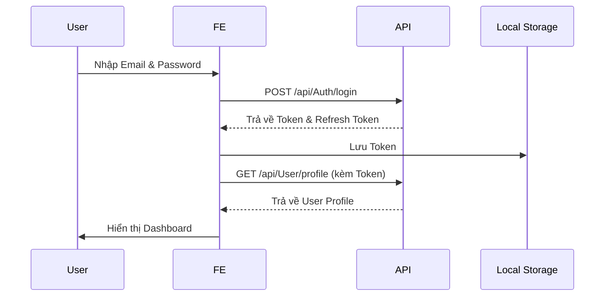
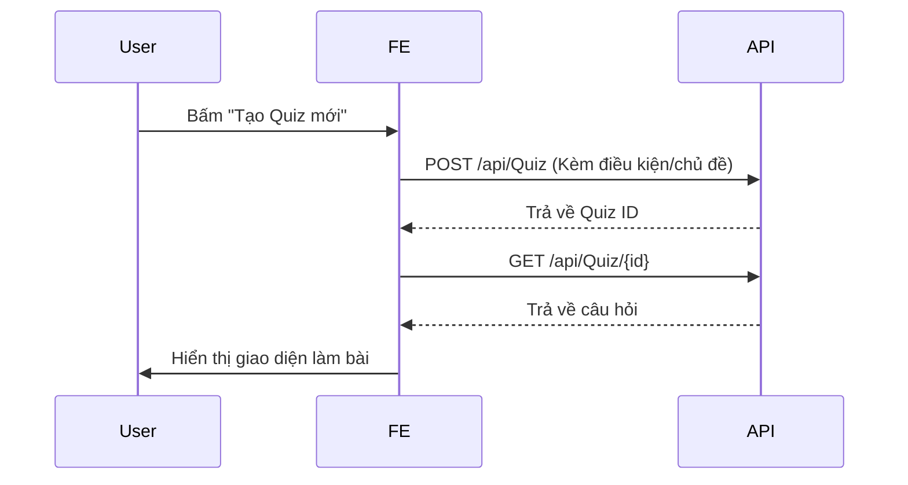
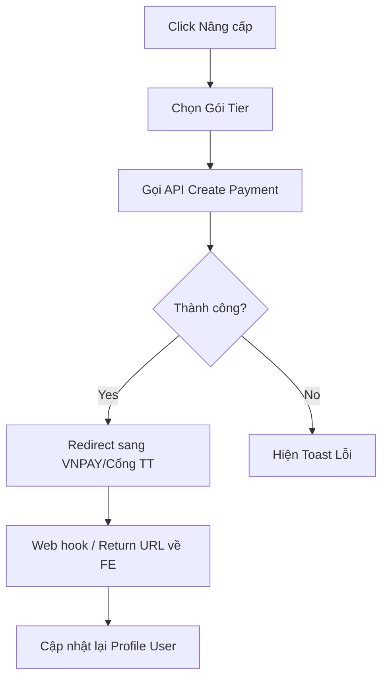
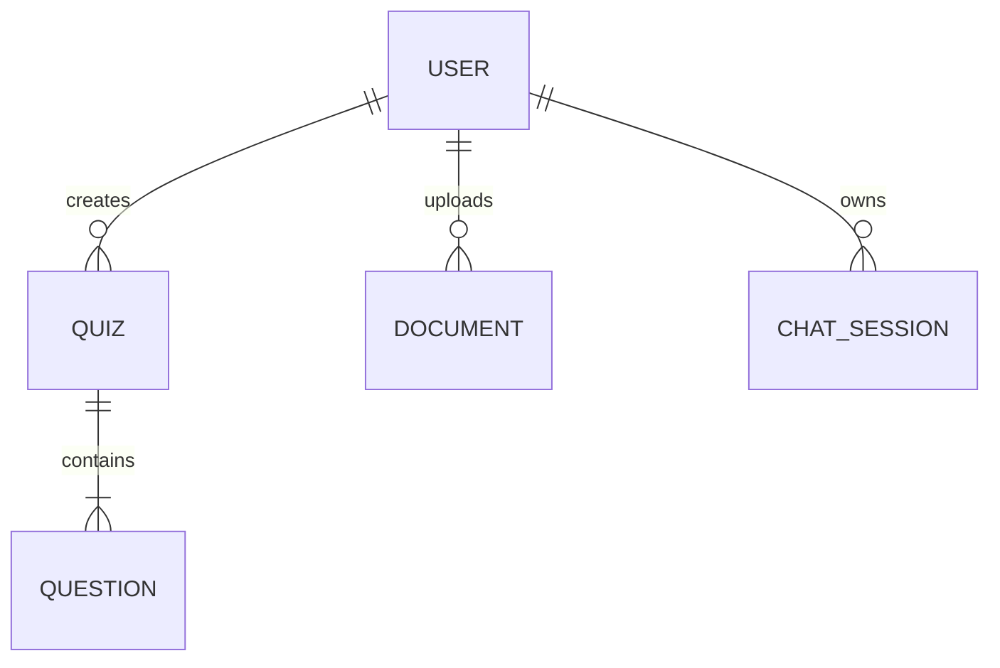

# 1. Tổng quan hệ thống

- **Kiến trúc Backend**: ASP.NET Core 8 Web API
- **Authentication**: JWT Bearer Token
- **Authorization**: Role-based (Admin, User, etc.) & Subscription Tier-based
- **Response Format**: Thường trả về data trực tiếp hoặc gói trong một object chứa Data, Message, Success (cần xem kỹ từng API).
- **Error Format**: Theo chuẩn HTTP Status Code. Các lỗi validation thường trả về `400 Bad Request` kèm theo chi tiết lỗi (ValidationProblemDetails).

## Authentication

```
Authorization: Bearer <token>
```
*Lưu ý: Header `Authorization` bắt buộc ở hầu hết các API ngoại trừ Auth.*

# 2. Base URL

- **Development**: `http://localhost:5000` (hoặc port được config)
- **Swagger**: `http://localhost:5000/swagger`
- **SignalR/WebSocket**: Dự án không sử dụng SignalR.

# 3. Luồng nghiệp vụ (Business Flows)

## Đăng nhập & Xác thực


## Luồng tạo Quiz


# 4. Danh sách toàn bộ API
| API | Method | Description |
|---|---|---|
| `/api/Admin/reindex` | **POST** |  |
| `/api/AI/rag/ask` | **POST** |  |
| `/api/AI/rag/summarize` | **POST** |  |
| `/api/AI/flashcards/generate` | **POST** |  |
| `/api/AI/quizzes/generate` | **POST** |  |
| `/api/Auth/register` | **POST** |  |
| `/api/Auth/login` | **POST** |  |
| `/api/Auth/refresh-token` | **POST** |  |
| `/api/Auth/verify-registration-otp` | **POST** |  |
| `/api/Auth/resend-registration-otp` | **POST** |  |
| `/api/Auth/forgot-password` | **POST** |  |
| `/api/Auth/reset-password` | **POST** |  |
| `/api/Auth/change-password` | **POST** |  |
| `/api/Auth/logout` | **POST** |  |
| `/api/Auth/external-login/{provider}` | **GET** |  |
| `/api/Auth/external-callback/{provider}` | **GET** |  |
| `/api/Chat/sessions` | **GET** |  |
| `/api/Chat/sessions` | **POST** |  |
| `/api/Chat/sessions/{sessionId}/messages` | **GET** |  |
| `/api/Chat/messages` | **POST** |  |
| `/api/Document` | **GET** |  |
| `/api/Document/{id}` | **GET** |  |
| `/api/Document/{id}` | **PUT** |  |
| `/api/Document/{id}` | **DELETE** |  |
| `/api/Document/{id}/share` | **POST** |  |
| `/api/Document/{id}/download` | **GET** |  |
| `/api/Document/{id}/preview` | **GET** |  |
| `/api/Document/{id}/status` | **GET** |  |
| `/api/Document/{id}/chunks` | **GET** |  |
| `/api/Document/upload/file` | **POST** |  |
| `/api/Document/{id}/reprocess` | **POST** |  |
| `/api/Flashcard/{docId}/flashcards` | **GET** |  |
| `/api/Flashcard` | **GET** |  |
| `/api/Flashcard` | **POST** |  |
| `/api/Flashcard/{id}` | **GET** |  |
| `/api/Flashcard/{id}` | **PUT** |  |
| `/api/Flashcard/{id}` | **DELETE** |  |
| `/api/Notification` | **GET** |  |
| `/api/Notification/{id}` | **GET** |  |
| `/api/Notification/my` | **GET** |  |
| `/api/Notification/{id}/read` | **POST** |  |
| `/api/Notification/mark-all-read` | **POST** |  |
| `/api/Payment` | **GET** |  |
| `/api/Payment/{id}` | **GET** |  |
| `/api/Payment/my` | **GET** |  |
| `/api/Payment/{id}/refund` | **POST** |  |
| `/api/Payment/create-checkout-url` | **POST** |  |
| `/api/Payment/vnpay-return` | **GET** |  |
| `/api/Question` | **GET** |  |
| `/api/Question` | **POST** |  |
| `/api/Question/{id}` | **GET** |  |
| `/api/Question/{id}` | **PUT** |  |
| `/api/Question/{id}` | **DELETE** |  |
| `/api/Quiz` | **GET** |  |
| `/api/Quiz/{id}` | **GET** |  |
| `/api/Quiz/{id}` | **DELETE** |  |
| `/api/Quiz/{id}/questions` | **GET** |  |
| `/api/Quiz/{quizId}/questions/{questionId}` | **GET** |  |
| `/api/Quiz/{quizId}/questions/{questionId}/answers` | **GET** |  |
| `/api/QuizSubmission` | **GET** |  |
| `/api/QuizSubmission/{id}` | **GET** |  |
| `/api/Report` | **GET** |  |
| `/api/Report` | **POST** |  |
| `/api/Report/{id}` | **GET** |  |
| `/api/Report/{id}` | **DELETE** |  |
| `/api/Subject` | **GET** |  |
| `/api/Subject` | **POST** |  |
| `/api/Subject/{id}` | **GET** |  |
| `/api/Subject/{id}` | **PUT** |  |
| `/api/Subject/{id}` | **DELETE** |  |
| `/api/TierMembership` | **GET** |  |
| `/api/TierMembership` | **POST** |  |
| `/api/TierMembership/{id}` | **GET** |  |
| `/api/TierMembership/{id}` | **PUT** |  |
| `/api/TierMembership/{id}` | **DELETE** |  |
| `/api/User` | **GET** |  |
| `/api/User/{id}` | **GET** |  |
| `/api/User/me/tier` | **GET** |  |
| `/api/User/shareable` | **GET** |  |
| `/api/User/{id}/tier` | **PUT** |  |
| `/api/User/me` | **PUT** |  |
| `/api/Vote/{id}` | **GET** |  |
| `/api/Vote/{id}` | **DELETE** |  |
| `/api/Vote` | **POST** |  |

# 5. Chi tiết từng API

## POST /api/Admin/reindex
**POST** `/api/Admin/reindex`

- **Yêu cầu Token:** Không/Tùy chọn (Cần check code)

### Responses
**200** - OK
---

## POST /api/AI/rag/ask
**POST** `/api/AI/rag/ask`

- **Yêu cầu Token:** Không/Tùy chọn (Cần check code)

### Body (`application/json`)
```json
{
  "question": "string",
}
```

### Responses
**200** - OK
---

## POST /api/AI/rag/summarize
**POST** `/api/AI/rag/summarize`

- **Yêu cầu Token:** Không/Tùy chọn (Cần check code)

### Body (`application/json`)
```json
{
  "documentId": "string",
}
```

### Responses
**200** - OK
---

## POST /api/AI/flashcards/generate
**POST** `/api/AI/flashcards/generate`

- **Yêu cầu Token:** Không/Tùy chọn (Cần check code)

### Body (`application/json`)
```json
{
  "numberOfFlashcards": 0,
}
```

### Parameters
| Name | In | Type | Required | Description |
|---|---|---|---|---|
| docId | query | string | No |  |


### Responses
**200** - OK
```json
[
  {
    "id": "string",
    "documentId": "string",
    "front": "string",
    "back": "string",
    "createdAt": "string",
    "updatedAt": "string",
  }
]
```

---

## POST /api/AI/quizzes/generate
**POST** `/api/AI/quizzes/generate`

- **Yêu cầu Token:** Không/Tùy chọn (Cần check code)

### Body (`application/json`)
```json
{
  "numberOfQuestions": 0,
}
```

### Parameters
| Name | In | Type | Required | Description |
|---|---|---|---|---|
| docId | query | string | No |  |


### Responses
**200** - OK
```json
{
  "id": "string",
  "documentId": "string",
  "title": "string",
  "createdAt": "string",
  "updatedAt": "string",
  "questions": [
    {
      "id": "string",
      "quizId": "string",
      "title": "string",
      "type": "integer",
      "position": 0,
      "createdAt": "string",
      "updatedAt": "string",
      "answers": [
        {
          "id": "string",
          "questionId": "string",
          "selectedOption": "string",
          "isCorrect": false,
          "createdAt": "string",
          "updatedAt": "string",
        }
      ],
    }
  ],
}
```

---

## POST /api/Auth/register
**POST** `/api/Auth/register`

- **Yêu cầu Token:** Không/Tùy chọn (Cần check code)

### Body (`application/json`)
```json
{
  "fullName": "string",
  "email": "string",
  "password": "string",
  "dateOfBirth": "string",
}
```

### Responses
**200** - OK
```json
{
  "message": "string",
  "email": "string",
}
```

---

## POST /api/Auth/login
**POST** `/api/Auth/login`

- **Yêu cầu Token:** Không/Tùy chọn (Cần check code)

### Body (`application/json`)
```json
{
  "email": "string",
  "password": "string",
}
```

### Responses
**200** - OK
```json
{
  "user": {
    "id": "string",
    "fullName": "string",
    "email": "string",
    "dateOfBirth": "string",
    "currentStorageCapacity": 0,
    "currentAiTokenUsage": 0,
    "status": "string",
    "role": "string",
    "tierId": "string",
    "tierName": "string",
    "tierStorageLimitMb": 0,
    "tierAiTokens": 0,
    "tierExpireAt": "string",
    "createdAt": "string",
    "updatedAt": "string",
  },
  "accessToken": "string",
  "accessTokenExpiresAt": "string",
  "refreshToken": "string",
  "refreshTokenExpiresAt": "string",
}
```

---

## POST /api/Auth/refresh-token
**POST** `/api/Auth/refresh-token`

- **Yêu cầu Token:** Không/Tùy chọn (Cần check code)

### Body (`application/json`)
```json
{
  "refreshToken": "string",
}
```

### Responses
**200** - OK
```json
{
  "user": {
    "id": "string",
    "fullName": "string",
    "email": "string",
    "dateOfBirth": "string",
    "currentStorageCapacity": 0,
    "currentAiTokenUsage": 0,
    "status": "string",
    "role": "string",
    "tierId": "string",
    "tierName": "string",
    "tierStorageLimitMb": 0,
    "tierAiTokens": 0,
    "tierExpireAt": "string",
    "createdAt": "string",
    "updatedAt": "string",
  },
  "accessToken": "string",
  "accessTokenExpiresAt": "string",
  "refreshToken": "string",
  "refreshTokenExpiresAt": "string",
}
```

---

## POST /api/Auth/verify-registration-otp
**POST** `/api/Auth/verify-registration-otp`

- **Yêu cầu Token:** Không/Tùy chọn (Cần check code)

### Body (`application/json`)
```json
{
  "email": "string",
  "otp": "string",
}
```

### Responses
**200** - OK
---

## POST /api/Auth/resend-registration-otp
**POST** `/api/Auth/resend-registration-otp`

- **Yêu cầu Token:** Không/Tùy chọn (Cần check code)

### Body (`application/json`)
```json
{
  "email": "string",
}
```

### Responses
**200** - OK
---

## POST /api/Auth/forgot-password
**POST** `/api/Auth/forgot-password`

- **Yêu cầu Token:** Không/Tùy chọn (Cần check code)

### Body (`application/json`)
```json
{
  "email": "string",
}
```

### Responses
**200** - OK
---

## POST /api/Auth/reset-password
**POST** `/api/Auth/reset-password`

- **Yêu cầu Token:** Không/Tùy chọn (Cần check code)

### Body (`application/json`)
```json
{
  "email": "string",
  "otp": "string",
  "newPassword": "string",
}
```

### Responses
**200** - OK
---

## POST /api/Auth/change-password
**POST** `/api/Auth/change-password`

- **Yêu cầu Token:** Không/Tùy chọn (Cần check code)

### Body (`application/json`)
```json
{
  "currentPassword": "string",
  "newPassword": "string",
}
```

### Responses
**200** - OK
---

## POST /api/Auth/logout
**POST** `/api/Auth/logout`

- **Yêu cầu Token:** Không/Tùy chọn (Cần check code)

### Body (`application/json`)
```json
{
  "refreshToken": "string",
}
```

### Responses
**200** - OK
---

## GET /api/Auth/external-login/{provider}
**GET** `/api/Auth/external-login/{provider}`

- **Yêu cầu Token:** Không/Tùy chọn (Cần check code)

### Parameters
| Name | In | Type | Required | Description |
|---|---|---|---|---|
| provider | path | string | Yes |  |


### Responses
**200** - OK
---

## GET /api/Auth/external-callback/{provider}
**GET** `/api/Auth/external-callback/{provider}`

- **Yêu cầu Token:** Không/Tùy chọn (Cần check code)

### Parameters
| Name | In | Type | Required | Description |
|---|---|---|---|---|
| provider | path | string | Yes |  |


### Responses
**200** - OK
```json
{
  "user": {
    "id": "string",
    "fullName": "string",
    "email": "string",
    "dateOfBirth": "string",
    "currentStorageCapacity": 0,
    "currentAiTokenUsage": 0,
    "status": "string",
    "role": "string",
    "tierId": "string",
    "tierName": "string",
    "tierStorageLimitMb": 0,
    "tierAiTokens": 0,
    "tierExpireAt": "string",
    "createdAt": "string",
    "updatedAt": "string",
  },
  "accessToken": "string",
  "accessTokenExpiresAt": "string",
  "refreshToken": "string",
  "refreshTokenExpiresAt": "string",
}
```

---

## GET /api/Chat/sessions
**GET** `/api/Chat/sessions`

- **Yêu cầu Token:** Không/Tùy chọn (Cần check code)

### Responses
**200** - OK
```json
[
  {
    "id": "string",
    "userId": "string",
    "documentId": "string",
    "sessionTitle": "string",
    "createdAt": "string",
    "updatedAt": "string",
  }
]
```

---

## POST /api/Chat/sessions
**POST** `/api/Chat/sessions`

- **Yêu cầu Token:** Không/Tùy chọn (Cần check code)

### Body (`application/json`)
```json
{
  "sessionTitle": "string",
}
```

### Responses
**200** - OK
```json
{
  "id": "string",
  "userId": "string",
  "documentId": "string",
  "sessionTitle": "string",
  "createdAt": "string",
  "updatedAt": "string",
}
```

---

## GET /api/Chat/sessions/{sessionId}/messages
**GET** `/api/Chat/sessions/{sessionId}/messages`

- **Yêu cầu Token:** Không/Tùy chọn (Cần check code)

### Parameters
| Name | In | Type | Required | Description |
|---|---|---|---|---|
| sessionId | path | string | Yes |  |


### Responses
**200** - OK
```json
[
  {
    "id": "string",
    "chatSessionId": "string",
    "sender": "string",
    "content": "string",
    "createdAt": "string",
    "updatedAt": "string",
  }
]
```

---

## POST /api/Chat/messages
**POST** `/api/Chat/messages`

- **Yêu cầu Token:** Không/Tùy chọn (Cần check code)

### Body (`application/json`)
```json
{
  "sessionId": "string",
  "documentId": "string",
  "message": "string",
}
```

### Responses
**200** - OK
```json
{
  "id": "string",
  "chatSessionId": "string",
  "sender": "string",
  "content": "string",
  "createdAt": "string",
  "updatedAt": "string",
}
```

---

## GET /api/Document
**GET** `/api/Document`

- **Yêu cầu Token:** Không/Tùy chọn (Cần check code)

### Parameters
| Name | In | Type | Required | Description |
|---|---|---|---|---|
| Offset | query | integer | No |  |
| Limit | query | integer | No |  |
| SearchTerm | query | string | No |  |
| SortBy | query | string | No |  |
| IsDescending | query | boolean | No |  |
| subjectId | query | string | No |  |


### Responses
**200** - OK
```json
{
  "items": [
    {
      "id": "string",
      "userId": "string",
      "subjectId": "string",
      "title": "string",
      "fileLink": "string",
      "fileName": "string",
      "fileExtension": "string",
      "fileType": "string",
      "fileSizeBytes": 0,
      "sharedUsers": "string",
      "shareStatus": "string",
      "status": "integer",
      "voteCount": 0,
      "createdAt": "string",
      "updatedAt": "string",
    }
  ],
  "totalCount": 0,
  "offset": 0,
  "limit": 0,
}
```

---

## GET /api/Document/{id}
**GET** `/api/Document/{id}`

- **Yêu cầu Token:** Không/Tùy chọn (Cần check code)

### Parameters
| Name | In | Type | Required | Description |
|---|---|---|---|---|
| id | path | string | Yes |  |


### Responses
**200** - OK
```json
{
  "id": "string",
  "userId": "string",
  "subjectId": "string",
  "title": "string",
  "fileLink": "string",
  "fileName": "string",
  "fileExtension": "string",
  "fileType": "string",
  "fileSizeBytes": 0,
  "sharedUsers": "string",
  "shareStatus": "string",
  "status": "integer",
  "voteCount": 0,
  "createdAt": "string",
  "updatedAt": "string",
}
```

---

## PUT /api/Document/{id}
**PUT** `/api/Document/{id}`

- **Yêu cầu Token:** Không/Tùy chọn (Cần check code)

### Body (`application/json`)
```json
{
  "title": "string",
  "fileName": "string",
  "fileExtension": "string",
  "fileType": "string",
  "shareStatus": "string",
}
```

### Parameters
| Name | In | Type | Required | Description |
|---|---|---|---|---|
| id | path | string | Yes |  |


### Responses
**200** - OK
```json
{
  "id": "string",
  "userId": "string",
  "subjectId": "string",
  "title": "string",
  "fileLink": "string",
  "fileName": "string",
  "fileExtension": "string",
  "fileType": "string",
  "fileSizeBytes": 0,
  "sharedUsers": "string",
  "shareStatus": "string",
  "status": "integer",
  "voteCount": 0,
  "createdAt": "string",
  "updatedAt": "string",
}
```

---

## DELETE /api/Document/{id}
**DELETE** `/api/Document/{id}`

- **Yêu cầu Token:** Không/Tùy chọn (Cần check code)

### Parameters
| Name | In | Type | Required | Description |
|---|---|---|---|---|
| id | path | string | Yes |  |


### Responses
**200** - OK
---

## POST /api/Document/{id}/share
**POST** `/api/Document/{id}/share`

- **Yêu cầu Token:** Không/Tùy chọn (Cần check code)

### Body (`application/json`)
```json
{
  "sharedUserIds": [
    "string"
  ],
}
```

### Parameters
| Name | In | Type | Required | Description |
|---|---|---|---|---|
| id | path | string | Yes |  |


### Responses
**200** - OK
```json
{
  "documentId": "string",
  "sharedUserIds": [
    "string"
  ],
}
```

---

## GET /api/Document/{id}/download
**GET** `/api/Document/{id}/download`

- **Yêu cầu Token:** Không/Tùy chọn (Cần check code)

### Parameters
| Name | In | Type | Required | Description |
|---|---|---|---|---|
| id | path | string | Yes |  |


### Responses
**200** - OK
---

## GET /api/Document/{id}/preview
**GET** `/api/Document/{id}/preview`

- **Yêu cầu Token:** Không/Tùy chọn (Cần check code)

### Parameters
| Name | In | Type | Required | Description |
|---|---|---|---|---|
| id | path | string | Yes |  |


### Responses
**200** - OK
---

## GET /api/Document/{id}/status
**GET** `/api/Document/{id}/status`

- **Yêu cầu Token:** Không/Tùy chọn (Cần check code)

### Parameters
| Name | In | Type | Required | Description |
|---|---|---|---|---|
| id | path | string | Yes |  |


### Responses
**200** - OK
---

## GET /api/Document/{id}/chunks
**GET** `/api/Document/{id}/chunks`

- **Yêu cầu Token:** Không/Tùy chọn (Cần check code)

### Parameters
| Name | In | Type | Required | Description |
|---|---|---|---|---|
| id | path | string | Yes |  |


### Responses
**200** - OK
```json
[
  {
    "id": "string",
    "documentId": "string",
    "content": "string",
    "orderIndex": 0,
    "vectorId": "string",
    "score": 0,
  }
]
```

---

## POST /api/Document/upload/file
**POST** `/api/Document/upload/file`

- **Yêu cầu Token:** Không/Tùy chọn (Cần check code)

### Body (`multipart/form-data`)
```json
{
  "file": "string", // File to upload (.pdf, .docx, .txt, .md, .jpg, .png, .mp4, .mp3, etc.)
  "title": "string", // Document title
  "subjectId": "string", // Subject ID
}
```

### Responses
**200** - OK
```json
{
  "documentId": "string",
  "status": "string",
  "chunkCount": 0,
  "message": "string",
}
```

---

## POST /api/Document/{id}/reprocess
**POST** `/api/Document/{id}/reprocess`

- **Yêu cầu Token:** Không/Tùy chọn (Cần check code)

### Parameters
| Name | In | Type | Required | Description |
|---|---|---|---|---|
| id | path | string | Yes |  |


### Responses
**200** - OK
```json
{
  "documentId": "string",
  "status": "string",
  "chunkCount": 0,
  "message": "string",
}
```

---

## GET /api/Flashcard/{docId}/flashcards
**GET** `/api/Flashcard/{docId}/flashcards`

- **Yêu cầu Token:** Không/Tùy chọn (Cần check code)

### Parameters
| Name | In | Type | Required | Description |
|---|---|---|---|---|
| docId | path | string | Yes |  |


### Responses
**200** - OK
```json
[
  {
    "id": "string",
    "documentId": "string",
    "front": "string",
    "back": "string",
    "createdAt": "string",
    "updatedAt": "string",
  }
]
```

---

## GET /api/Flashcard
**GET** `/api/Flashcard`

- **Yêu cầu Token:** Không/Tùy chọn (Cần check code)

### Parameters
| Name | In | Type | Required | Description |
|---|---|---|---|---|
| Offset | query | integer | No |  |
| Limit | query | integer | No |  |
| SearchTerm | query | string | No |  |
| SortBy | query | string | No |  |
| IsDescending | query | boolean | No |  |


### Responses
**200** - OK
```json
{
  "items": [
    {
      "id": "string",
      "documentId": "string",
      "front": "string",
      "back": "string",
      "createdAt": "string",
      "updatedAt": "string",
    }
  ],
  "totalCount": 0,
  "offset": 0,
  "limit": 0,
}
```

---

## POST /api/Flashcard
**POST** `/api/Flashcard`

- **Yêu cầu Token:** Không/Tùy chọn (Cần check code)

### Body (`application/json`)
```json
{
  "documentId": "string",
  "front": "string",
  "back": "string",
}
```

### Responses
**200** - OK
```json
{
  "id": "string",
  "documentId": "string",
  "front": "string",
  "back": "string",
  "createdAt": "string",
  "updatedAt": "string",
}
```

---

## GET /api/Flashcard/{id}
**GET** `/api/Flashcard/{id}`

- **Yêu cầu Token:** Không/Tùy chọn (Cần check code)

### Parameters
| Name | In | Type | Required | Description |
|---|---|---|---|---|
| id | path | string | Yes |  |


### Responses
**200** - OK
```json
{
  "id": "string",
  "documentId": "string",
  "front": "string",
  "back": "string",
  "createdAt": "string",
  "updatedAt": "string",
}
```

---

## PUT /api/Flashcard/{id}
**PUT** `/api/Flashcard/{id}`

- **Yêu cầu Token:** Không/Tùy chọn (Cần check code)

### Body (`application/json`)
```json
{
  "front": "string",
  "back": "string",
}
```

### Parameters
| Name | In | Type | Required | Description |
|---|---|---|---|---|
| id | path | string | Yes |  |


### Responses
**200** - OK
```json
{
  "id": "string",
  "documentId": "string",
  "front": "string",
  "back": "string",
  "createdAt": "string",
  "updatedAt": "string",
}
```

---

## DELETE /api/Flashcard/{id}
**DELETE** `/api/Flashcard/{id}`

- **Yêu cầu Token:** Không/Tùy chọn (Cần check code)

### Parameters
| Name | In | Type | Required | Description |
|---|---|---|---|---|
| id | path | string | Yes |  |


### Responses
**200** - OK
---

## GET /api/Notification
**GET** `/api/Notification`

- **Yêu cầu Token:** Không/Tùy chọn (Cần check code)

### Responses
**200** - OK
```json
[
  {
    "id": "string",
    "userId": "string",
    "message": "string",
    "isRead": false,
    "type": "string",
    "createdAt": "string",
    "updatedAt": "string",
  }
]
```

---

## GET /api/Notification/{id}
**GET** `/api/Notification/{id}`

- **Yêu cầu Token:** Không/Tùy chọn (Cần check code)

### Parameters
| Name | In | Type | Required | Description |
|---|---|---|---|---|
| id | path | string | Yes |  |


### Responses
**200** - OK
```json
{
  "id": "string",
  "userId": "string",
  "message": "string",
  "isRead": false,
  "type": "string",
  "createdAt": "string",
  "updatedAt": "string",
}
```

---

## GET /api/Notification/my
**GET** `/api/Notification/my`

- **Yêu cầu Token:** Không/Tùy chọn (Cần check code)

### Responses
**200** - OK
```json
[
  {
    "id": "string",
    "userId": "string",
    "message": "string",
    "isRead": false,
    "type": "string",
    "createdAt": "string",
    "updatedAt": "string",
  }
]
```

---

## POST /api/Notification/{id}/read
**POST** `/api/Notification/{id}/read`

- **Yêu cầu Token:** Không/Tùy chọn (Cần check code)

### Parameters
| Name | In | Type | Required | Description |
|---|---|---|---|---|
| id | path | string | Yes |  |


### Responses
**200** - OK
---

## POST /api/Notification/mark-all-read
**POST** `/api/Notification/mark-all-read`

- **Yêu cầu Token:** Không/Tùy chọn (Cần check code)

### Responses
**200** - OK
---

## GET /api/Payment
**GET** `/api/Payment`

- **Yêu cầu Token:** Không/Tùy chọn (Cần check code)

### Responses
**200** - OK
```json
[
  {
    "id": "string",
    "userId": "string",
    "paymentInfo": "string",
    "paymentDate": "string",
    "status": "integer",
    "tierId": "string",
    "createdAt": "string",
    "updatedAt": "string",
  }
]
```

---

## GET /api/Payment/{id}
**GET** `/api/Payment/{id}`

- **Yêu cầu Token:** Không/Tùy chọn (Cần check code)

### Parameters
| Name | In | Type | Required | Description |
|---|---|---|---|---|
| id | path | string | Yes |  |


### Responses
**200** - OK
```json
{
  "id": "string",
  "userId": "string",
  "paymentInfo": "string",
  "paymentDate": "string",
  "status": "integer",
  "tierId": "string",
  "createdAt": "string",
  "updatedAt": "string",
}
```

---

## GET /api/Payment/my
**GET** `/api/Payment/my`

- **Yêu cầu Token:** Không/Tùy chọn (Cần check code)

### Responses
**200** - OK
```json
[
  {
    "id": "string",
    "userId": "string",
    "paymentInfo": "string",
    "paymentDate": "string",
    "status": "integer",
    "tierId": "string",
    "createdAt": "string",
    "updatedAt": "string",
  }
]
```

---

## POST /api/Payment/{id}/refund
**POST** `/api/Payment/{id}/refund`

- **Yêu cầu Token:** Không/Tùy chọn (Cần check code)

### Parameters
| Name | In | Type | Required | Description |
|---|---|---|---|---|
| id | path | string | Yes |  |


### Responses
**200** - OK
---

## POST /api/Payment/create-checkout-url
**POST** `/api/Payment/create-checkout-url`

- **Yêu cầu Token:** Không/Tùy chọn (Cần check code)

### Body (`application/json`)
```json
{
  "tierId": "string",
}
```

### Responses
**200** - OK
```json
{
  "paymentUrl": "string",
}
```

---

## GET /api/Payment/vnpay-return
**GET** `/api/Payment/vnpay-return`

- **Yêu cầu Token:** Không/Tùy chọn (Cần check code)

### Responses
**200** - OK
---

## GET /api/Question
**GET** `/api/Question`

- **Yêu cầu Token:** Không/Tùy chọn (Cần check code)

### Responses
**200** - OK
```json
[
  {
    "id": "string",
    "quizId": "string",
    "title": "string",
    "type": "integer",
    "position": 0,
    "createdAt": "string",
    "updatedAt": "string",
    "answers": [
      {
        "id": "string",
        "questionId": "string",
        "selectedOption": "string",
        "isCorrect": false,
        "createdAt": "string",
        "updatedAt": "string",
      }
    ],
  }
]
```

---

## POST /api/Question
**POST** `/api/Question`

- **Yêu cầu Token:** Không/Tùy chọn (Cần check code)

### Body (`application/json`)
```json
{
  "quizId": "string",
  "title": "string",
  "type": "integer",
  "position": 0,
}
```

### Responses
**200** - OK
```json
{
  "id": "string",
  "quizId": "string",
  "title": "string",
  "type": "integer",
  "position": 0,
  "createdAt": "string",
  "updatedAt": "string",
  "answers": [
    {
      "id": "string",
      "questionId": "string",
      "selectedOption": "string",
      "isCorrect": false,
      "createdAt": "string",
      "updatedAt": "string",
    }
  ],
}
```

---

## GET /api/Question/{id}
**GET** `/api/Question/{id}`

- **Yêu cầu Token:** Không/Tùy chọn (Cần check code)

### Parameters
| Name | In | Type | Required | Description |
|---|---|---|---|---|
| id | path | string | Yes |  |


### Responses
**200** - OK
```json
{
  "id": "string",
  "quizId": "string",
  "title": "string",
  "type": "integer",
  "position": 0,
  "createdAt": "string",
  "updatedAt": "string",
  "answers": [
    {
      "id": "string",
      "questionId": "string",
      "selectedOption": "string",
      "isCorrect": false,
      "createdAt": "string",
      "updatedAt": "string",
    }
  ],
}
```

---

## PUT /api/Question/{id}
**PUT** `/api/Question/{id}`

- **Yêu cầu Token:** Không/Tùy chọn (Cần check code)

### Body (`application/json`)
```json
{
  "title": "string",
  "type": "integer",
  "position": 0,
}
```

### Parameters
| Name | In | Type | Required | Description |
|---|---|---|---|---|
| id | path | string | Yes |  |


### Responses
**200** - OK
```json
{
  "id": "string",
  "quizId": "string",
  "title": "string",
  "type": "integer",
  "position": 0,
  "createdAt": "string",
  "updatedAt": "string",
  "answers": [
    {
      "id": "string",
      "questionId": "string",
      "selectedOption": "string",
      "isCorrect": false,
      "createdAt": "string",
      "updatedAt": "string",
    }
  ],
}
```

---

## DELETE /api/Question/{id}
**DELETE** `/api/Question/{id}`

- **Yêu cầu Token:** Không/Tùy chọn (Cần check code)

### Parameters
| Name | In | Type | Required | Description |
|---|---|---|---|---|
| id | path | string | Yes |  |


### Responses
**200** - OK
---

## GET /api/Quiz
**GET** `/api/Quiz`

- **Yêu cầu Token:** Không/Tùy chọn (Cần check code)

### Parameters
| Name | In | Type | Required | Description |
|---|---|---|---|---|
| Offset | query | integer | No |  |
| Limit | query | integer | No |  |
| SearchTerm | query | string | No |  |
| SortBy | query | string | No |  |
| IsDescending | query | boolean | No |  |


### Responses
**200** - OK
```json
{
  "items": [
    {
      "id": "string",
      "documentId": "string",
      "title": "string",
      "createdAt": "string",
      "updatedAt": "string",
      "questions": [
        {
          "id": "string",
          "quizId": "string",
          "title": "string",
          "type": "integer",
          "position": 0,
          "createdAt": "string",
          "updatedAt": "string",
          "answers": [
            {
              "id": "string",
              "questionId": "string",
              "selectedOption": "string",
              "isCorrect": false,
              "createdAt": "string",
              "updatedAt": "string",
            }
          ],
        }
      ],
    }
  ],
  "totalCount": 0,
  "offset": 0,
  "limit": 0,
}
```

---

## GET /api/Quiz/{id}
**GET** `/api/Quiz/{id}`

- **Yêu cầu Token:** Không/Tùy chọn (Cần check code)

### Parameters
| Name | In | Type | Required | Description |
|---|---|---|---|---|
| id | path | string | Yes |  |


### Responses
**200** - OK
```json
{
  "id": "string",
  "documentId": "string",
  "title": "string",
  "createdAt": "string",
  "updatedAt": "string",
  "questions": [
    {
      "id": "string",
      "quizId": "string",
      "title": "string",
      "type": "integer",
      "position": 0,
      "createdAt": "string",
      "updatedAt": "string",
      "answers": [
        {
          "id": "string",
          "questionId": "string",
          "selectedOption": "string",
          "isCorrect": false,
          "createdAt": "string",
          "updatedAt": "string",
        }
      ],
    }
  ],
}
```

---

## DELETE /api/Quiz/{id}
**DELETE** `/api/Quiz/{id}`

- **Yêu cầu Token:** Không/Tùy chọn (Cần check code)

### Parameters
| Name | In | Type | Required | Description |
|---|---|---|---|---|
| id | path | string | Yes |  |


### Responses
**200** - OK
---

## GET /api/Quiz/{id}/questions
**GET** `/api/Quiz/{id}/questions`

- **Yêu cầu Token:** Không/Tùy chọn (Cần check code)

### Parameters
| Name | In | Type | Required | Description |
|---|---|---|---|---|
| id | path | string | Yes |  |


### Responses
**200** - OK
```json
[
  {
    "id": "string",
    "quizId": "string",
    "title": "string",
    "type": "integer",
    "position": 0,
    "createdAt": "string",
    "updatedAt": "string",
    "answers": [
      {
        "id": "string",
        "questionId": "string",
        "selectedOption": "string",
        "isCorrect": false,
        "createdAt": "string",
        "updatedAt": "string",
      }
    ],
  }
]
```

---

## GET /api/Quiz/{quizId}/questions/{questionId}
**GET** `/api/Quiz/{quizId}/questions/{questionId}`

- **Yêu cầu Token:** Không/Tùy chọn (Cần check code)

### Parameters
| Name | In | Type | Required | Description |
|---|---|---|---|---|
| quizId | path | string | Yes |  |
| questionId | path | string | Yes |  |


### Responses
**200** - OK
```json
{
  "id": "string",
  "quizId": "string",
  "title": "string",
  "type": "integer",
  "position": 0,
  "createdAt": "string",
  "updatedAt": "string",
  "answers": [
    {
      "id": "string",
      "questionId": "string",
      "selectedOption": "string",
      "isCorrect": false,
      "createdAt": "string",
      "updatedAt": "string",
    }
  ],
}
```

---

## GET /api/Quiz/{quizId}/questions/{questionId}/answers
**GET** `/api/Quiz/{quizId}/questions/{questionId}/answers`

- **Yêu cầu Token:** Không/Tùy chọn (Cần check code)

### Parameters
| Name | In | Type | Required | Description |
|---|---|---|---|---|
| quizId | path | string | Yes |  |
| questionId | path | string | Yes |  |


### Responses
**200** - OK
```json
[
  {
    "id": "string",
    "questionId": "string",
    "selectedOption": "string",
    "isCorrect": false,
    "createdAt": "string",
    "updatedAt": "string",
  }
]
```

---

## GET /api/QuizSubmission
**GET** `/api/QuizSubmission`

- **Yêu cầu Token:** Không/Tùy chọn (Cần check code)

### Responses
**200** - OK
```json
[
  {
    "id": "string",
    "userId": "string",
    "quizId": "string",
    "answers": "string",
    "score": 0,
    "maxScore": 0,
    "totalCorrect": 0,
    "gradedAt": "string",
    "submittedAt": "string",
    "createdAt": "string",
    "updatedAt": "string",
  }
]
```

---

## GET /api/QuizSubmission/{id}
**GET** `/api/QuizSubmission/{id}`

- **Yêu cầu Token:** Không/Tùy chọn (Cần check code)

### Parameters
| Name | In | Type | Required | Description |
|---|---|---|---|---|
| id | path | string | Yes |  |


### Responses
**200** - OK
```json
{
  "id": "string",
  "userId": "string",
  "quizId": "string",
  "answers": "string",
  "score": 0,
  "maxScore": 0,
  "totalCorrect": 0,
  "gradedAt": "string",
  "submittedAt": "string",
  "createdAt": "string",
  "updatedAt": "string",
}
```

---

## GET /api/Report
**GET** `/api/Report`

- **Yêu cầu Token:** Không/Tùy chọn (Cần check code)

### Responses
**200** - OK
```json
[
  {
    "id": "string",
    "userId": "string",
    "documentId": "string",
    "reason": "string",
    "createdAt": "string",
    "updatedAt": "string",
  }
]
```

---

## POST /api/Report
**POST** `/api/Report`

- **Yêu cầu Token:** Không/Tùy chọn (Cần check code)

### Body (`application/json`)
```json
{
  "userId": "string",
  "documentId": "string",
  "reason": "string",
}
```

### Responses
**200** - OK
```json
{
  "id": "string",
  "userId": "string",
  "documentId": "string",
  "reason": "string",
  "createdAt": "string",
  "updatedAt": "string",
}
```

---

## GET /api/Report/{id}
**GET** `/api/Report/{id}`

- **Yêu cầu Token:** Không/Tùy chọn (Cần check code)

### Parameters
| Name | In | Type | Required | Description |
|---|---|---|---|---|
| id | path | string | Yes |  |


### Responses
**200** - OK
```json
{
  "id": "string",
  "userId": "string",
  "documentId": "string",
  "reason": "string",
  "createdAt": "string",
  "updatedAt": "string",
}
```

---

## DELETE /api/Report/{id}
**DELETE** `/api/Report/{id}`

- **Yêu cầu Token:** Không/Tùy chọn (Cần check code)

### Parameters
| Name | In | Type | Required | Description |
|---|---|---|---|---|
| id | path | string | Yes |  |


### Responses
**200** - OK
---

## GET /api/Subject
**GET** `/api/Subject`

- **Yêu cầu Token:** Không/Tùy chọn (Cần check code)

### Parameters
| Name | In | Type | Required | Description |
|---|---|---|---|---|
| Offset | query | integer | No |  |
| Limit | query | integer | No |  |
| SearchTerm | query | string | No |  |
| SortBy | query | string | No |  |
| IsDescending | query | boolean | No |  |


### Responses
**200** - OK
```json
{
  "items": [
    {
      "id": "string",
      "subjectCode": "string",
      "subjectName": "string",
      "description": "string",
      "createdAt": "string",
      "updatedAt": "string",
    }
  ],
  "totalCount": 0,
  "offset": 0,
  "limit": 0,
}
```

---

## POST /api/Subject
**POST** `/api/Subject`

- **Yêu cầu Token:** Không/Tùy chọn (Cần check code)

### Body (`application/json`)
```json
{
  "subjectCode": "string",
  "subjectName": "string",
  "description": "string",
}
```

### Responses
**200** - OK
```json
{
  "id": "string",
  "subjectCode": "string",
  "subjectName": "string",
  "description": "string",
  "createdAt": "string",
  "updatedAt": "string",
}
```

---

## GET /api/Subject/{id}
**GET** `/api/Subject/{id}`

- **Yêu cầu Token:** Không/Tùy chọn (Cần check code)

### Parameters
| Name | In | Type | Required | Description |
|---|---|---|---|---|
| id | path | string | Yes |  |


### Responses
**200** - OK
```json
{
  "id": "string",
  "subjectCode": "string",
  "subjectName": "string",
  "description": "string",
  "createdAt": "string",
  "updatedAt": "string",
}
```

---

## PUT /api/Subject/{id}
**PUT** `/api/Subject/{id}`

- **Yêu cầu Token:** Không/Tùy chọn (Cần check code)

### Body (`application/json`)
```json
{
  "subjectCode": "string",
  "subjectName": "string",
  "description": "string",
}
```

### Parameters
| Name | In | Type | Required | Description |
|---|---|---|---|---|
| id | path | string | Yes |  |


### Responses
**200** - OK
```json
{
  "id": "string",
  "subjectCode": "string",
  "subjectName": "string",
  "description": "string",
  "createdAt": "string",
  "updatedAt": "string",
}
```

---

## DELETE /api/Subject/{id}
**DELETE** `/api/Subject/{id}`

- **Yêu cầu Token:** Không/Tùy chọn (Cần check code)

### Parameters
| Name | In | Type | Required | Description |
|---|---|---|---|---|
| id | path | string | Yes |  |


### Responses
**200** - OK
---

## GET /api/TierMembership
**GET** `/api/TierMembership`

- **Yêu cầu Token:** Không/Tùy chọn (Cần check code)

### Responses
**200** - OK
```json
[
  {
    "id": "string",
    "tierName": "string",
    "price": 0,
    "storageLimitMb": 0,
    "aiTokens": 0,
    "createdAt": "string",
    "updatedAt": "string",
  }
]
```

---

## POST /api/TierMembership
**POST** `/api/TierMembership`

- **Yêu cầu Token:** Không/Tùy chọn (Cần check code)

### Body (`application/json`)
```json
{
  "tierName": "string",
  "price": 0,
  "storageLimitMb": 0,
  "aiTokens": 0,
}
```

### Responses
**200** - OK
```json
{
  "id": "string",
  "tierName": "string",
  "price": 0,
  "storageLimitMb": 0,
  "aiTokens": 0,
  "createdAt": "string",
  "updatedAt": "string",
}
```

---

## GET /api/TierMembership/{id}
**GET** `/api/TierMembership/{id}`

- **Yêu cầu Token:** Không/Tùy chọn (Cần check code)

### Parameters
| Name | In | Type | Required | Description |
|---|---|---|---|---|
| id | path | string | Yes |  |


### Responses
**200** - OK
```json
{
  "id": "string",
  "tierName": "string",
  "price": 0,
  "storageLimitMb": 0,
  "aiTokens": 0,
  "createdAt": "string",
  "updatedAt": "string",
}
```

---

## PUT /api/TierMembership/{id}
**PUT** `/api/TierMembership/{id}`

- **Yêu cầu Token:** Không/Tùy chọn (Cần check code)

### Body (`application/json`)
```json
{
  "tierName": "string",
  "price": 0,
  "storageLimitMb": 0,
  "aiTokens": 0,
}
```

### Parameters
| Name | In | Type | Required | Description |
|---|---|---|---|---|
| id | path | string | Yes |  |


### Responses
**200** - OK
```json
{
  "id": "string",
  "tierName": "string",
  "price": 0,
  "storageLimitMb": 0,
  "aiTokens": 0,
  "createdAt": "string",
  "updatedAt": "string",
}
```

---

## DELETE /api/TierMembership/{id}
**DELETE** `/api/TierMembership/{id}`

- **Yêu cầu Token:** Không/Tùy chọn (Cần check code)

### Parameters
| Name | In | Type | Required | Description |
|---|---|---|---|---|
| id | path | string | Yes |  |


### Responses
**200** - OK
---

## GET /api/User
**GET** `/api/User`

- **Yêu cầu Token:** Không/Tùy chọn (Cần check code)

### Responses
**200** - OK
```json
[
  {
    "id": "string",
    "fullName": "string",
    "email": "string",
    "dateOfBirth": "string",
    "currentStorageCapacity": 0,
    "currentAiTokenUsage": 0,
    "status": "string",
    "role": "string",
    "tierId": "string",
    "tierName": "string",
    "tierStorageLimitMb": 0,
    "tierAiTokens": 0,
    "tierExpireAt": "string",
    "createdAt": "string",
    "updatedAt": "string",
  }
]
```

---

## GET /api/User/{id}
**GET** `/api/User/{id}`

- **Yêu cầu Token:** Không/Tùy chọn (Cần check code)

### Parameters
| Name | In | Type | Required | Description |
|---|---|---|---|---|
| id | path | string | Yes |  |


### Responses
**200** - OK
```json
{
  "id": "string",
  "fullName": "string",
  "email": "string",
  "dateOfBirth": "string",
  "currentStorageCapacity": 0,
  "currentAiTokenUsage": 0,
  "status": "string",
  "role": "string",
  "tierId": "string",
  "tierName": "string",
  "tierStorageLimitMb": 0,
  "tierAiTokens": 0,
  "tierExpireAt": "string",
  "createdAt": "string",
  "updatedAt": "string",
}
```

---

## GET /api/User/me/tier
**GET** `/api/User/me/tier`

- **Yêu cầu Token:** Không/Tùy chọn (Cần check code)

### Responses
**200** - OK
```json
{
  "tierId": "string",
  "tierName": "string",
  "storageLimitMb": 0,
  "aiTokens": 0,
  "tierExpireAt": "string",
  "currentStorageMb": 0,
  "currentAiTokensUsed": 0,
}
```

---

## GET /api/User/shareable
**GET** `/api/User/shareable`

- **Yêu cầu Token:** Không/Tùy chọn (Cần check code)

### Parameters
| Name | In | Type | Required | Description |
|---|---|---|---|---|
| keyword | query | string | No |  |


### Responses
**200** - OK
```json
[
  {
    "id": "string",
    "fullName": "string",
    "email": "string",
    "role": "string",
  }
]
```

---

## PUT /api/User/{id}/tier
**PUT** `/api/User/{id}/tier`

- **Yêu cầu Token:** Không/Tùy chọn (Cần check code)

### Body (`application/json`)
```json
{
  "tierId": "string",
  "tierExpireAt": "string",
}
```

### Parameters
| Name | In | Type | Required | Description |
|---|---|---|---|---|
| id | path | string | Yes |  |


### Responses
**200** - OK
---

## PUT /api/User/me
**PUT** `/api/User/me`

- **Yêu cầu Token:** Không/Tùy chọn (Cần check code)

### Body (`application/json`)
```json
{
  "fullName": "string",
  "dateOfBirth": "string",
}
```

### Responses
**200** - OK
---

## GET /api/Vote/{id}
**GET** `/api/Vote/{id}`

- **Yêu cầu Token:** Không/Tùy chọn (Cần check code)

### Parameters
| Name | In | Type | Required | Description |
|---|---|---|---|---|
| id | path | string | Yes |  |


### Responses
**200** - OK
```json
{
  "id": "string",
  "userId": "string",
  "documentId": "string",
  "type": "integer",
  "createdAt": "string",
  "updatedAt": "string",
}
```

---

## DELETE /api/Vote/{id}
**DELETE** `/api/Vote/{id}`

- **Yêu cầu Token:** Không/Tùy chọn (Cần check code)

### Parameters
| Name | In | Type | Required | Description |
|---|---|---|---|---|
| id | path | string | Yes |  |


### Responses
**200** - OK
---

## POST /api/Vote
**POST** `/api/Vote`

- **Yêu cầu Token:** Không/Tùy chọn (Cần check code)

### Body (`application/json`)
```json
{
  "documentId": "string",
  "type": "integer",
}
```

### Responses
**200** - OK
```json
{
  "id": "string",
  "userId": "string",
  "documentId": "string",
  "type": "integer",
  "createdAt": "string",
  "updatedAt": "string",
}
```

---

# 6. DTO (Data Transfer Objects)

## AnswerResponseDto
| Field | Type | Required | Description |
|---|---|---|---|
| `id` | `string` | No |  |
| `questionId` | `string` | No |  |
| `selectedOption` | `string (nullable)` | No |  |
| `isCorrect` | `boolean` | No |  |
| `createdAt` | `string` | No |  |
| `updatedAt` | `string (nullable)` | No |  |


## AskRequest
| Field | Type | Required | Description |
|---|---|---|---|
| `question` | `string (nullable)` | No |  |


## AuthResponseDto
| Field | Type | Required | Description |
|---|---|---|---|
| `user` | `UserResponseDto` | No |  |
| `accessToken` | `string (nullable)` | No |  |
| `accessTokenExpiresAt` | `string` | No |  |
| `refreshToken` | `string (nullable)` | No |  |
| `refreshTokenExpiresAt` | `string` | No |  |


## ChangePasswordRequestDto
| Field | Type | Required | Description |
|---|---|---|---|
| `currentPassword` | `string (nullable)` | No |  |
| `newPassword` | `string (nullable)` | No |  |


## ChatMessageResponseDto
| Field | Type | Required | Description |
|---|---|---|---|
| `id` | `string` | No |  |
| `chatSessionId` | `string` | No |  |
| `sender` | `string (nullable)` | No |  |
| `content` | `string (nullable)` | No |  |
| `createdAt` | `string` | No |  |
| `updatedAt` | `string (nullable)` | No |  |


## ChatSessionResponseDto
| Field | Type | Required | Description |
|---|---|---|---|
| `id` | `string` | No |  |
| `userId` | `string` | No |  |
| `documentId` | `string (nullable)` | No |  |
| `sessionTitle` | `string (nullable)` | No |  |
| `createdAt` | `string` | No |  |
| `updatedAt` | `string (nullable)` | No |  |


## ChunkDto
| Field | Type | Required | Description |
|---|---|---|---|
| `id` | `string` | No |  |
| `documentId` | `string` | No |  |
| `content` | `string (nullable)` | No |  |
| `orderIndex` | `integer` | No |  |
| `vectorId` | `string (nullable)` | No |  |
| `score` | `number` | No |  |


## CreateChatMessageRequestDto
| Field | Type | Required | Description |
|---|---|---|---|
| `sessionId` | `string (nullable)` | No |  |
| `documentId` | `string (nullable)` | No |  |
| `message` | `string (nullable)` | No |  |


## CreateChatSessionRequestDto
| Field | Type | Required | Description |
|---|---|---|---|
| `sessionTitle` | `string (nullable)` | No |  |


## CreateFlashcardRequestDto
| Field | Type | Required | Description |
|---|---|---|---|
| `documentId` | `string` | No |  |
| `front` | `string (nullable)` | No |  |
| `back` | `string (nullable)` | No |  |


## CreateFlashcardsViaAiRequestDto
| Field | Type | Required | Description |
|---|---|---|---|
| `numberOfFlashcards` | `integer` | No |  |


## CreatePaymentLinkRequestDto
| Field | Type | Required | Description |
|---|---|---|---|
| `tierId` | `string` | No |  |


## CreateQuestionRequestDto
| Field | Type | Required | Description |
|---|---|---|---|
| `quizId` | `string` | No |  |
| `title` | `string (nullable)` | No |  |
| `type` | `QuestionType` | No |  |
| `position` | `integer` | No |  |


## CreateQuizRequestViaAIDto
| Field | Type | Required | Description |
|---|---|---|---|
| `numberOfQuestions` | `integer` | No |  |


## CreateReportRequestDto
| Field | Type | Required | Description |
|---|---|---|---|
| `userId` | `string` | No |  |
| `documentId` | `string` | No |  |
| `reason` | `string (nullable)` | No |  |


## CreateSubjectRequestDto
| Field | Type | Required | Description |
|---|---|---|---|
| `subjectCode` | `string (nullable)` | No |  |
| `subjectName` | `string (nullable)` | No |  |
| `description` | `string (nullable)` | No |  |


## CreateTierMembershipRequestDto
| Field | Type | Required | Description |
|---|---|---|---|
| `tierName` | `string (nullable)` | No |  |
| `price` | `number` | No |  |
| `storageLimitMb` | `integer` | No |  |
| `aiTokens` | `integer` | No |  |


## CreateVoteRequestDto
| Field | Type | Required | Description |
|---|---|---|---|
| `documentId` | `string` | No |  |
| `type` | `VoteType` | No |  |


## DocumentResponseDto
| Field | Type | Required | Description |
|---|---|---|---|
| `id` | `string` | No |  |
| `userId` | `string` | No |  |
| `subjectId` | `string` | No |  |
| `title` | `string (nullable)` | No |  |
| `fileLink` | `string (nullable)` | No |  |
| `fileName` | `string (nullable)` | No |  |
| `fileExtension` | `string (nullable)` | No |  |
| `fileType` | `string (nullable)` | No |  |
| `fileSizeBytes` | `integer` | No |  |
| `sharedUsers` | `string (nullable)` | No |  |
| `shareStatus` | `string (nullable)` | No |  |
| `status` | `DocumentStatus` | No |  |
| `voteCount` | `integer` | No |  |
| `createdAt` | `string` | No |  |
| `updatedAt` | `string (nullable)` | No |  |


## DocumentResponseDtoPagedResultDto
| Field | Type | Required | Description |
|---|---|---|---|
| `items` | `Array<DocumentResponseDto> (nullable)` | No |  |
| `totalCount` | `integer` | No |  |
| `offset` | `integer` | No |  |
| `limit` | `integer` | No |  |


## FlashcardResponseDto
| Field | Type | Required | Description |
|---|---|---|---|
| `id` | `string` | No |  |
| `documentId` | `string` | No |  |
| `front` | `string (nullable)` | No |  |
| `back` | `string (nullable)` | No |  |
| `createdAt` | `string` | No |  |
| `updatedAt` | `string (nullable)` | No |  |


## FlashcardResponseDtoPagedResultDto
| Field | Type | Required | Description |
|---|---|---|---|
| `items` | `Array<FlashcardResponseDto> (nullable)` | No |  |
| `totalCount` | `integer` | No |  |
| `offset` | `integer` | No |  |
| `limit` | `integer` | No |  |


## ForgotPasswordRequestDto
| Field | Type | Required | Description |
|---|---|---|---|
| `email` | `string (nullable)` | No |  |


## LoginRequestDto
| Field | Type | Required | Description |
|---|---|---|---|
| `email` | `string (nullable)` | No |  |
| `password` | `string (nullable)` | No |  |


## LogoutRequestDto
| Field | Type | Required | Description |
|---|---|---|---|
| `refreshToken` | `string (nullable)` | No |  |


## NotificationResponseDto
| Field | Type | Required | Description |
|---|---|---|---|
| `id` | `string` | No |  |
| `userId` | `string` | No |  |
| `message` | `string (nullable)` | No |  |
| `isRead` | `boolean` | No |  |
| `type` | `string (nullable)` | No |  |
| `createdAt` | `string` | No |  |
| `updatedAt` | `string (nullable)` | No |  |


## PaymentLinkResponseDto
| Field | Type | Required | Description |
|---|---|---|---|
| `paymentUrl` | `string (nullable)` | No |  |


## PaymentResponseDto
| Field | Type | Required | Description |
|---|---|---|---|
| `id` | `string` | No |  |
| `userId` | `string` | No |  |
| `paymentInfo` | `string (nullable)` | No |  |
| `paymentDate` | `string` | No |  |
| `status` | `PaymentStatus` | No |  |
| `tierId` | `string (nullable)` | No |  |
| `createdAt` | `string` | No |  |
| `updatedAt` | `string (nullable)` | No |  |


## QuestionResponseDto
| Field | Type | Required | Description |
|---|---|---|---|
| `id` | `string` | No |  |
| `quizId` | `string` | No |  |
| `title` | `string (nullable)` | No |  |
| `type` | `QuestionType` | No |  |
| `position` | `integer` | No |  |
| `createdAt` | `string` | No |  |
| `updatedAt` | `string (nullable)` | No |  |
| `answers` | `Array<AnswerResponseDto> (nullable)` | No |  |


## QuizResponseDto
| Field | Type | Required | Description |
|---|---|---|---|
| `id` | `string` | No |  |
| `documentId` | `string` | No |  |
| `title` | `string (nullable)` | No |  |
| `createdAt` | `string` | No |  |
| `updatedAt` | `string (nullable)` | No |  |
| `questions` | `Array<QuestionResponseDto> (nullable)` | No |  |


## QuizResponseDtoPagedResultDto
| Field | Type | Required | Description |
|---|---|---|---|
| `items` | `Array<QuizResponseDto> (nullable)` | No |  |
| `totalCount` | `integer` | No |  |
| `offset` | `integer` | No |  |
| `limit` | `integer` | No |  |


## QuizSubmissionResponseDto
| Field | Type | Required | Description |
|---|---|---|---|
| `id` | `string` | No |  |
| `userId` | `string` | No |  |
| `quizId` | `string` | No |  |
| `answers` | `string (nullable)` | No |  |
| `score` | `integer` | No |  |
| `maxScore` | `integer` | No |  |
| `totalCorrect` | `integer` | No |  |
| `gradedAt` | `string (nullable)` | No |  |
| `submittedAt` | `string` | No |  |
| `createdAt` | `string` | No |  |
| `updatedAt` | `string (nullable)` | No |  |


## RefreshTokenRequestDto
| Field | Type | Required | Description |
|---|---|---|---|
| `refreshToken` | `string (nullable)` | No |  |


## RegisterRequestDto
| Field | Type | Required | Description |
|---|---|---|---|
| `fullName` | `string (nullable)` | No |  |
| `email` | `string (nullable)` | No |  |
| `password` | `string (nullable)` | No |  |
| `dateOfBirth` | `string (nullable)` | No |  |


## RegisterResultDto
| Field | Type | Required | Description |
|---|---|---|---|
| `message` | `string (nullable)` | No |  |
| `email` | `string (nullable)` | No |  |


## ReportResponseDto
| Field | Type | Required | Description |
|---|---|---|---|
| `id` | `string` | No |  |
| `userId` | `string` | No |  |
| `documentId` | `string` | No |  |
| `reason` | `string (nullable)` | No |  |
| `createdAt` | `string` | No |  |
| `updatedAt` | `string (nullable)` | No |  |


## ResendOtpRequestDto
| Field | Type | Required | Description |
|---|---|---|---|
| `email` | `string (nullable)` | No |  |


## ResetPasswordRequestDto
| Field | Type | Required | Description |
|---|---|---|---|
| `email` | `string (nullable)` | No |  |
| `otp` | `string (nullable)` | No |  |
| `newPassword` | `string (nullable)` | No |  |


## ShareDocumentRequestDto
| Field | Type | Required | Description |
|---|---|---|---|
| `sharedUserIds` | `Array<string> (nullable)` | No |  |


## ShareDocumentResponseDto
| Field | Type | Required | Description |
|---|---|---|---|
| `documentId` | `string` | No |  |
| `sharedUserIds` | `Array<string> (nullable)` | No |  |


## ShareableUserDto
| Field | Type | Required | Description |
|---|---|---|---|
| `id` | `string` | No |  |
| `fullName` | `string (nullable)` | No |  |
| `email` | `string (nullable)` | No |  |
| `role` | `string (nullable)` | No |  |


## SubjectResponseDto
| Field | Type | Required | Description |
|---|---|---|---|
| `id` | `string` | No |  |
| `subjectCode` | `string (nullable)` | No |  |
| `subjectName` | `string (nullable)` | No |  |
| `description` | `string (nullable)` | No |  |
| `createdAt` | `string` | No |  |
| `updatedAt` | `string (nullable)` | No |  |


## SubjectResponseDtoPagedResultDto
| Field | Type | Required | Description |
|---|---|---|---|
| `items` | `Array<SubjectResponseDto> (nullable)` | No |  |
| `totalCount` | `integer` | No |  |
| `offset` | `integer` | No |  |
| `limit` | `integer` | No |  |


## SummarizeRequest
| Field | Type | Required | Description |
|---|---|---|---|
| `documentId` | `string` | No |  |


## TierMembershipResponseDto
| Field | Type | Required | Description |
|---|---|---|---|
| `id` | `string` | No |  |
| `tierName` | `string (nullable)` | No |  |
| `price` | `number` | No |  |
| `storageLimitMb` | `integer` | No |  |
| `aiTokens` | `integer` | No |  |
| `createdAt` | `string` | No |  |
| `updatedAt` | `string (nullable)` | No |  |


## UpdateDocumentRequestDto
| Field | Type | Required | Description |
|---|---|---|---|
| `title` | `string (nullable)` | No |  |
| `fileName` | `string (nullable)` | No |  |
| `fileExtension` | `string (nullable)` | No |  |
| `fileType` | `string (nullable)` | No |  |
| `shareStatus` | `string (nullable)` | No |  |


## UpdateFlashcardRequestDto
| Field | Type | Required | Description |
|---|---|---|---|
| `front` | `string (nullable)` | No |  |
| `back` | `string (nullable)` | No |  |


## UpdateProfileRequestDto
| Field | Type | Required | Description |
|---|---|---|---|
| `fullName` | `string (nullable)` | No |  |
| `dateOfBirth` | `string (nullable)` | No |  |


## UpdateQuestionRequestDto
| Field | Type | Required | Description |
|---|---|---|---|
| `title` | `string (nullable)` | No |  |
| `type` | `QuestionType` | No |  |
| `position` | `integer` | No |  |


## UpdateSubjectRequestDto
| Field | Type | Required | Description |
|---|---|---|---|
| `subjectCode` | `string (nullable)` | No |  |
| `subjectName` | `string (nullable)` | No |  |
| `description` | `string (nullable)` | No |  |


## UpdateTierMembershipRequestDto
| Field | Type | Required | Description |
|---|---|---|---|
| `tierName` | `string (nullable)` | No |  |
| `price` | `number` | No |  |
| `storageLimitMb` | `integer` | No |  |
| `aiTokens` | `integer` | No |  |


## UpdateUserTierRequestDto
| Field | Type | Required | Description |
|---|---|---|---|
| `tierId` | `string` | No |  |
| `tierExpireAt` | `string (nullable)` | No |  |


## UploadDocumentResponseDto
| Field | Type | Required | Description |
|---|---|---|---|
| `documentId` | `string` | No |  |
| `status` | `string (nullable)` | No |  |
| `chunkCount` | `integer` | No |  |
| `message` | `string (nullable)` | No |  |


## UserResponseDto
| Field | Type | Required | Description |
|---|---|---|---|
| `id` | `string` | No |  |
| `fullName` | `string (nullable)` | No |  |
| `email` | `string (nullable)` | No |  |
| `dateOfBirth` | `string (nullable)` | No |  |
| `currentStorageCapacity` | `integer` | No |  |
| `currentAiTokenUsage` | `integer` | No |  |
| `status` | `string (nullable)` | No |  |
| `role` | `string (nullable)` | No |  |
| `tierId` | `string` | No |  |
| `tierName` | `string (nullable)` | No |  |
| `tierStorageLimitMb` | `integer` | No |  |
| `tierAiTokens` | `integer` | No |  |
| `tierExpireAt` | `string (nullable)` | No |  |
| `createdAt` | `string` | No |  |
| `updatedAt` | `string (nullable)` | No |  |


## UserTierInfoDto
| Field | Type | Required | Description |
|---|---|---|---|
| `tierId` | `string` | No |  |
| `tierName` | `string (nullable)` | No |  |
| `storageLimitMb` | `integer` | No |  |
| `aiTokens` | `integer` | No |  |
| `tierExpireAt` | `string (nullable)` | No |  |
| `currentStorageMb` | `integer` | No |  |
| `currentAiTokensUsed` | `integer` | No |  |


## VerifyRegistrationOtpRequestDto
| Field | Type | Required | Description |
|---|---|---|---|
| `email` | `string (nullable)` | No |  |
| `otp` | `string (nullable)` | No |  |


## VoteResponseDto
| Field | Type | Required | Description |
|---|---|---|---|
| `id` | `string` | No |  |
| `userId` | `string` | No |  |
| `documentId` | `string` | No |  |
| `type` | `VoteType` | No |  |
| `createdAt` | `string` | No |  |
| `updatedAt` | `string (nullable)` | No |  |


# 7. Validation Rules (Frontend cần xử lý)
- **Email**: Đúng định dạng regex email.
- **Password**: Thường yêu cầu tối thiểu 6-8 ký tự, có thể có chữ hoa, số, ký tự đặc biệt (tùy config Identity). FE nên validate minLength=6 trước khi gọi API.
- **Tên/Title**: Không để trống, trim khoảng trắng.
- **Trạng thái HTTP 400**: Khi API trả về 400, hãy đọc trường `errors` trong body để hiển thị lỗi tương ứng trên UI.

# 8. Enum

Các enum phát hiện được từ Swagger:

### DocumentStatus
- `1`
- `2`
- `3`
- `4`
- `5`
- `6`


### PaymentStatus
- `1`
- `2`
- `3`
- `4`


### QuestionType
- `1`
- `2`
- `3`


### VoteType
- `1`
- `2`


# 9. Phân trang (Pagination) & 10. Filter
Đối với các danh sách dài (như danh sách Quiz, Flashcard, User), API thường hỗ trợ các query params:
- `pageIndex` / `pageNumber` (int): Số trang hiện tại (bắt đầu từ 1).
- `pageSize` (int): Số phần tử trên mỗi trang (VD: 10, 20).
- `search` / `keyword` (string): Tìm kiếm theo tên/tiêu đề.
- `sortBy` / `orderBy` (string): Sắp xếp theo trường nào.

**Response thường có dạng:**
```json
{
  "items": [...],
  "totalCount": 100,
  "totalPages": 10,
  "pageIndex": 1,
  "pageSize": 10
}
```
*Frontend cần sử dụng các giá trị này để render component Pagination.*


# 11. Upload File
- **Document / Avatar**: Tìm các API có `multipart/form-data`.
- Gửi bằng `FormData` trong Axios/Fetch:
```javascript
const formData = new FormData();
formData.append('file', fileObject);
axios.post('/api/Document/upload', formData, {
  headers: { 'Content-Type': 'multipart/form-data' }
});
```


# 13. Luồng Front-end (Ví dụ: Thanh toán/Nâng cấp Tier)


# 14. State Management Recommendation
- **Token & User Profile**: Lưu bằng `Zustand`, `Redux Toolkit` hoặc `Context API`. Kèm lưu trữ `localStorage` để giữ login session.
- **Data Fetching (Quizzes, Flashcards, Chat)**: Dùng `TanStack Query (React Query)` để tự động cache, retry khi lỗi và quản lý loading state.

# 15. Error Handling
- **401 Unauthorized**: Token hết hạn. Nếu có Refresh Token, hãy gọi ngầm API refresh. Nếu thất bại, clear storage và redirect về `/login`.
- **403 Forbidden**: User không có quyền (VD: user thường truy cập tính năng Admin). Hiện trang "Access Denied".
- **400 Bad Request**: Form không hợp lệ. Highlight các input bị lỗi.
- **404 Not Found**: Data không tồn tại. Chuyển sang trang 404 hoặc báo lỗi "Không tìm thấy".
- **500 Internal Server Error**: Lỗi Backend. Báo lỗi "Đã có lỗi xảy ra, thử lại sau".

# 16. Loading State
- **Skeleton**: Cho danh sách Quiz, Dashboard.
- **Spinner / Button Disabled**: Cho các thao tác `POST`, `PUT`, `DELETE` (Login, Create, Upload).

# 17. Caching Strategy
- **Nên Cache (React Query - staleTime: 5 mins)**: Danh sách Tier, Danh sách Subject, Profile User (nếu ít đổi).
- **Không Cache (staleTime: 0)**: Chat Messages, Lịch sử làm bài Quiz, Thanh toán.

# 18. API Checklist cho Front-end
- [ ] Tích hợp Login / Register.
- [ ] Gắn Axios Interceptor để đính kèm Token tự động.
- [ ] Xử lý luồng Refresh Token (nếu có).
- [ ] Giao diện User Profile / Cập nhật Avatar.
- [ ] Tích hợp tính năng Chat AI.
- [ ] Tích hợp quản lý Document (Upload / Danh sách).
- [ ] Tích hợp luồng tạo và làm Quiz.
- [ ] Tích hợp Thanh toán (VNPay).
- [ ] Tích hợp Flashcard.


# 20. Sơ đồ thực thể chính (ERD Mẫu)

