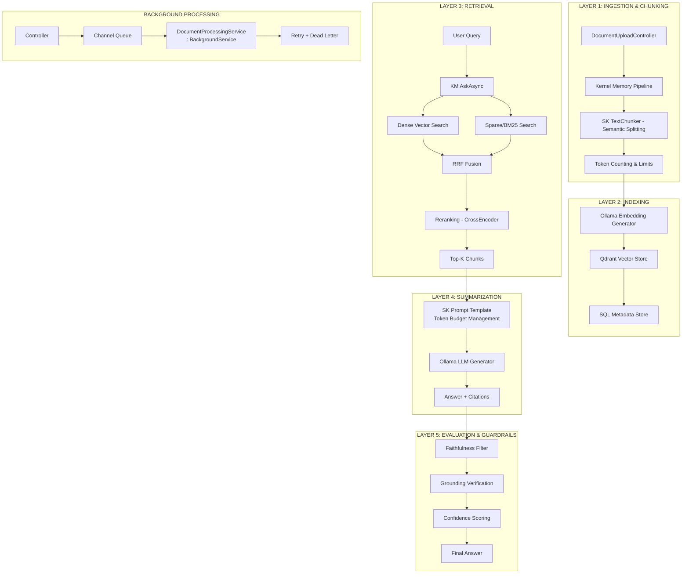

# RAG System Refactor Design

**Date:** 2026-06-21
**Status:** Draft

## 1. Overview

Refactor toán bộ hệ thống RAG từ custom implementation sang **Semantic Kernel + Kernel Memory** với **Modern RAG 5-Layer Architecture**. Chiến lược migration: **Big Bang**. Data: **Reindex all**.

## 2. Architecture - 5 Layers



## 3. Components

### 3.1 Dependencies (NuGet Packages)

| Package | Purpose |
|---------|---------|
| `Microsoft.SemanticKernel` | Core orchestration |
| `Microsoft.KernelMemory.Core` | RAG pipeline |
| `Microsoft.KernelMemory.Qdrant` | Qdrant connector |
| `Microsoft.KernelMemory.Ollama` | Ollama connector |
| `Microsoft.KernelMemory.Service` | Hosted service |
| `Microsoft.SemanticKernel.Connectors.Qdrant` | Direct Qdrant ops |
| `PdfPig` | PDF text extraction |

### 3.2 New Project Structure

```
AIStudyHub.Business/
├── Services/
│   ├── KernelMemoryService.cs          # KM wrapper
│   ├── SemanticKernelService.cs       # SK orchestration
│   ├── BackgroundDocumentProcessor.cs  # BackgroundService
│   └── RagPipelineService.cs          # L1-L5 orchestration
├── TextChunking/
│   ├── SemanticTextChunker.cs         # SK TextChunker wrapper
│   └── ChunkingOptions.cs
├── Search/
│   ├── HybridSearchService.cs         # L3: Dense + Sparse
│   ├── RerankingService.cs            # L3: CrossEncoder
│   └── RetrievalService.cs            # L3: Orchestration
├── Guardrails/
│   ├── FaithfulnessFilter.cs           # L5: Hallucination check
│   ├── GroundingVerifier.cs            # L5: Citation check
│   └── ConfidenceScorer.cs             # L5: Score assignment
├── Configuration/
│   ├── KernelMemoryOptions.cs
│   ├── SemanticKernelOptions.cs
│   └── RerankingOptions.cs
└── AIStudyHub.Business.csproj (update packages)

AIStudyHub.API/
├── Controllers/
│   ├── DocumentUploadController.cs (refactor to use Channel queue)
│   └── RagChatController.cs (new - L3-L5)
└── AIStudyHub.API.csproj (add references)
```

### 3.3 Background Processing (Critical Fix)

```csharp
// New: Channel-based queue
public interface IDocumentProcessingQueue
{
    ValueTask EnqueueAsync(DocumentProcessRequest request, CancellationToken ct);
    IAsyncEnumerable<DocumentProcessRequest> DequeueAsync(...);
}

// New: BackgroundService replacement for Task.Run
public class DocumentProcessingService : BackgroundService
{
    private readonly IDocumentProcessingQueue _queue;
    private readonly IKernelMemory _memory;
    
    protected override async Task ExecuteAsync(CancellationToken stoppingToken)
    {
        await foreach (var request in _queue.DequeueAsync(stoppingToken))
        {
            await ProcessAsync(request, stoppingToken);
        }
    }
}
```

### 3.4 Kernel Memory Integration (L1-L2)

```csharp
// Configuration
var memory = new KernelMemoryBuilder()
    .WithQdrantMemoryDb(host: "http://localhost:6333", 1536) // Config, not hardcoded
    .WithOllamaTextGeneration("http://localhost:11434", "llama3.1")
    .WithOllamaTextEmbedding("http://localhost:11434", "nomic-embed-text")
    .WithSimpleFileLogging()
    .Build<MemoryServerless>();

// Import pipeline (L1-L2)
await memory.ImportDocumentAsync(filePath, 
    steps: Constants.PipelineWithoutSummary); // SK handles chunking
```

### 3.5 Retrieval (L3)

```csharp
// Hybrid Search
var answer = await memory.AskAsync(
    question,
    filter: MemoryFilters.ByUser(userId),
    options: new SearchOptions { Top = 10, Temperature = 0.3 });

// Reranking (if cross-encoder available)
var reranked = await _rerankingService.RerankAsync(query, chunks, topK: 5);
```

### 3.6 Generation (L4)

```csharp
// SK Prompt Template with citations
var prompt = """
    Based on the following context, answer the question.
    If you cannot answer from the context, say so.
    
    Context:
    {{$context}}
    
    Question: {{$question}}
    
    Answer with citations: [1], [2], etc.
    """;

var kernel = new KernelBuilder()
    .WithOllamaChatCompletion("http://localhost:11434", "llama3.1")
    .Build();
```

### 3.7 Guardrails (L5)

```csharp
// Faithfulness check
var isFaithful = await _faithfulnessFilter.ValidateAsync(
    answer, sourceChunks);

// Grounding verification  
var citations = await _groundingVerifier.VerifyAsync(
    answer, retrievedChunks);

// Confidence scoring
var confidence = _confidenceScorer.Score(answer, citations, isFaithful);
```

## 4. Data Flow

### 4.1 Document Ingestion Flow

```
User Upload → Controller → Channel Queue → BackgroundService 
    → Kernel Memory Pipeline → TextChunker → Embedding → Qdrant + SQL
```

### 4.2 Query Flow

```
User Query → Controller → Kernel Memory Ask
    → Hybrid Search (L3) → Rerank → Top-K
    → SK Prompt Template (L4) → Ollama LLM
    → Guardrails (L5) → Response + Citations
```

## 5. Configuration

```json
{
  "KernelMemory": {
    "Qdrant": {
      "Host": "http://localhost:6333",
      "VectorSize": 1536,
      "CollectionName": "aistudyhub"
    },
    "Ollama": {
      "Endpoint": "http://localhost:11434",
      "EmbeddingModel": "nomic-embed-text",
      "GenerationModel": "llama3.1"
    }
  },
  "Chunking": {
    "MaxTokensPerChunk": 1024,
    "OverlapTokens": 128,
    "MinTokensPerChunk": 128
  },
  "Retrieval": {
    "TopK": 10,
    "RerankTopK": 5,
    "UseHybridSearch": true,
    "UseReranking": true
  },
  "Generation": {
    "MaxTokens": 2048,
    "Temperature": 0.3
  },
  "Guardrails": {
    "FaithfulnessThreshold": 0.7,
    "GroundingThreshold": 0.5
  }
}
```

## 6. Error Handling

| Scenario | Strategy |
|----------|----------|
| Ollama unavailable | Circuit breaker + fallback message |
| Qdrant connection failed | Retry 3x, then dead-letter queue |
| Embedding generation timeout | Per-chunk timeout, partial success allowed |
| LLM hallucination detected | Block answer, return "Cannot verify" |
| Reindex failure | Transaction rollback, notify admin |

## 7. Testing Strategy

### Unit Tests
- `SemanticTextChunker` - token counting accuracy
- `HybridSearchService` - search result relevance
- `FaithfulnessFilter` - hallucination detection
- `ConfidenceScorer` - score calculation

### Integration Tests
- Full pipeline: PDF → Qdrant → Query → Answer
- Background processing queue
- Ollama/LLM response validation

### E2E Tests
- Upload document → Wait for processing → Query → Verify citation

## 8. Migration Steps

1. **Phase 1: Setup** - Add packages, create new files
2. **Phase 2: Background** - Replace Task.Run with BackgroundService
3. **Phase 3: KM Integration** - Wire up Kernel Memory for L1-L2
4. **Phase 4: Retrieval** - Implement L3 hybrid search
5. **Phase 5: Generation** - Wire up L4 with SK prompts
6. **Phase 6: Guardrails** - Add L5 filters
7. **Phase 7: Reindex** - Run reindex job for existing data
8. **Phase 8: Testing** - Full test suite
9. **Phase 9: Deploy** - Big bang cutover

## 9. Rollback Plan

- Keep backup of current `QdrantVectorService.cs`
- Feature flag: `UseLegacyRag` (default: false)
- If KM fails, flip flag to use legacy
- Database migration rollback scripts ready
