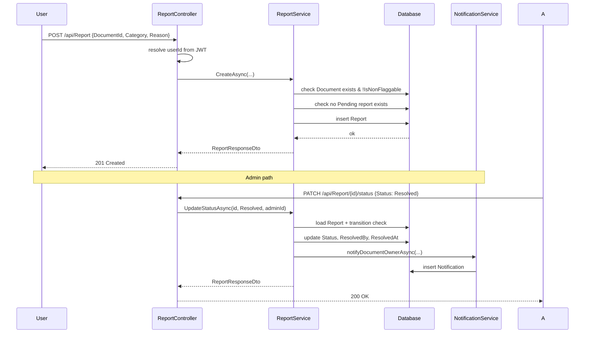

# Report Workflow Design — AI Study Hub

**Status:** Draft (pending user review)
**Date:** 2026-06-28
**Author:** Brainstorming session

## 1. Purpose & Scope

Extend the current minimal `Report` CRUD into a moderation workflow for
documents, supporting:

- Users reporting a document with a **category** plus optional free-text
  reason (required when category is "Other").
- **Admin review workflow**: `Pending → Reviewed → Resolved | Rejected`.
- **Admin bulk actions** to mark documents non-flaggable and to bulk-close
  reports.
- **Notification** to the document owner when a report is closed.
- **Deduplication**: one user can only have one active (`Pending`) report
  per document at a time.

Out of scope: auto-hide/ban on threshold, email notifications, extending
to Quiz/Flashcard/ChatMessage, audit log table.

## 2. Domain Model

### 2.1 `Report` entity (extended)

```csharp
public sealed class Report : BaseEntity
{
    public Guid UserId { get; set; }
    public Guid DocumentId { get; set; }
    public ReportCategory Category { get; set; }
    public string? Reason { get; set; }
    public ReportStatus Status { get; set; } = ReportStatus.Pending;
    public Guid? ResolvedBy { get; set; }
    public DateTime? ResolvedAt { get; set; }

    public User User { get; set; } = null!;
    public Document Document { get; set; } = null!;
    public User? ResolvedByUser { get; set; }
}
```

### 2.2 `Document` entity (one new field)

```csharp
public bool IsNonFlaggable { get; set; } = false;
```

### 2.3 New enum: `ReportCategory`

```csharp
public enum ReportCategory
{
    Spam = 1,
    CopyrightViolation = 2,
    IncorrectInformation = 3,
    InappropriateContent = 4,
    Other = 5  // requires Reason
}
```

### 2.4 Existing enum: `ReportStatus`

```csharp
public enum ReportStatus { Pending = 1, Reviewed = 2, Resolved = 3, Rejected = 4 }
```

`ResolvedBy` and `ResolvedAt` capture who closed the report and when;
`AdminNote` was explicitly removed — admin feedback is not stored on the
report. Admin communicates through the document moderation flow and
notifications.

## 3. Database Migration

Single migration: `YYYYMMDDHHMMSS_AddReportWorkflowFields`

**Reports table**

| Column | Type | Default | Notes |
|--------|------|---------|-------|
| `category` | int | 5 | mapped to `ReportCategory` |
| `status` | int | 1 | mapped to `ReportStatus` (Pending) |
| `resolved_by` | uniqueidentifier | NULL | FK → Users |
| `resolved_at` | datetime2 | NULL | |

**Documents table**

| Column | Type | Default | Notes |
|--------|------|---------|-------|
| `is_non_flaggable` | bit | 0 | |

**Index**

```sql
CREATE UNIQUE INDEX IX_Reports_UserId_DocumentId_Pending
ON Reports (user_id, document_id)
WHERE status = 1;
```

## 4. DTOs

```csharp
public enum ReportCategoryDto { Spam = 1, CopyrightViolation = 2, IncorrectInformation = 3, InappropriateContent = 4, Other = 5 }
public enum ReportStatusDto { Pending = 1, Reviewed = 2, Resolved = 3, Rejected = 4 }

public sealed record ReportResponseDto(
    Guid Id, Guid UserId, string UserFullName,
    Guid DocumentId, string DocumentTitle,
    ReportCategoryDto Category, string? Reason,
    ReportStatusDto Status,
    Guid? ResolvedBy, string? ResolvedByFullName, DateTime? ResolvedAt,
    DateTime CreatedAt, DateTime? UpdatedAt);

public sealed record CreateReportRequestDto(
    Guid DocumentId,
    ReportCategoryDto Category,
    string? Reason);

public sealed record UpdateReportStatusRequestDto(
    ReportStatusDto Status);

public sealed record ReportFilterDto(
    ReportStatusDto? Status,
    Guid? DocumentId,
    Guid? UserId,
    DateTime? FromDate,
    DateTime? ToDate,
    int Page = 1,
    int PageSize = 20);

public sealed record BulkReportIdsRequestDto(IReadOnlyList<Guid> ReportIds, ReportStatusDto Status);
public sealed record BulkDocumentIdsRequestDto(IReadOnlyList<Guid> DocumentIds);
public sealed record BulkFailureDto(Guid Id, string Reason);
public sealed record BulkReportStatusResultDto(int Updated, IReadOnlyList<BulkFailureDto> Failed);
public sealed record BulkMarkNonFlaggableResultDto(int Documents, int ReportsRejected);
```

## 5. API Endpoints

`ReportController` is the single controller. Routes use `[Route("api/[controller]")]`.

| Method | Route | Auth | Description |
|--------|-------|------|-------------|
| `POST` | `/api/Report` | User | Create report. `UserId` taken from JWT, never from body. |
| `GET` | `/api/Report/my` | User | Reports created by current user. |
| `GET` | `/api/Report/{id}` | Owner or Admin | Report detail. |
| `GET` | `/api/Report` | Admin | Paged search with `ReportFilterDto` query string. |
| `PATCH` | `/api/Report/{id}/status` | Admin | Update status; emits notifications. |
| `POST` | `/api/Report/{documentId}/mark-non-flaggable` | Admin | Mark document non-flaggable + auto-reject pending reports. |
| `PATCH` | `/api/Report/bulk/status` | Admin | Bulk update status. |
| `PATCH` | `/api/Report/bulk/mark-non-flaggable` | Admin | Bulk mark documents non-flaggable. |
| `DELETE` | `/api/Report/{id}` | Admin | Delete report (only when Status != Pending). |

Note: `POST` for single non-flaggable route keeps REST semantics (action
verb against a parent resource); `PATCH` is used for bulk state changes
since they operate on a collection.

## 6. Service Layer

### 6.1 Interface

```csharp
public interface IReportService : ICrudService<ReportResponseDto, CreateReportRequestDto, UpdateReportRequestDto>
{
    Task<IReadOnlyList<ReportResponseDto>> GetMyReportsAsync(Guid userId, CancellationToken ct = default);
    Task<PagedResultDto<ReportResponseDto>> SearchAsync(ReportFilterDto filter, CancellationToken ct = default);
    Task<ReportResponseDto> UpdateStatusAsync(Guid id, ReportStatusDto status, Guid adminUserId, CancellationToken ct = default);
    Task<int> MarkDocumentNonFlaggableAsync(Guid documentId, Guid adminUserId, CancellationToken ct = default);
    Task<BulkReportStatusResultDto> BulkUpdateStatusAsync(IReadOnlyList<Guid> ids, ReportStatusDto status, Guid adminUserId, CancellationToken ct = default);
    Task<BulkMarkNonFlaggableResultDto> BulkMarkNonFlaggableAsync(IReadOnlyList<Guid> documentIds, Guid adminUserId, CancellationToken ct = default);
}
```

### 6.2 Business Rules

**Create**

1. Resolve `userId` from JWT in the controller; ignore any `UserId` in the
   body. `CreateReportRequestDto` does not expose `UserId`.
2. Verify the document exists.
3. Reject if `Document.IsNonFlaggable == true`.
4. Reject if a `Pending` report already exists for `(userId, documentId)`.
5. If `Category == Other`, require non-empty `Reason` (10–500 chars).
6. Persist and return DTO.

**UpdateStatus (single)**

1. Allowed transitions only:
   - `Pending → Reviewed`
   - `Reviewed → Resolved`
   - `Reviewed → Rejected`
2. Set `ResolvedBy = adminUserId`, `ResolvedAt = UtcNow`.
3. If new status is `Resolved` or `Rejected`, emit a `Notification` for
   `Document.UserId` with a contextual message.
4. Reload and return DTO with `ResolvedByFullName`.

**MarkDocumentNonFlaggable (single)**

1. Load document; throw if not found.
2. Set `IsNonFlaggable = true`.
3. Load all `Pending` reports for the document; for each, set
   `Status = Rejected`, `ResolvedBy = adminUserId`, `ResolvedAt = UtcNow`.
4. Save all in one transaction.
5. Emit a single notification to the document owner.
6. Return count of reports auto-rejected.

**BulkUpdateStatus**

1. Load all reports by id (skipping not-found ids in the failure list).
2. For each, validate transition; record failures.
3. Apply the same status/resolver to all valid reports.
4. Save in one transaction.
5. Emit notifications (one per distinct document owner).
6. Return `BulkReportStatusResultDto`.

**BulkMarkNonFlaggable**

1. Load all documents by id; mark each `IsNonFlaggable = true`.
2. For each document, load `Pending` reports; set to `Rejected` with
   resolver/timestamp.
3. Save in one transaction.
4. Emit one notification per document owner.
5. Return `BulkMarkNonFlaggableResultDto` with totals.

**GetById (ownership check at controller layer)**

- Controller allows the report creator (owner) or Admin. The service-level
  `ICrudService.GetByIdAsync` is reused unchanged; ownership is enforced in
  the controller before returning.

**Delete**

- Admin only. Refuse to delete when `Status == Pending` (must be closed
  first to keep the audit trail meaningful).

### 6.3 Errors

| Condition | Exception | HTTP |
|-----------|-----------|------|
| Document not found | `KeyNotFoundException` | 404 |
| Document non-flaggable | `InvalidOperationException` | 409 |
| Duplicate active report | `InvalidOperationException` | 409 |
| Invalid transition | `InvalidOperationException` | 400 |
| Reason missing for `Other` | FluentValidation | 400 |
| Not owner / not admin | `Forbid()` | 403 |

## 7. Validation (FluentValidation)

- `CreateReportRequestDtoValidator`
  - `DocumentId`: not empty.
  - `Category`: enum value 1–5.
  - `Reason`: when `Category == Other`, length 10–500; otherwise null OK.
- `UpdateReportStatusRequestDtoValidator`
  - `Status`: enum value 1–4.
- `ReportFilterDtoValidator`
  - `Page >= 1`, `PageSize` between 1 and 100.

## 8. AutoMapper additions

```csharp
CreateMap<Report, ReportResponseDto>()
    .ForMember(d => d.UserFullName, o => o.MapFrom(s => s.User.FullName))
    .ForMember(d => d.DocumentTitle, o => o.MapFrom(s => s.Document.Title))
    .ForMember(d => d.ResolvedByFullName,
        o => o.MapFrom(s => s.ResolvedByUser != null ? s.ResolvedByUser.FullName : null));
CreateMap<CreateReportRequestDto, Report>();
CreateMap<UpdateReportRequestDto, Report>();
```

## 9. Sequence Diagram



## 10. Testing Plan

Service unit tests (xUnit + Moq, alongside existing tests if any):

- Create: document `IsNonFlaggable=true` throws `InvalidOperationException`.
- Create: existing pending report throws.
- Create: `Category=Other` + empty `Reason` throws.
- Create: happy path returns DTO with `Status = Pending`.
- UpdateStatus: `Pending → Resolved` (skipping `Reviewed`) throws.
- UpdateStatus: `Resolved` produces notification for document owner.
- MarkDocumentNonFlaggable: auto-rejects all pending reports and emits
  notification.
- BulkUpdateStatus: invalid transitions recorded in `Failed`.
- BulkMarkNonFlaggable: aggregate counts correct.
- Delete: `Status == Pending` throws.

Controller integration tests (existing test project if available):

- `POST /api/Report` without JWT → 401.
- `POST /api/Report` non-admin to admin route → 403.
- `PATCH /api/Report/{id}/status` by non-admin → 403.
- `GET /api/Report/{id}` by non-owner non-admin → 403.
- `DELETE /api/Report/{id}` when `Status == Pending` → 400.

## 11. Out of Scope (for this design)

- Auto-hide or auto-ban documents based on report count.
- Email notifications (in-app only).
- Reporting Quiz/Flashcard/ChatMessage.
- Audit log table (we rely on `ResolvedBy` + `ResolvedAt`).
- Soft delete on reports.

## 12. Risks & Mitigations

| Risk | Mitigation |
|------|-----------|
| Filtered unique index may not translate cleanly | Verify the migration via EF Core 8 on SQL Server; fall back to a regular unique index `(user_id, document_id)` if the database provider rejects it (loses active-state filter but keeps dedupe). |
| Two admins race on the same report | Optimistic check on `Status` inside `UpdateStatusAsync`: reload report, validate `Status` matches the expected current value (e.g., `Pending` before moving to `Reviewed`) before applying update; throw `InvalidOperationException` on mismatch. |
| Notification spam when admin bulk-closes | One notification per document owner (deduplicated in bulk paths). |
| Reason free-text may contain PII or abuse | Length cap and content moderation deferred; add moderation later if needed. |

## 13. Open Questions

None — all clarifying questions resolved during brainstorming.
